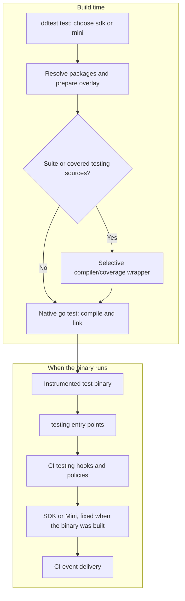
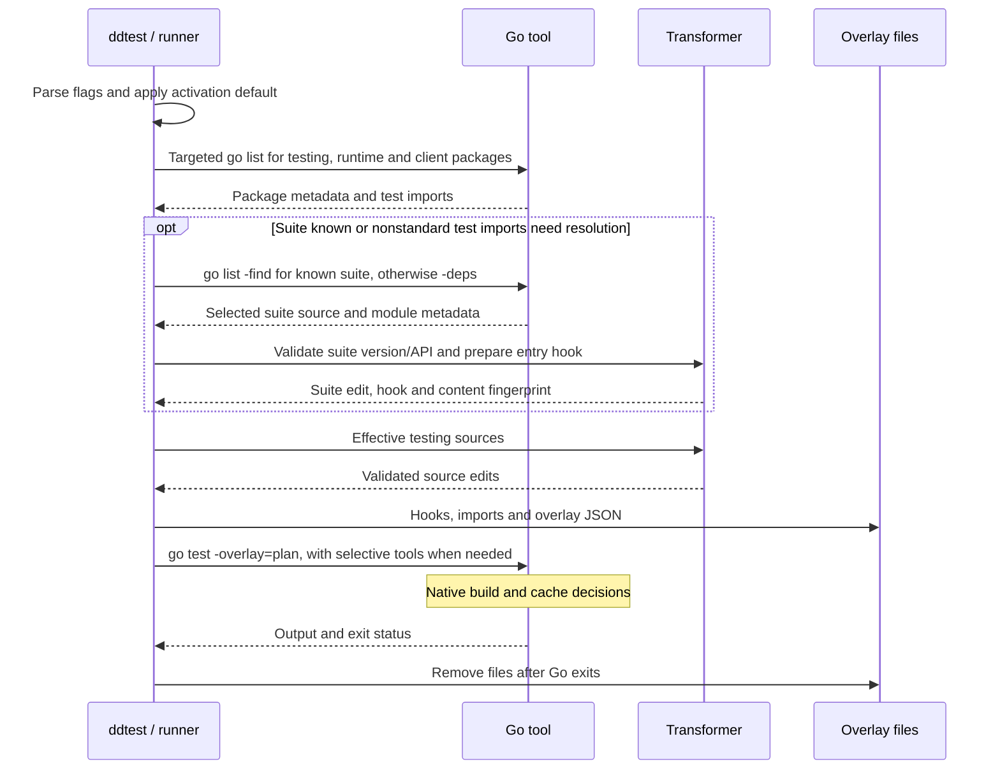
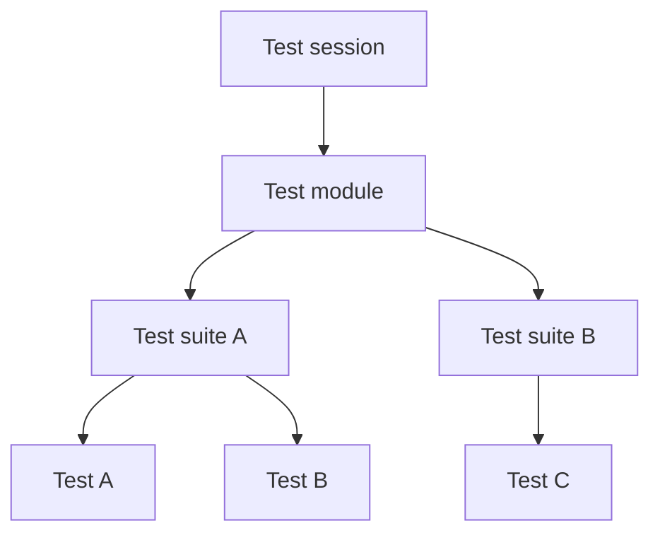
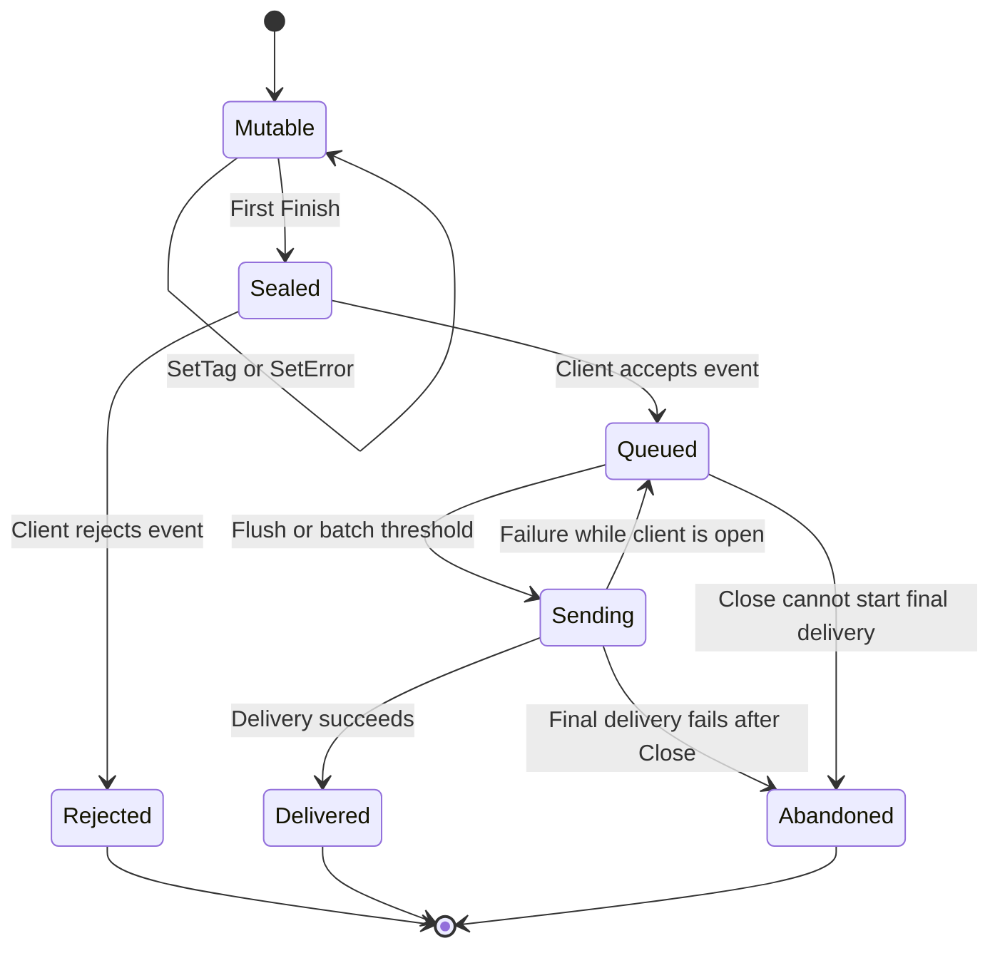
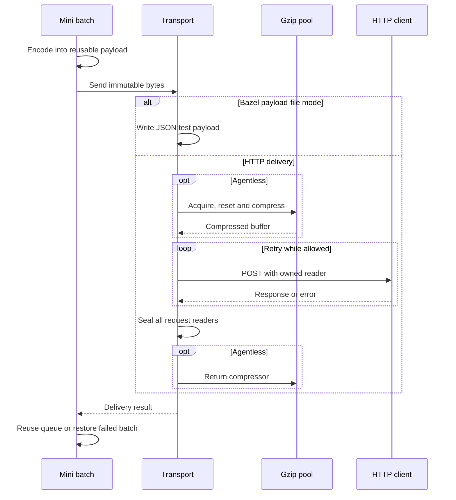
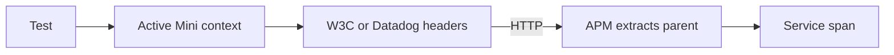

# Architecture

The project has two jobs: insert the SDK's testing hooks during a native Go
build, and offer a small runtime that writes CI Visibility events. Separating
them lets us compare instrumentation with the full SDK and with Mini while
keeping the same testing entry points.

The CLI defaults to `sdk`. That backend requires the exact, unreplaced SDK
version in [`internal/version`](../internal/version/version.go). The `mini`
backend links this module's CI runtime. It has no external runtime module
dependencies, although the repository uses external libraries in its tests.

## Build time and runtime

The CLI finishes preparing the overlay before Go starts compiling. The resulting
test binary contains the testing hooks and selected runtime; running that binary
does not need the CLI.

Orchestrion remains the reference instrumenter in differential tests. The POC
implements only its testing advice. Its front-end prepares one overlay per
invocation, so compiler processes do not each load an instrumentation engine.

| Code | Owns |
| --- | --- |
| [`cmd/ddtest`](../cmd/ddtest/main.go) | CLI entry point, runtime selection, activation and interrupt handling |
| [`internal/runner`](../internal/runner/run.go) | Go flags, package discovery, overlay merging, temporary files and child exit status |
| [`internal/instrument`](../internal/instrument/transform.go) | Validation and source edits for native `testing` and the original Testify suite entry |
| [Extracted `gotesting`](../internal/thirdparty/dd-trace-go/civisibility/integrations/gotesting) | Test callbacks, parallel ownership, retries and CI policies |
| [`internal/minitracer`](../internal/minitracer/README.md) | Event fields, identities, byte accounting and batching |
| [`internal/citransport`](../internal/citransport/transport.go) | Test-cycle delivery, retries, compression and request-body lifetime |
| [`propagation`](../propagation/context.go) and [`testopt`](../testopt/testopt.go) | Public context exchange and native-client API |
| [`internal/thirdparty`](../internal/thirdparty/README.md) | Maintained SDK, codec and platform subsets with source provenance |

## Preparing an overlay

An overlay maps a logical source path to a backing file. Go reads that backing
file during its build. The original files remain in their project, SDK or
toolchain directories.

The transformer parses Go's `testing` package and applies edits at source
positions. It returns only changed files and retains logical filenames through
line directives. A generated file declares the private SDK hooks with
`go:linkname`. Each selected package with tests receives a virtual external
test file that blank-imports the chosen runtime.

Existing overlays are merged before transformation. Generated-path collisions,
missing or ambiguous hooks, already instrumented sources and conflicting
`-toolexec` settings fail during preparation. The [flag parser](../internal/runner/options.go)
also rejects explicit Go-file mode, `-C` and unknown flags before `-args`.

[Testify preparation](testify.md) detects the suite package in the actual test
import graph and prepares a registration call at its original `Run` entry.
One private `-toolexec` hook substitutes compiler inputs for that package,
including covered sources. It also bridges covered rewritten `testing` sources
when needed. Unrelated calls bypass plan loading and replace the wrapper with
the native tool on Unix. Builds needing neither feature omit `-toolexec`.
The suite fingerprint travels through `testing` export data; compiler and
linker identities remain native, so unrelated packages share Go's cache. The
selected version and API are checked before Go can reuse a cached suite. A
coverage bridge has its own version contract. Its dispatch, cache invalidation
and source ownership are described in [Testify instrumentation](testify.md).

The plan lives for one invocation. Identical generated content shares a backing
file within that plan. Go still owns its build cache and test-result cache; use
`-count=1` when a test must run again and emit fresh events. With `-c`, Go builds
the instrumented binary and leaves execution to the caller. `-work` preserves
Go's work directory, but the CLI still removes its own overlay plan.

## The testing boundary

The advice covers `M.Run`, `T.Run`, `B.Run`, failure methods, formatted errors,
formatted skips, `SkipNow` and `Parallel`. The ownership marker keeps the SDK's
original Orchestrion name because the runtime uses that symbol to recognize
woven testing code.

The extracted runtime owns retry, EFD, ITR, quarantine and attempt-to-fix
decisions. The CLI forwards test arguments and starts the build; it does not
implement those policies. Formatted error and skip hooks receive the already
formatted text, so an argument's `String` method runs once.

These hooks are a private ABI. Their signatures, native `testing` layouts and
source locations must be reviewed when Go or the SDK changes. A successful AST
match alone cannot establish compatibility with a new toolchain.

## Native event ownership

CI session, module, suite and test identifiers describe the CI hierarchy.
The edges below mean "contains":

Distributed trace identity is separate: the propagation package carries a
128-bit trace ID and active span ID. Test-cycle serialization writes hierarchy
IDs as native fields, with the SDK's event-specific ID rules. End events identify
their session, module or suite; test events retain their own trace identity.
Retries and parallel-test ownership are managed by the extracted testing hooks,
which also control when a session closes and flushes.

For a span with a client, the lifetime is:

`Finish` seals the span under its mutex. It copies the event's scalar fields and
shares the private metadata and metric maps with the event. Setters then become
no-ops; getters remain usable. Repeated `Finish` calls do not enqueue again.
A span without a client can still carry context, but it is not queued.

The client has two synchronization boundaries. `mu` protects queue, closure,
error and drop state. `sendMu` is a context-aware token that serializes event
acceptance and delivery, including ownership of the payload buffer. Slow delivery
can therefore block concurrent finishers. While the client is open, a failed
flush restores the older batch; when it fills the bounds and cannot be delivered,
a new event is rejected and counted.

The default event-count limit is 1,000. Byte accounting includes the envelope
and uses generated `Msgsize()` upper bounds. The flush threshold is 2.5 MiB and
the maximum uncompressed test-cycle payload is 5 MiB. A single event that cannot
fit is rejected. Small batches flush at explicit or CI lifecycle boundaries;
the Mini client has no periodic flush worker.

`Close` prevents new events, performs a final flush and releases idle HTTP
connections. Explicit clients report errors through `Flush`, `Close`,
`LastError` and `DroppedEvents`. Hook-driven shutdown logs failures while
preserving the test result. A final delivery failure abandons the pending batch,
releases its events and increments `endpoint_payload.dropped` once. Transport
attempts, event count and rejected events do not multiply that payload counter.
`DroppedEvents` separately includes rejected events and those in abandoned
batches. Repeated close/flush calls cannot resend or recount an abandoned batch.

## Delivery and compression

Test-cycle events use the native client and transport. Coverage and CI telemetry
keep their extracted writers and endpoints. They are separate payload streams;
changing `citransport` does not update those writers.

Agentless delivery uses gzip and `/api/v2/citestcycle`. Agent delivery uses
`/evp_proxy/v2/api/v2/citestcycle` and the EVP subdomain header, with uncompressed
MessagePack. Bazel file mode writes JSON under
`TEST_UNDECLARED_OUTPUTS_DIR/payloads/tests/`. Coverage and telemetry use their
corresponding output directories.

HTTP retries reuse the same immutable bytes. The defaults are three attempts,
100 ms initial exponential backoff and a 10-second HTTP timeout. Network errors,
429 and 5xx responses are retryable. Other non-success responses stop delivery;
429 can provide an integer `Retry-After` between zero and 60 seconds. Context
cancellation bounds requests and backoff. Redirects are refused.

An HTTP implementation may keep reading after `Do` returns. Each reader shares
an owner lock; sealing that owner waits for an active read and makes subsequent
reads return EOF. The payload or gzip buffer can then be reused safely. Delivery
can repeat after an ambiguous network failure, so consumers must not assume
exactly-once transport.

## Propagation into an integration test

`testopt.Context(t)` exposes the active test context. An instrumented test can
read it with `propagation.FromContext`, then inject W3C or Datadog headers into
an outbound request.

Inside the same process, another tracer must explicitly extract the Mini
identity through its own API or through a header carrier. Its private
`context.Context` value is different. A future dd-trace-go helper could expose that bridge;
the current API provides context values and header carriers. Sampling priority is carried as propagation
metadata; Mini has no APM sampling engine.

## Runtime scope

Mini retains CI policies, coverage, Git/CI metadata, diagnostic logs and CI
telemetry. It reads the supported configuration from environment variables.
APM YAML/Fleet configuration, telemetry heartbeats, dependency inventories,
profiling, security and the general APM tracer are excluded from the port.

Public-intake acceptance, actual Bazel toolchain execution, full fuzz campaigns
and arbitrary downstream projects require separate evidence. See the
[validation contract](validation.md) for exercised cases and
[maintenance guide](maintenance.md) for upgrade requirements.
