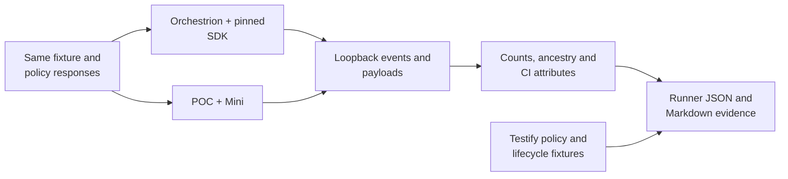

# CI Visibility feature parity

Mini registers `testify/suite` at its original entry, including callers in external
modules. A 26-case Testify comparison checks the original runner, lifecycle,
policies and covered helpers. Its native `testing` path passes a 65-scenario
comparison against the unmodified SDK instrumented by Orchestrion. Additional fixtures exercise manual hierarchy calls, CI child spans,
multiple package binaries, Unix sockets, a bounded fuzz campaign and CI telemetry.
This evidence does not establish complete product parity.

Mini also checks 17 of these combinations with deferred delivery and seven
Testify combinations in that mode. Its automatic goleak fixture checks both
delivery modes, external helpers, race, covered library inputs and deliberate
test/HTTP leaks. These local runtime checks are described in
[delivery and goleak](delivery.md); historical CI revisions below predate them.

The SDK reference is `dd-trace-go/main` at
[`96aedb31048c07e29e7a20a4333dc3b8d289c52d`](https://github.com/DataDog/dd-trace-go/tree/96aedb31048c07e29e7a20a4333dc3b8d289c52d),
also the base of our incorporated CI source. The exact module version is owned by
[`internal/version`](../internal/version/version.go). Orchestrion is pinned to
`v1.13.2-0.20260917114356-5c24783fcd76`; the fixture loads `gotesting/orchestrion.yml`
from that SDK checkout, including its Testify rule. Comparing only the POC's
`sdk` and `mini` backends would hide a transformation missing from both.



## Feature inventory

“Verified” means the named fixtures prove the described contract. “Partial”
identifies narrower evidence or a remaining integration boundary. The individual
policy combinations and counts are exported by every workflow run.

| Feature | Evidence and combinations | Status |
| --- | --- | --- |
| Session, module, suite and test lifecycle | Native `testing`, `TestMain`, two source suites, multiple package binaries; unique IDs, resolved hierarchy and event multiplicity | Verified |
| Pass, failure and skip | All six failure entrypoints, Helper stacks, three skip entrypoints/reasons, source locations and exit status | Verified |
| Subtests and cleanup | Nested children, Context cancellation, cleanup order; disabled/quarantined children and subtest feature gate | Verified |
| Parallel execution | Parallel children with count/shuffle; ATR in both execution modes; exact parallel coverage attribution under race | Verified |
| Automatic test retries (ATR) | Recovery/exhaustion, zero budget, environment on/off override, process and in-process execution; parallel tests and coverage | Verified |
| Early flake detection (EFD) | New/known tests, retry cap, faulty-session abort; ATR combination, impacted known tests and parallel retry execution | Verified for these decisions; long slow-test duration thresholds have unit evidence only |
| Test impact analysis / ITR | Skip, forced run, unskippable annotation, missing-line-coverage response; coverage, ATR/EFD, disabled/quarantined and attempt-to-fix combinations | Verified |
| Impacted tests | Actual two-commit Git diff; known-test EFD reruns, ITR interaction, environment disable | Verified |
| Test management | Disabled, quarantined, attempt-to-fix; overlapping flags, ATR/EFD, ITR, subtests, feature override and both retry modes | Verified for selected overlaps; not every permutation |
| Per-test coverage | Atomic/race coverage, pass versus skip, exact distinct-function bitmaps with count/shuffle and retries; initial-attempt-only behavior matches SDK | Verified |
| Coverage report upload | Gzip multipart LCOV and its complete event metadata; combined with ITR and per-test coverage | Verified |
| CI logs | Actual logs intake JSON, test/trace correlation and line multiplicity; retries and manual hierarchy logs | Verified |
| Git metadata and upload | Commit/base metadata, CODEOWNERS and actual Git pack upload when settings require it; original Git fixture assertions retained | Verified |
| CI providers, version and session name | GitHub wire fixture; ported SDK provider fixtures, `DD_VERSION`, custom tags and explicit/job/command session naming | Verified at those levels; other providers have unit evidence |
| Empty selection, list, examples and fuzz seeds | Same session-only events as SDK; a one-iteration fuzz campaign compares parent/worker sessions | Verified SDK limitation: no example/fuzz-case test events; long campaigns unverified |
| Benchmarks | Same benchmark events, metric keys/types and run counts; values must be finite/nonnegative | Verified semantics; measured timings/allocations differ |
| Panic, Goexit and timeout | Existing reference fixtures compare diagnostics, exit status and abnormal finalization | Verified for those fixtures |
| CLI activation and Go flags | Parent default, explicit values and child inheritance; overlays, GOFLAGS, tags, JSON, selection and native result-cache semantics | Verified |
| Agent and Agentless | HTTP EVP v2, gzip Agentless test-cycle payloads, per-test coverage and ATR/ITR combinations; settings/test-cycle over Unix sockets on Unix CI | Verified loopback protocol; real Agent/intake unverified |
| Payload size, retries and failures | Native byte/count bounds, oversized rejection, failed-batch retention, gzip reuse, 403/429/5xx and cancellation tests | Verified Mini contracts; not an exhaustive SDK/Mini delivery stress comparison |
| Bazel | Manifest/read cache plus test, coverage and telemetry payload files; no HTTP requests | Partial: file/offline contracts verified; actual Bazel invocation unverified |
| Manual hierarchy API | Two modules/four suites/twelve tests; repeated lookup/close, statuses, error/custom tags/metrics, logs and child span | Verified internal API; no new public API added |
| Additional CI spans | Two explicitly CI-marked spans attached to the active test context, including test → parent → child identity; manual hierarchy child span | Verified internal span API; automatic APM integration is outside Mini |
| Context propagation | W3C and Datadog carriers, 128-bit identity, extraction by SDK propagator | Verified carrier compatibility; in-process APM shim not implemented |
| CI telemetry | Original CI instrumentation/unit assertions; wire fixture compares semantic CI count/rate metrics and validates request counters against actual HTTP requests | Partial: representative wire counts verified; distributions/policy cross-product unverified; failure counters have known differences |
| `testify/suite` | 26 Mini cases against full SDK/Orchestrion, plus a POC SDK pass/skip control; version fixtures v1.11.1/v1.12.1, aliases, helpers, lifecycle, retries, management and race/coverage | Verified for local and external-module callers; method-level ITR retains the SDK limitation |

The inventory follows the SDK's CI integrations, manual API, coverage, feature
selection, Git/settings clients, telemetry and testing YAML. The source and test
manifests identify the copied production files and which original tests were
ported. A copied file is implementation evidence, not a substitute for runtime
proof. A green run is a regression gate for this inventory, not a promise that
all combinations or downstream applications have been tested.

## Event counts

Counts below are representative Linux Go 1.27.1 observations. CI produces the
same table per runner from its own captured events. Retry attempts each produce
a test event, while their module/suite/session are closed once by the controller.

| Scenario | Sessions | Modules | Suites | Tests | Spans | SDK versus Mini |
| --- | ---: | ---: | ---: | ---: | ---: | --- |
| Pass | 1 | 1 | 1 | 1 | 0 | Equal |
| Nested tests, cleanup and Context | 1 | 1 | 1 | 6 | 0 | Equal |
| Parallel tests, count=2, shuffle | 1 | 1 | 1 | 18 | 0 | Equal |
| ATR recovery / exhaustion | 1 | 1 | 1 | 2 / 3 | 0 | Equal in both execution modes |
| EFD new test | 1 | 1 | 1 | 3 | 0 | Equal in both execution modes |
| Two package binaries | 2 | 2 | 2 | 2 | 0 | Equal |
| Empty selection / list / examples and seeds | 1 | 0 | 0 | 0 | 0 | Equal SDK limitation |
| Manual hierarchy | 1 | 2 | 4 | 12 | 1 | Equal |
| Test with CI parent/child spans | 1 | 1 | 1 | 1 | 2 | Equal |
| Testify suite with pass/skip methods | 1 | 1 | 2 | 3 | 0 | Equal, including hierarchy and method source metadata |

The 65 matrix scenarios total **65 sessions, 62 modules, 63 suites and 142 test
events** in each runtime, with no extra spans. Additional span fixtures deliberately
create them. This aggregate is a fixture observation, not an expected count for
an arbitrary build; per-scenario counts and ancestry checks prevent equal totals
from hiding a missing or duplicated event.

## Comparison contract

The harness decodes actual MessagePack envelopes and preserves event kind/version,
service/resource/type, errors, custom tags, CI metadata and CI metrics. It compares
multiplicity and exit status. Every test resolves its session/module/suite; IDs
are unique and ancestry is consistent. Additional spans retain their test and
span parentage. Logs resolve their test IDs before random IDs are normalized.
Coverage bitmaps resolve their events and compare exactly. The multipart report
is decompressed and its full LCOV text and event JSON are compared.

Only declared differences are normalized:

- Generated IDs, timestamps, durations and execution order vary between runs.
  Their relationship is checked separately before comparing attributes.
- APM sampling, profiling, process enrichment, runtime identity and redundant
  Git/hierarchy aliases are excluded. Aliases must agree with native CI fields
  when present. Unknown CI attributes and custom tags remain in the comparison.
- Mini retains capabilities and ITR session metadata. Missing SDK session values
  may be inherited from consistent test values, following the approved contract.
  Session-only runs validate Mini's complete capabilities against the pinned
  declarations. Present but incorrect values and missing Mini fields fail.
- Benchmark measurement values may vary; names, types, run count and valid
  numeric values remain required. CI request counters are checked against each
  sender's requests because batching can differ. All other captured CI semantic
  counters compare exactly.
- Relocated SDK library stack paths are canonicalized. Mini's known deferred
  wrapper line 844 is mapped to the pinned SDK's line 838; other library
  locations remain strict. For the six `testing`
  failure methods, Orchestrion's `<generated>:1` frame (bare on Go 1.26, prefixed on Go 1.27)
  and the toolchain's
  `testing.go` frame are equivalent by method name. Application frames, their
  source lines, error text and frame order remain compared.

The span fixture explicitly marks both runtimes' spans as `ciapp-test`. Mini
adds that origin automatically; SDK public span creation does not automatically
copy it to each span. This is an intentional CI-only enrichment difference.
The fixture does not stand in for an external APM integration.

The manual fixture waits through the SDK's existing `GetKnownTests` initialization
barrier before creating modules and tests. Without it, the SDK can omit capability
metadata from the entire hierarchy on fast runners. Mini deliberately has no
barrier; a delayed settings response verifies its static capabilities are already
available. This stabilizes the reference without changing the SDK or filling
missing test attributes in the comparator.

## Run and maintain the gate

Run from this checkout with the frozen reference available:

```sh
go install github.com/DataDog/orchestrion@v1.13.2-0.20260917114356-5c24783fcd76
mkdir -p artifacts
ORCHESTRION_BIN="$(go env GOPATH)/bin/orchestrion" \
  PARITY_REPORT_PATH="$PWD/artifacts/parity.json" \
  go test -v -count=1 -timeout=20m ./...
python scripts/parity_report.py artifacts/parity.json --output artifacts/parity.md
```

On Windows set `ORCHESTRION_BIN` to `orchestrion.exe`. Linux race validation uses
`go test -race` and a distinct `parity-race.json` prefix. The parallel/retry
coverage test explicitly compiles the fixture with `-race -covermode=atomic`;
the outer harness's `-race` alone would not make every child binary a race build.
The Windows Testify reference build uses `-work` with a fixture-owned
`GOTMPDIR`. The pinned Orchestrion job server can keep its stderr log open while
Go tries to remove its build directory. The harness retains that directory until
both delivery modes finish, then cleans it through `TestMain`. Compilation errors
still fail the test; event comparisons and the SDK reference are unchanged.
Without the Orchestrion variable, the matrix can run against the POC SDK backend,
including Testify, but the report renderer rejects a full parity report without
the independent Orchestrion reference.

[`compatibility.yml`](../.github/workflows/compatibility.yml) runs the suite on
Linux Go 1.26/1.27 and macOS/Windows Go 1.27. Linux normal and race suites run
as separate jobs, with SDK-first and Mini-first execution respectively. Each
job runs the complete suite once. The six-job matrix runs on pull requests,
pushes to `main` and manual dispatch; feature branch pushes use the pull request
run instead of launching a second matrix. Artifact names include the mode.
Each job uploads JSON counts, supplemental evidence, logs and a Markdown table;
the table also appears in the GitHub job summary. Artifacts are retained for seven
days; download them before expiry to keep a run beyond that period. Missing
evidence, a failed comparison or an omitted reference fails the report step. The Testify fixture
requires every Testify policy case, timing and count comparison to pass. Historical
reports retain their original gap records; new evidence does not rewrite old runs.

The normal and deferred `testing` matrices share one covered set of SDK, Mini
and Orchestrion binaries. Testify shares its own race/coverage set. Both sets
keep their source directories through the test process, including `-count`
repetitions, and `TestMain` removes them afterward. Selecting only a deferred
test still builds the required set. A failed build also fails later consumers.
This reuse ends with the process; it adds no persistent build cache.
On Windows, cleanup retries sharing violations and access-denied errors for up
to two seconds, as `testing.TempDir` does. Removing the URL file requests
Orchestrion shutdown; its log handles may close slightly later. A persistent
cleanup error still fails the harness.

Each scenario still starts a new child process with its own receiver and retry
state. Cases, comparisons, execution order and report filenames are unchanged.
Builds that deliberately alter flags, sources, overlays, workspaces or library
versions keep their independent fixtures. Do not add those variants to the
shared sets without checking their inputs and cleanup ownership.

The [fixture-sharing measurements](results/ci-harness-20261004-linux-go1.27/README.md)
retain three alternating pairs of all 115 scenarios. Local warm-cache harness
walltime falls from a median of 110.257 s to 95.324 s (13.5%). These timings
include compilation and comparison; they do not measure GitHub CI duration.

### Per-case duration records

The [recorded Linux Go 1.27 run](results/ci-parity-20261002-linux-go1.27/README.md)
includes all scenario durations and supplemental fixtures. Its adjacent JSON files
preserve the raw observations; `run.json` records the command, execution order,
reference versions and hashes of the tested harness. This is one observed run,
not a performance baseline with a stability threshold.

Schemas 2 and 3 record `timing.sdk_wall_ns` and `timing.mini_wall_ns` for every matrix
scenario and additional fixture. The renderer adds separate SDK/Mini walltimes
in seconds and the signed difference `(Mini / SDK - 1) * 100`. JSON keeps the
integer nanoseconds returned by the monotonic clock, without table rounding.
Missing or invalid observations fail the current report. Schema 1 reports remain
readable and show `Not recorded`; their logs cannot reconstruct separate times.

The matrix times the prebuilt child binary from process start to exit. This
includes initialization, settings requests, tests/retries and shutdown/flush.
It excludes compilation, fixture setup and the comparator. The multiple-package
fixture times the CLI and includes preparation and compilation; its JSON scope
and separate table identify that difference. The manual fixture deliberately
uses a 100 ms settings delay. Testify times the full Orchestrion reference against
Mini for every Testify combination; the POC SDK pass/skip time is also kept in
that JSON. Historical reports still show the former grouping gap.

Each invocation records one observation per variant. The default matrix runs SDK first
and Mini second; Testify cases run the reference SDK, then Mini, with a separate
POC SDK check for pass/skip.
These are diagnostic durations from compatibility tests, with no speed threshold.
A performance claim needs repeated, balanced runs with the same inputs and
enough context to separate host load, compilation and SDK work. The compile-only cold/incremental benchmarks in the README measure another contract.

### Repeated whole-matrix timing

The [six-round Linux comparison](results/ci-parity-repeated-20261002-linux-go1.27/README.md)
keeps every input report, the run manifest and a separate continuous wall clock
for the entire 65-scenario SDK block and Mini block. A full warmup runs first and
is excluded from the six measured rounds. All seven supplemental fixtures also
run in every round and retain their own times; they have different compilation
and initialization contracts and are outside the main block.

Set `PARITY_EXECUTION_ORDER=sdk-first` or `mini-first` to use grouped execution.
Each variant runs all matrix cases before their differential comparisons. The
block timer includes receiver setup, child-process execution and shutdown/flush;
it excludes compilation and comparison. This is a measured interval, not the
sum of the individual child clocks. Schema 3 exports `execution_block` and
`execution_order`. The normal job uses SDK first; Linux race validation uses
Mini first so both paths are exercised by CI. Both commands use `-count=1` to
regenerate their evidence instead of reusing a Go test-result cache entry.

For repeated timing, run an unmeasured warmup, then six fresh invocations with
three in each order. Use the same Go version, build cache, flags, fixture and
GOMAXPROCS for every round. Keep output prefixes distinct:

```sh
# ORCHESTRION_BIN and the pinned SDK must be configured as above.
PARITY_EXECUTION_ORDER=sdk-first PARITY_REPORT_PATH="$PWD/artifacts/warmup.json" \
  go test -count=1 -run '^TestCIVisibility' ./integration
for round in 1 2 3 4 5 6; do
  order=sdk-first
  if [ $((round % 2)) -eq 0 ]; then order=mini-first; fi
  PARITY_EXECUTION_ORDER="$order" \
    PARITY_REPORT_PATH="$PWD/artifacts/round-$round.json" \
    go test -count=1 -run '^TestCIVisibility' ./integration || exit 1
done
python scripts/parity_series.py artifacts/round-*.json \
  --output artifacts/series.md --json-output artifacts/series.json
```

The summary checks all matrix and supplemental evidence, identical references
and scenario contracts, distinct report paths and balanced execution orders.
It shows median, mean, range, coefficient of variation (standard deviation over
mean), every block observation and the paired percentage differences. The local
manifest also preserves the elapsed time of each complete SDK-and-Mini harness
invocation, including compilation and comparison; that combined clock cannot
be interpreted as either variant's runtime. The seven supplemental fixtures
retain their existing SDK-first order, except the separate Testify reference.

### Completing CI telemetry parity

The incorporated CI distribution helpers match all 24 definitions in the pinned
SDK except their import path. Mini's native writer also calls the test-cycle
size, event-count, serialization-time and request-time helpers. The current wire
fixture reads only count/rate metrics; it does not prove distribution delivery
or every policy/error interaction. Collection concurrency already has unit/race
checks, which do not replace that differential wire evidence.

| Work | Required evidence |
| --- | --- |
| Metric inventory | Map each CI metric to its kind, tags, unit and emission site in the pinned SDK and Mini. Preserve count versus rate and distribution schema fields; compare only the `civisibility` namespace. |
| Distribution capture | Decode `distributions` inside telemetry message batches and save the actual samples for each variant. Assert required metric/tag sets and finite, nonnegative values, including valid zero millisecond measurements. |
| Semantic comparisons | Compare deterministic samples such as returned test/file counts against fixture responses. For payload bytes, event counts and request latency, validate each sender against its own captured payloads and attempts. Batching and retry serialization differ, so latency or payload-size samples must not be required to be identical. |
| Policy interactions | Enable telemetry on selected existing ATR/EFD/ITR, test-management, coverage/report, impacted-test and Git-upload combinations, including both retry modes and parallel execution. Route Agent and Agentless telemetry to local capture endpoints; keep real credentials out of fixtures. |
| Delivery failures | Exercise successful retry, exhausted retry, permanent HTTP failure, network error, cancellation and oversized rejection. Distinguish one logical batch from its HTTP attempts and one discarded batch from its events. |
| Aggregation and shutdown | Replay deterministic metric samples, submit concurrently with collection, and verify final flush sends each accepted sample once. Add missing differential proof alongside the existing collector race tests. |
| Offline output | Decode Bazel telemetry files with the same assertions and prove telemetry-disabled runs emit none. This covers the file contract; an actual Bazel invocation remains a separate gate. |
| Regression gate | Export metric inventories/samples and outcomes per case. Fail on missing Mini metrics or changed CI kinds/tags; run on the existing Linux/macOS/Windows matrix and Linux race harness. |

The payload-drop unit is now aligned with the SDK. One known production
difference remains before a complete telemetry-parity claim:

- SDK `ciVisibilityTransport.send` returns network failures before incrementing
  `endpoint_payload.requests_errors`; Mini records them with `error_type:network`.
  The fixture must expose this difference rather than discard it as an APM metric.

SDK and Mini now increment `endpoint_payload.dropped` once per abandoned batch.
Mini keeps a failed `Flush` batch for recovery while open; final `Close` failure
abandons it. HTTP attempts and the number of events do not multiply that count.
Rejected or oversized individual events increment `DroppedEvents()` only. Tests
cover retry exhaustion, later recovery, buffered and in-flight cancellation,
concurrent repeated close/flush, post-close rejection and oversized rejection.
This verifies the Mini contract and unit; the full differential failure-policy
cross-product remains open.

Both implementations increment `endpoint_payload.requests` once per logical
send, outside their retry loops. The current fixture can compare it with HTTP
requests because there are no transport retries in that fixture. A retry fixture
must check logical batches and attempts separately. The SDK also serializes and
emits payload-size/event-count samples on each attempt; Mini encodes a batch once
and reuses it. Validate those samples against the actual serialization/send
operations without removing that optimization.

No sampling, heartbeat, security, remote configuration or other APM functionality
is needed to close this CI telemetry work. Implementation differences and missing
proof remain separate entries until their contracts and tests are resolved.

When updating the SDK, follow [maintenance](maintenance.md#updating-the-sdk-base).
Review the upstream testing YAML and CI production/test inventory as well as the
source diff. Add fixtures for new settings, tags and precedence rules, then run
this matrix against the same exact upstream version. Keep APM exclusions specific;
a broad prefix filter could hide a new CI attribute. Do not normalize a new
mismatch before determining whether it is a bug or an intentional contract.

## Boundaries that remain open

Real Datadog intake acceptance and UI grouping have not been tested. Actual Bazel
execution and long fuzz campaigns need their own environment and proof. CI runs
native Linux, macOS and Windows; other cross-linked targets still have build
evidence only. The current suite samples feature interactions rather than
enumerating their unbounded flags, environments and failure timings.

[Testify support](testify.md) adds suite registration in the instrumentator for
both runtimes, including callers in external modules. Method-level ITR retains
the pinned SDK limitation.
