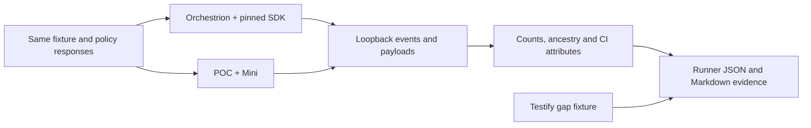

# CI Visibility feature parity

Mini has a confirmed instrumentation gap in `testify/suite`. Its native `testing`
path passes a 65-scenario comparison against the unmodified SDK instrumented by
Orchestrion. Additional fixtures exercise manual hierarchy calls, CI child spans,
multiple package binaries, Unix sockets, a bounded fuzz campaign and CI telemetry.
This evidence does not establish complete product parity.

The SDK reference is `dd-trace-go/main` at
[`96aedb31048c07e29e7a20a4333dc3b8d289c52d`](https://github.com/DataDog/dd-trace-go/tree/96aedb31048c07e29e7a20a4333dc3b8d289c52d),
also the base of our incorporated CI source. The exact module version is owned by
[`internal/version`](../internal/version/version.go). Orchestrion is pinned to
`v1.13.2-0.20260917114356-5c24783fcd76`; the fixture loads `gotesting/orchestrion.yml`
from that SDK checkout, including its Testify rule. Comparing only the POC's
`sdk` and `mini` backends would hide a transformation missing from both.



## Feature inventory

“Verified” means the named fixtures prove the described contract. “Partial”
identifies narrower evidence or a remaining integration boundary. The individual
policy combinations and counts are exported by every workflow run.

| Feature | Evidence and combinations | Status |
| --- | --- | --- |
| Session, module, suite and test lifecycle | Native `testing`, `TestMain`, two source suites, multiple package binaries; unique IDs, resolved hierarchy and event multiplicity | Verified |
| Pass, failure and skip | All six failure entrypoints, Helper stacks, three skip entrypoints/reasons, source locations and exit status | Verified |
| Subtests and cleanup | Nested children, Context cancellation, cleanup order; disabled/quarantined children and subtest feature gate | Verified |
| Parallel execution | Parallel children with count/shuffle; ATR in both execution modes; exact parallel coverage attribution under race | Verified |
| Automatic test retries (ATR) | Recovery/exhaustion, zero budget, environment on/off override, process and in-process execution; parallel tests and coverage | Verified |
| Early flake detection (EFD) | New/known tests, retry cap, faulty-session abort; ATR combination, impacted known tests and parallel retry execution | Verified for these decisions; long slow-test duration thresholds have unit evidence only |
| Test impact analysis / ITR | Skip, forced run, unskippable annotation, missing-line-coverage response; coverage, ATR/EFD, disabled/quarantined and attempt-to-fix combinations | Verified |
| Impacted tests | Actual two-commit Git diff; known-test EFD reruns, ITR interaction, environment disable | Verified |
| Test management | Disabled, quarantined, attempt-to-fix; overlapping flags, ATR/EFD, ITR, subtests, feature override and both retry modes | Verified for selected overlaps; not every permutation |
| Per-test coverage | Atomic/race coverage, pass versus skip, exact distinct-function bitmaps with count/shuffle and retries; initial-attempt-only behavior matches SDK | Verified |
| Coverage report upload | Gzip multipart LCOV and its complete event metadata; combined with ITR and per-test coverage | Verified |
| CI logs | Actual logs intake JSON, test/trace correlation and line multiplicity; retries and manual hierarchy logs | Verified |
| Git metadata and upload | Commit/base metadata, CODEOWNERS and actual Git pack upload when settings require it; original Git fixture assertions retained | Verified |
| CI providers, version and session name | GitHub wire fixture; ported SDK provider fixtures, `DD_VERSION`, custom tags and explicit/job/command session naming | Verified at those levels; other providers have unit evidence |
| Empty selection, list, examples and fuzz seeds | Same session-only events as SDK; a one-iteration fuzz campaign compares parent/worker sessions | Verified SDK limitation: no example/fuzz-case test events; long campaigns unverified |
| Benchmarks | Same benchmark events, metric keys/types and run counts; values must be finite/nonnegative | Verified semantics; measured timings/allocations differ |
| Panic, Goexit and timeout | Existing reference fixtures compare diagnostics, exit status and abnormal finalization | Verified for those fixtures |
| CLI activation and Go flags | Parent default, explicit values and child inheritance; overlays, GOFLAGS, tags, JSON, selection and native result-cache semantics | Verified |
| Agent and Agentless | HTTP EVP v2, gzip Agentless test-cycle payloads, per-test coverage and ATR/ITR combinations; settings/test-cycle over Unix sockets on Unix CI | Verified loopback protocol; real Agent/intake unverified |
| Payload size, retries and failures | Native byte/count bounds, oversized rejection, failed-batch retention, gzip reuse, 403/429/5xx and cancellation tests | Verified Mini contracts; not an exhaustive SDK/Mini delivery stress comparison |
| Bazel | Manifest/read cache plus test, coverage and telemetry payload files; no HTTP requests | Partial: file/offline contracts verified; actual Bazel invocation unverified |
| Manual hierarchy API | Two modules/four suites/twelve tests; repeated lookup/close, statuses, error/custom tags/metrics, logs and child span | Verified internal API; no new public API added |
| Additional CI spans | Two explicitly CI-marked spans attached to the active test context, including test → parent → child identity; manual hierarchy child span | Verified internal span API; automatic APM integration is outside Mini |
| Context propagation | W3C and Datadog carriers, 128-bit identity, extraction by SDK propagator | Verified carrier compatibility; in-process APM shim not implemented |
| CI telemetry | Original CI instrumentation/unit assertions; wire fixture compares semantic CI count/rate metrics and validates request counters against actual HTTP requests | Partial: representative wire counts verified; distributions/policy cross-product unverified |
| `testify/suite` | Full SDK/Orchestrion compared with both POC backends | Missing `testify.suite.Run` advice: module/suite grouping and method source metadata differ |

The inventory follows the SDK's CI integrations, manual API, coverage, feature
selection, Git/settings clients, telemetry and testing YAML. The source and test
manifests identify the copied production files and which original tests were
ported. A copied file is implementation evidence, not a substitute for runtime
proof. A green run is a regression gate for this inventory, not a promise that
all combinations or downstream applications have been tested.

## Event counts

Counts below are representative Linux Go 1.27.1 observations. CI produces the
same table per runner from its own captured events. Retry attempts each produce
a test event, while their module/suite/session are closed once by the controller.

| Scenario | Sessions | Modules | Suites | Tests | Spans | SDK versus Mini |
| --- | ---: | ---: | ---: | ---: | ---: | --- |
| Pass | 1 | 1 | 1 | 1 | 0 | Equal |
| Nested tests, cleanup and Context | 1 | 1 | 1 | 6 | 0 | Equal |
| Parallel tests, count=2, shuffle | 1 | 1 | 1 | 18 | 0 | Equal |
| ATR recovery / exhaustion | 1 | 1 | 1 | 2 / 3 | 0 | Equal in both execution modes |
| EFD new test | 1 | 1 | 1 | 3 | 0 | Equal in both execution modes |
| Two package binaries | 2 | 2 | 2 | 2 | 0 | Equal |
| Empty selection / list / examples and seeds | 1 | 0 | 0 | 0 | 0 | Equal SDK limitation |
| Manual hierarchy | 1 | 2 | 4 | 12 | 1 | Equal |
| Test with CI parent/child spans | 1 | 1 | 1 | 1 | 2 | Equal |
| Testify suite with pass/skip methods | 1 | SDK: 1; Mini: 2 | SDK: 2; Mini: 3 | 3 | 0 | Gap in hierarchy and source metadata |

The 65 matrix scenarios total **65 sessions, 62 modules, 63 suites and 142 test
events** in each runtime, with no extra spans. Additional span fixtures deliberately
create them. This aggregate is a fixture observation, not an expected count for
an arbitrary build; per-scenario counts and ancestry checks prevent equal totals
from hiding a missing or duplicated event.

## Comparison contract

The harness decodes actual MessagePack envelopes and preserves event kind/version,
service/resource/type, errors, custom tags, CI metadata and CI metrics. It compares
multiplicity and exit status. Every test resolves its session/module/suite; IDs
are unique and ancestry is consistent. Additional spans retain their test and
span parentage. Logs resolve their test IDs before random IDs are normalized.
Coverage bitmaps resolve their events and compare exactly. The multipart report
is decompressed and its full LCOV text and event JSON are compared.

Only declared differences are normalized:

- Generated IDs, timestamps, durations and execution order vary between runs.
  Their relationship is checked separately before comparing attributes.
- APM sampling, profiling, process enrichment, runtime identity and redundant
  Git/hierarchy aliases are excluded. Aliases must agree with native CI fields
  when present. Unknown CI attributes and custom tags remain in the comparison.
- Mini retains capabilities and ITR session metadata. Missing SDK session values
  may be inherited from consistent test values, following the approved contract.
  Session-only runs validate Mini's complete capabilities against the pinned
  declarations. Present but incorrect values and missing Mini fields fail.
- Benchmark measurement values may vary; names, types, run count and valid
  numeric values remain required. CI request counters are checked against each
  sender's requests because batching can differ. All other captured CI semantic
  counters compare exactly.
- Relocated SDK library stack paths are canonicalized. For the six `testing`
  failure methods, Orchestrion's `<generated>:1` frame and the toolchain's
  `testing.go` frame are equivalent by method name. Application frames, their
  source lines, error text and frame order remain compared.

The span fixture explicitly marks both runtimes' spans as `ciapp-test`. Mini
adds that origin automatically; SDK public span creation does not automatically
copy it to each span. This is an intentional CI-only enrichment difference.
The fixture does not stand in for an external APM integration.

## Run and maintain the gate

Run from this checkout with the frozen reference available:

```sh
go install github.com/DataDog/orchestrion@v1.13.2-0.20260917114356-5c24783fcd76
mkdir -p artifacts
ORCHESTRION_BIN="$(go env GOPATH)/bin/orchestrion" \
  PARITY_REPORT_PATH="$PWD/artifacts/parity.json" \
  go test -v -count=1 -timeout=20m ./...
python scripts/parity_report.py artifacts/parity.json --output artifacts/parity.md
```

On Windows set `ORCHESTRION_BIN` to `orchestrion.exe`. Linux race validation uses
`go test -race` and a distinct `parity-race.json` prefix. The parallel/retry
coverage test explicitly compiles the fixture with `-race -covermode=atomic`;
the outer harness's `-race` alone would not make every child binary a race build.
Without the Orchestrion variable, the matrix can run against the POC SDK backend,
but Testify is skipped and the report renderer rejects a full parity report.

[`compatibility.yml`](../.github/workflows/compatibility.yml) runs the suite on
Linux Go 1.26/1.27 and macOS/Windows Go 1.27. Linux also runs the race harness.
Each job uploads JSON counts, supplemental evidence, logs and a Markdown table;
the table also appears in the GitHub job summary. Missing evidence, a failed
comparison or an omitted reference fails the report step. The Testify fixture
freezes its known gap and reports it explicitly, so green CI never means complete
parity. A change to that gap requires review and conversion to strict comparison.

When updating the SDK, follow [maintenance](maintenance.md#updating-the-sdk-base).
Review the upstream testing YAML and CI production/test inventory as well as the
source diff. Add fixtures for new settings, tags and precedence rules, then run
this matrix against the same exact upstream version. Keep APM exclusions specific;
a broad prefix filter could hide a new CI attribute. Do not normalize a new
mismatch before determining whether it is a bug or an intentional contract.

## Boundaries that remain open

Real Datadog intake acceptance and UI grouping have not been tested. Actual Bazel
execution and long fuzz campaigns need their own environment and proof. CI runs
native Linux, macOS and Windows; other cross-linked targets still have build
evidence only. The current suite samples feature interactions rather than
enumerating their unbounded flags, environments and failure timings.

`testify/suite` needs a targeted transformation for its suite registration advice.
This belongs to the instrumentator and affects both POC runtimes. It cannot be
fixed by changing event serialization or by dropping the differing attributes.
