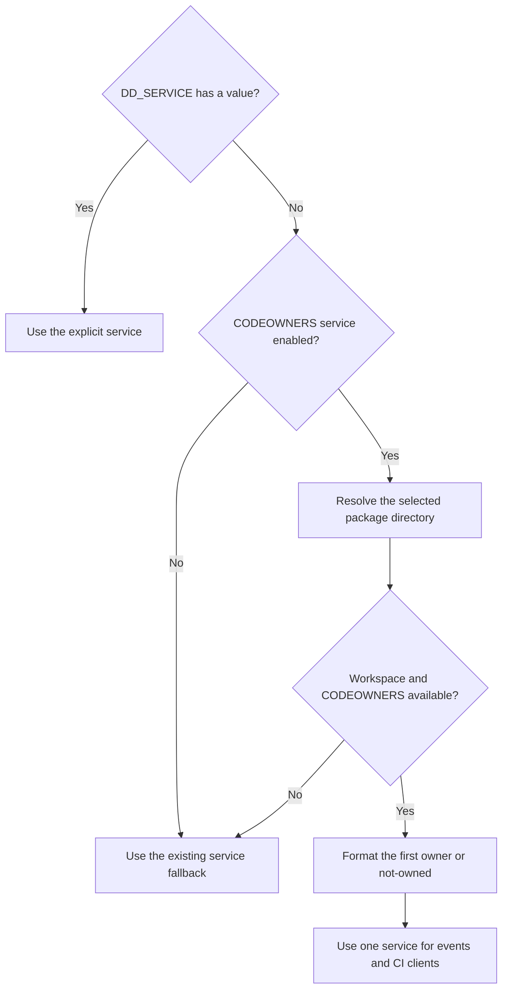

# Services from CODEOWNERS

Mini can name each test package's service from its CODEOWNERS entry. This is
optional: it is disabled by default, and a nonempty `DD_SERVICE` always wins.
The SDK backend keeps its existing service selection.

| Variable | Default | Meaning |
| --- | --- | --- |
| `DD_CIVISIBILITY_SERVICE_FROM_CODEOWNERS` | `false` | Enable package-based service selection in Mini. |
| `DD_CIVISIBILITY_SERVICE_FROM_CODEOWNERS_FORMAT` | `service-$(owner)` | Replace every literal `$(owner)` with the selected owner. |

For a CODEOWNERS entry such as `/payments/ @example/payments`, the default
service is `service-payments`. To use a repository prefix:

```sh
unset DD_SERVICE
DD_CIVISIBILITY_SERVICE_FROM_CODEOWNERS=true \
DD_CIVISIBILITY_SERVICE_FROM_CODEOWNERS_FORMAT='dd-go-$(owner)' \
ddto test -count=1 ./...
```

Quote the format with single quotes. Your shell must pass `$(owner)` literally;
Mini replaces that token and never executes a command. An empty format selects
the default. A format without the token produces that literal service name.

The selected rule follows the host-specific
[CODEOWNERS parser](codeownership.md). It supports exact package paths,
inherited directory rules, segment wildcards (`*`, `?`)
and recursive wildcards (`**`), preserving rule precedence. A terminal `/*`
selects direct children; a trailing `/` includes descendants. The first owner supplies the service name: `@organization/team`
becomes `team`, `@username` becomes `username`, and email owners keep their full
address. GitLab role owners such as `@@maintainer` become `maintainer`. Other
owners remain available in the existing `test.codeowners` tag.
A valid CODEOWNERS file with no matching owner uses `not-owned`, giving
`service-not-owned` with the default format.

Missing or unreadable CODEOWNERS, an unknown CI workspace, or a source package
outside that workspace retains the usual repository-name/`go.test` fallback.
The setting never changes `DD_SERVICE`, the test exit code, or file ownership
metadata. A service derived automatically retains
`_dd.test.is_user_provided_service=false`.

## Package identity and delivery

Each test binary has one service. Session, module, suite and test events use
that identity, as do settings requests, CI logs and telemetry. The result is
cached for that process; editing CODEOWNERS during a running test does not
rename its service.



`ddto` records the generated test package's source location during `init`,
before `TestMain` can change directories. The registration reads no source or
CODEOWNERS when disabled. Generated files remain identical for packages with
the same Go name, so preparation can keep sharing their backing file. Source
paths from `-trimpath` use the existing CI source resolver. The option also
works when a binary compiled with `-c` is executed later with the option enabled.
Manual `testopt.RunM` records its caller's location through the same path.

Normal delivery, deferred delivery and automatic goleak instrumentation keep
their existing lifecycle. This feature adds no build subprocess, package query,
`-toolexec` requirement, or external runtime dependency.

`DD_TRACE_DEBUG=true` includes the package path, selected owner and final
service in a runtime debug message.

## Maintaining the feature

- `internal/runner/run.go` emits the Mini registration call;
  `testopt/testopt.go` captures its caller once.
- `civisibility/utils/service_name.go` owns selection and process caching.
  `utils/codeowners_discovery.go` caches discovery; `utils/codeownership/` owns parsing,
  file selection and both kinds of queries.
- The CI bootstrap applies the selected name to the tracer. CI clients reuse
  it for settings, telemetry and logs; explicit client names retain priority.
- The two local configuration keys are read directly from the environment;
  the port has no generated configuration registry.

These SDK adaptations and their update checks are recorded in
[ADAPTATIONS.md](../internal/thirdparty/dd-trace-go/ADAPTATIONS.md#codeowners-derived-services).
`SOURCE.json` classifies the new helpers as local code and keeps the original
SDK paths and source hashes for adapted files.

The unit tests cover defaults, overrides, rule precedence, owners, formats,
missing inputs and concurrent readers. The integration tests compile and run
multiple packages with identical names, external tests, Testify and goleak.
They check standalone execution, `TestMain` directory changes, `-race`,
`-trimpath`, coverage, deferred delivery, settings, telemetry and logs against
HTTP receivers. They run in the existing compatibility workflow.

For an integration that previously forced a global `DD_SERVICE`, remove that
value from the Mini path before enabling this feature. Otherwise the explicit
service correctly takes precedence over CODEOWNERS.
