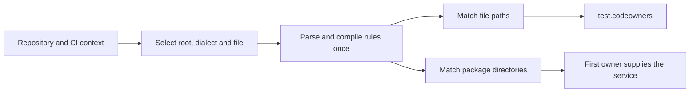

# CODEOWNERS parsing and maintenance

Mini uses one parser for test ownership and package service names. It supports
GitHub and GitLab dialects. The repository host selects the dialect first, then
the CI provider. If both are unknown, a lone `.gitlab/CODEOWNERS` selects GitLab;
otherwise the default is GitHub.

The implementation lives in
[`civisibility/codeownership`](../internal/thirdparty/dd-trace-go/civisibility/codeownership).
It is ported from dd-trace-dotnet master at
`843640c32bae5fe6dcdf790906f6431fe15f6973`. The package README maps original
files to Go files, and the SDK manifest records their original hashes under
`codeownership-dotnet`. Its Apache-2.0 license is kept beside the port.

## File selection and path rules

GitHub searches `.github/CODEOWNERS`, `CODEOWNERS`, then
`docs/CODEOWNERS`. GitLab searches `CODEOWNERS`, `docs/CODEOWNERS`, then
`.gitlab/CODEOWNERS`. A location belonging to the other dialect is ignored.
The first existing file is selected. A read error does not switch to another
file with different ownership.

Discovery recognizes both a `.git` directory and a worktree's `.git` file.
When the CI workspace is inside the repository, queries are rebased to that
repository root. Traversal segments are rejected. Go's existing source helpers
still resolve compiler paths, `-trimpath`, symlinks and package identity before
ownership lookup.

Patterns are case-sensitive on every platform. Queries accept Windows
separators; CODEOWNERS patterns keep backslashes as escapes. GitHub anchors
patterns with an interior slash to the repository root. GitLab only anchors
patterns beginning with a slash.

The dialects also differ in comments and precedence. GitHub uses the last
matching rule globally and permits ownerless rules to remove inherited owners.
Its inline comments are removed. GitLab evaluates sections independently,
combines their owners and applies exclusions within each section. Owners in
GitLab inline comment text are still parsed. Section defaults, optional
sections, approval-count headers, nested namespaces and recognized role owners
are supported. Approval counts do not affect CI ownership lookup.

## How the data flows



`CodeOwners` and `Ownership` keep their fields private. Parsed results are
immutable and safe for concurrent readers. `Ownership.Owners()` returns a copy;
`FirstOwner()` and `Tag()` read the prepared result without a copy.
`Tag()` contains the JSON array used by `test.codeowners`, or an empty string
for an ownerless match.

Owners are deduplicated in declaration order. GitLab combines sections in
their first-declared order, preserving owner order within each section. This
makes first-owner service selection deterministic. A single matching rule
reuses its prepared result. GitLab creates a union only when another section
contributes a new owner; duplicate-only sections reuse the first result.
The source cache retains the ownership result for each source file, and the
service is resolved once per test process.

`MatchDirectory` uses the same parsed rules and precedence as `Match`, with an
explicit directory target. A trailing slash includes the directory itself;
terminal `/*` selects direct children. Other directory patterns can be
inherited by descendant packages. For example, `/pkg/**/mobile*` can own a
package beneath `pkg/mobile-tests`. No synthetic filename is used to decide
the service. File queries retain the host's file-matching rules.

## Bounds and diagnostics

GitHub files larger than 3 MiB are ignored; GitLab does
not apply that file-size limit. The selected oversized file does not trigger
fallback to a lower-priority file. Valid lines longer than 64 KiB are accepted.

A pattern segment is limited to 1,024 UTF-16 units. Wildcard matching stops
after 65,536 steps per segment. Both limits match the .NET algorithm; the
path-level matcher has no extra limit. A limit produces a non-match, leaving
other rules eligible. No regular-expression engine runs during matching.

The matcher reads UTF-16 units without allocating a copy of the queried path.
For example, `?` does not match an entire emoji, while `??` can. GitLab email
limits and character-class ranges use the same units. Section names follow
.NET's ordinal case comparison, including its differences from Go's
`strings.EqualFold`. Small Unicode overrides keep the results stable between
Go 1.26 and 1.27; the saved reference checks their classifications and casing.

`Load` detects UTF-8, UTF-16 and UTF-32 BOMs and accepts CR, LF or CRLF line
endings. `Parse` receives decoded lines separated by LF, as .NET's in-memory
parser does. BOM decoding and the GitHub file-size limit belong to `Load`.
An ignored oversized file has zero parsing diagnostics, matching upstream.

Malformed rules are counted and skipped. GitLab's recognizable section headers
can still establish defaults while reporting malformed suffixes, following
the upstream parser. I/O errors return no partial ruleset and allow the CI
discovery layer to retry. Missing files and successfully parsed rules are
cached for the process. Debug logs report the selected file, dialect and
diagnostic count.

## CPU and allocation costs

Parsing compiles each segment once. File and directory targets share those
immutable tokens, with separate lists for their globstar requirements. Ordinary
ASCII literal segments use string equality. A rooted literal prefix is checked
once, including its segment boundary, before the remaining wildcard matcher.
Escapes and non-ASCII segments retain the UTF-16 matcher and its work bound.

Short UTF-16 inputs use stack storage. Longer inputs grow through `append`;
the parser retains no view of the reused storage. ASCII classification avoids
Unicode table searches; the exhaustive reference test checks both paths.
Valid GitLab owners keep their original bytes, role checks allocate no builder,
and ordinary pattern keys need no escaped copy.

A GitLab section without exclusions stops at its winning reversed rule.
Sections with exclusions still scan far enough to preserve sticky exclusions.
Small owner unions use a slice; at 16 owners, a map prevents quadratic lookups.
The returned order, defensive getters and JSON escaping remain unchanged.

[Performance measurements](codeownership-performance.md) contain the inputs,
repetitions, allocation counts and commands. These are parser measurements;
they do not predict an equivalent reduction in complete build or test time.

## Updating the port

1. Freeze a new dd-trace-dotnet default-branch SHA. Obtain the original files
   listed in `codeownership-dotnet`, including the license and specification
   tests, at both the recorded and candidate revisions.
2. Compare upstream changes with our port. Keep private immutable state,
   precompiled character classes, stable owner order and explicit directory
   queries. Review the Go source resolver separately; do not replace it with
   .NET-specific compiler-path handling.
3. Run the [reference harness](../scripts/codeownership/README.md). It checks
   original file hashes, runs the original parser tests with real assertions,
   and exports their inputs and results. Go compares owner arrays in their
   original order and checks diagnostics too. Keep the concurrency, work-limit,
   missing-file and immutable-result tests.
4. Update the feature SHA, original paths/hashes, local file records, license
   and test inventory. Use `--source-commit` when auditing this port; the main
   SDK revision remains independent.

From the repository root, using an archive whose directory structure matches
the upstream repository:

```sh
python3 scripts/upstream.py diff --library dd-trace-go \
  --source "$NEW_DOTNET" --source-commit "$RECORDED_DOTNET_SHA"
python3 scripts/upstream.py patch --library dd-trace-go \
  --source "$OLD_DOTNET" --source-commit "$RECORDED_DOTNET_SHA"
python3 scripts/upstream.py verify
```

After reviewing and updating the original-source records, rehash against that
exact .NET archive. Review changes to CI adapters against the SDK archive too;
each revision is checked separately.

## Validation

`TestDotNetSpecification` covers every method in `CodeOwnersSpecTests.cs` and
`CodeOwnersTests.cs`: 72 methods, 137 executions with theory parameters. The
[inventory](../internal/thirdparty/dd-trace-go/civisibility/codeownership/testdata/dotnet-tests.json)
lists each method and the hashes of its original inputs. The compressed corpus
also retains the large tests and their parsing diagnostics.

`TestDotNetDifferential` compares 1,800 additional rulesets and 18,000 file
queries with the original .NET parser. `TestDotNetUnicodeProperties` compares
all UTF-16 chars and the recorded supplementary case mappings. Separate tests
cover simultaneous readers, directory targets, file encodings, discovery and
immutable results. The [harness guide](../scripts/codeownership/README.md)
explains how to regenerate and inspect the corpus.

These are parser/matcher checks. Mini retains its Go compiler-path resolver;
.NET-specific source-path and repository-wide C# checks are not presented as
ported parser tests. Workspace boundaries and Go build variants are checked
by the integration tests below.

The integration suite checks actual HTTP payloads. It exercises GitHub and
GitLab, file-owner tags and package services, normal and deferred delivery.
The compiled-binary cases also cover Testify, goleak, external tests, coverage,
`-race`, `-trimpath` and directory changes in TestMain.

```sh
go test -race ./internal/thirdparty/dd-trace-go/civisibility/codeownership
go test -race -run 'Test(GetCodeOwners|CodeOwners)' \
  ./internal/thirdparty/dd-trace-go/civisibility/utils
go test -run '^TestMiniCodeOwners' ./integration
go test -run '^$' -fuzz FuzzMatch -fuzztime 10s \
  ./internal/thirdparty/dd-trace-go/civisibility/codeownership
```

These tests run in the existing compatibility workflow on Linux, macOS and
Windows. A future parser update must preserve the host-specification
expectations, even when an older comparison SDK has a different result.
