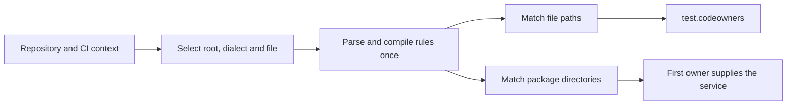

# CODEOWNERS implementation

`internal/thirdparty/dd-trace-go/civisibility/utils/codeownership` is the SDK package
that parses ownership rules. It has no dependency on CI initialization.
CI Visibility uses it for `test.codeowners` and, when enabled, for package
service names. [Service configuration](codeowners-service.md) describes the
environment variables and the priority of an explicit `DD_SERVICE`.

## Discovery and matching

`Discover` finds the repository root from the workspace, including Git
worktrees whose `.git` is a file. It selects a dialect from the repository URL, then the CI provider. A lone
`.gitlab/CODEOWNERS` file selects GitLab when neither identifies the host.

| Dialect | File priority | Rule behavior |
| --- | --- | --- |
| GitHub | `.github/CODEOWNERS`, `CODEOWNERS`, `docs/CODEOWNERS` | Last matching rule wins. An ownerless rule clears ownership. Inline comments are supported. |
| GitLab | `CODEOWNERS`, `docs/CODEOWNERS`, `.gitlab/CODEOWNERS` | Sections match independently and combine their owners. Defaults, exclusions, roles and character classes are supported. |

The resolver rebases paths to the repository root and rejects traversal outside
it. The CI adapter in `utils/codeowners_discovery.go` caches both successful
lookup and missing files for the process. A read error leaves the lookup eligible
for a retry. A selected oversized GitHub file yields empty rules; it does not
fall back to another file.



## Package contract

`Load` reads a file. It recognizes UTF-8, UTF-16 and UTF-32 BOMs and normalizes
CR, LF and CRLF endings. `Parse` accepts decoded UTF-8 rules separated by LF.
Both return an error on read failure without returning a partial ruleset.
Malformed lines are counted by `Diagnostics` and skipped or retained with only
their recognized fields. GitHub files larger than 3 MiB are ignored; GitLab has
no file-size limit. Valid lines longer than 64 KiB are accepted.

`Match` takes a repository-relative file path. It accepts leading slashes and
Windows separators. Paths are case-sensitive. GitHub patterns with an interior
slash are rooted; GitLab patterns without a leading slash can match at any depth.
`**` is a globstar only as a whole path segment. GitLab's terminal `**` matches
one segment, while `**/` can match nested directories.

`MatchDirectory` selects ownership for a package without guessing a filename.
A trailing slash includes the directory itself; terminal `/*` selects direct
children. Other directory patterns can be inherited by descendant packages.
For example, `/pkg/**/mobile*` can own `pkg/mobile-tests/subpackage`.

Matching uses Go runes and the Unicode tables from the Go toolchain. `?` matches
one rune, including an emoji. A combining mark is a separate rune. Character
class ranges also use runes. GitLab section names are keyed with
`strings.ToUpper`; owner classification uses `unicode`. Role names are ASCII
identifiers with ASCII case variants. No runtime-specific Unicode tables are
stored in the package.

Patterns are limited to 1,024 runes per segment. Matching stops after 65,536
steps per segment, so pathological wildcards cannot run indefinitely. Exceeding
a matching limit yields a non-match and leaves other rules eligible.

`CodeOwners` and `Ownership` have private, immutable fields and support
concurrent readers. `Owners` returns a copy, `FirstOwner` returns the first
owner, and `Tag` returns the prepared JSON array for `test.codeowners`. A matching
ownerless GitHub rule returns `true` and an empty ownership result.

Owners keep declaration order. GitLab combines sections in first-declared order
and deduplicates owners without changing their order. This makes first-owner
service selection deterministic.

## Maintenance

This package is maintained with the CI Visibility SDK code. Its files are
recorded as local SDK additions in `dd-trace-go/SOURCE.json`. When an SDK revision
includes the package, update those entries to its original Go paths and hashes
using the [SDK update procedure](maintenance.md). Source attribution belongs in
the repository `NOTICE`; the SDK's Apache-2.0 license covers the package.

Keep the matching costs low:

- Compile pattern tokens once and share them between file and directory queries.
- Keep ASCII literal and rooted-prefix matching free of allocations.
- Stop at the winning GitLab rule only in sections without exclusions.
- Reuse immutable ownership results; create a section union only for new owners.
- Preserve stable owner order when large unions switch from slices to maps.

## Tests

`github_test.go` and `gitlab_test.go` contain readable rule tables with expected
owners and diagnostics. `example_test.go` shows usage and tests Unicode paths
and complete sample files in `testdata`. The remaining tests cover immutable
results, concurrent readers, work limits, long inputs, duplicate compaction,
encodings, discovery and workspace boundaries. Fuzzing checks deterministic
matching without external reference tools.

The integration suite checks actual HTTP payloads, source ownership and package
services in normal and deferred delivery. Compiled binaries also cover Testify,
goleak, external tests, coverage, `-race`, `-trimpath` and directory changes in
TestMain. The compatibility workflow runs these tests on Linux, macOS and Windows.

```sh
go test -race ./internal/thirdparty/dd-trace-go/civisibility/utils/codeownership
go test -race -run 'Test(GetCodeOwners|CodeOwners)' \
  ./internal/thirdparty/dd-trace-go/civisibility/utils
go test -run '^TestMiniCodeOwners' ./integration
go test -run '^$' -fuzz FuzzMatch -fuzztime 10s \
  ./internal/thirdparty/dd-trace-go/civisibility/utils/codeownership
```
