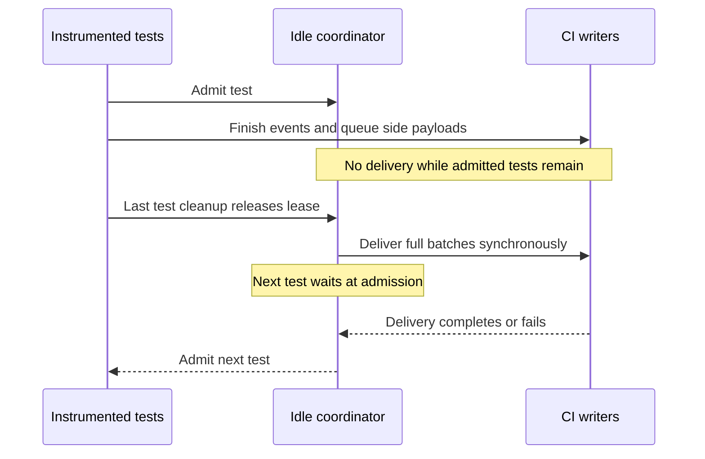
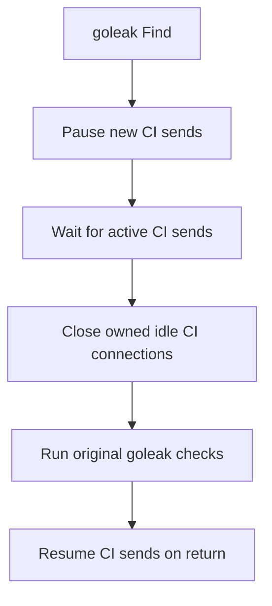
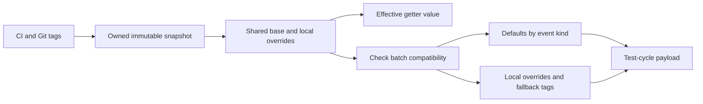

# Delivery checkpoints and goleak

These features belong to Mini. The `sdk` backend keeps the upstream SDK's
delivery behavior. Neither feature adds a runtime module dependency.

## Deferred delivery

Set `DD_CIVISIBILITY_DEFERRED_DELIVERY=true` before running the test binary:

```sh
DD_CIVISIBILITY_DEFERRED_DELIVERY=true ddtest test --runtime=mini -count=1 ./...
```

The default is ordinary delivery: finishing an event never performs network
I/O, and up to eight background senders deliver full batches. When delivery falls
behind, a finishing test waits for a sender rather than losing events; after a
failed delivery it drops events beyond the queue bound instead. With the variable
enabled, delivery runs between completed test groups, and remaining data is sent
at session close. Sequential tests can have a delivery checkpoint after each
test. Parallel tests continue together until the whole group finishes; the next
group waits while delivery completes.

Deferred mode buffers test-cycle events, coverage and diagnostic logs while
instrumented tests are active, and sends nothing concurrently with them. A test holds
an activity lease through its body, cleanup callbacks and parallel descendants.
The lease is acquired inside the existing instrumented function, preserving the
SDK's function-identity checks and retry accounting.



Nested tests and concurrent retry attempts use the same process-wide coordinator.
Waiting for delivery inside an active group would deadlock the test scheduler.
The coordinator starts no goroutines. Initial repository upload completes
during initialization in this mode. In both modes, settings and telemetry
startup run concurrently, and initialization waits for both before admitting
the first test. This also applies to cached settings and request failures.
`app-started` goes alone. Other initial telemetry payloads are snapshotted and
queued for the next regular flush or shutdown, retaining their timestamps and
order. A deferred flush runs at an idle checkpoint once its interval has
elapsed; ordinary telemetry keeps its periodic worker. Final shutdown drains
pending telemetry in both modes. `go test` does not count the joined settings
and `app-started` requests in any test's duration.

A checkpoint delivers only full payloads: sealed test-cycle batches (the event
count or 2.5 MiB threshold) and full coverage/log payloads. Partial payloads
wait for the end of the session, so a serial suite sends one payload per full
batch rather than one per test.

A checkpoint, deferred `Flush` or `Close` sends up to eight test-cycle payloads
at once and finishes every request before it returns, so the next test starts
with no CI delivery in flight. Payloads sent together can arrive in any order;
each keeps its events in order.

Coverage counter snapshots bracket the initial attempt, including its user
cleanups and descendants. The final snapshot runs in an early-registered
`t.Cleanup`, after user cleanups in Go's reverse registration order. Deferred
delivery postpones their processing as well as their upload until the whole
test group is idle. It never captures counters from a later test. In ordinary
delivery, processing finishes in the after hook when telemetry or debug logging
needs wall-clock timestamps; with both disabled it runs asynchronously.
Completed coverage workers exit before session shutdown. Serialization durations
use a monotonic origin, while event timestamps keep their wall-clock meaning.

A failed startup request keeps its payload for the next flush under the existing
endpoint and queue rules. Startup creates no worker. Ordinary mode then permits
periodic telemetry and CI sends during tests; use deferred delivery to keep all
queued processing and sends outside admitted test groups.

Each telemetry response is consumed and closed before its flush returns, including
error responses before endpoint fallback. The configured client timeouts bound
HTTP completion. This changes delivery timing, not the event contents or the
settings needed to choose test features.

This trades memory and delivery latency for isolation from test bodies. The
pending queue can grow throughout a parallel group; its total memory is not
bounded by `MaxEvents`. Each outgoing test-cycle payload still obeys the event
count limit, 2.5 MiB flush threshold and 5 MiB uncompressed intake limit. A failed
flush preserves unsent chunks in order. Successfully sent chunks are not retried.
Final abandonment reports drops per payload, not per event.

An explicit `Flush` during an active test returns without waiting for that test;
the next checkpoint then also delivers the partial test-cycle batch. `Close` is terminal and flushes
directly. Panic and signal shutdown force a checkpoint so writer shutdown can
join pending batches. A user-created explicit client therefore remains responsible
for its `Close` timing. Deferred mode is not a guarantee that no goroutine exists
in the test process: CI still installs its signal handler, and tests may start
their own workers.

`Flush` honors its context while waiting for deferred test admission and the
send lock. HTTP delivery also honors cancellation while goleak has paused new
sends. Canceling either wait starts no request and leaves no waiter goroutine.

`Client.Close` returns a final delivery error, including a failed background
payload that was already in flight when closing started. Rejected payloads are
counted once. The runtime logs this error and any dropped events; `ddtest`
returns the `go` command's exit code. A later empty `Close` does not report an
older failure again.

## Automatic goleak integration

When the selected Mini test graph reaches `go.uber.org/goleak`, `ddtest` prepares
its `Find` entry. This is automatic in both ordinary and deferred delivery.
Calling `VerifyNone`, `VerifyTestMain` or a helper in another module reaches that
same entry. An unused requirement in `go.mod` does not activate the integration.
The minimum supported version is v1.3.0, the first with `IgnoreAnyFunction`;
v2 needs a separate review. Preparation checks the selected version and entry
signature before a warm cache can skip compilation. The current version fixture
uses v1.3.0. An unsupported version or entry produces a warning and the build
continues without the integration; its leak checks can then report CI workers.



The shim adds exact function filters for the CI signal handler, telemetry ticker,
blocked CI senders, Mini's background and checkpoint test-cycle senders,
diagnostic log sender and coverage sender. It preserves the
caller's options and goleak's original validation, retry loop and error result.
Waiting for an active CI request can add its remaining HTTP/retry time before
goleak starts that loop; the checkpoint waits for delivery rather than canceling it.
It also waits, for up to one minute like the SDK's own end-of-session wait, for
the asynchronous settings start-up and repository upload, including their git
subprocesses, which would otherwise look like leaks.
It does not use `IgnoreCurrent`, ignore `net/http` functions, or suppress arbitrary
goroutine snapshots. Standard HTTP transports are cloned for Mini's ownership;
closing them does not close the caller's default transport. Custom RoundTrippers
are not closed by leak checkpoints; they retain their own lifecycle and may
require caller-managed cleanup.

`VerifyNone` itself cannot assign other parallel tests' goroutines to their owners.
Use `VerifyTestMain` for a parallel suite, following goleak's normal contract.
This shim excludes CI workers; it does not change that limitation or forgive test
leaks. Integration tests include a blocked test goroutine and a user-owned idle
HTTP connection as negative controls.

## Tool dispatch and cache identity

Go rejects overlays beneath `GOMODCACHE`, so goleak uses the existing selective
compiler wrapper. One shared graph query discovers Testify and goleak, including
external helpers. Builds needing neither library nor the coverage bridge omit
`-toolexec`. Unrelated tools bypass plan loading; compiler and linker version
probes keep Go's native identity.

Testify's fingerprint travels through `testing` export data. Goleak does not
import `testing`, so its prepared source and hook are hashed into a package-only
`-gcflags=go.uber.org/goleak=...` sentinel import directory. Go supplies imports
through `-importcfg`, so the sentinel is not read. Existing applicable user
compiler flags are retained. Only goleak's action key needs this additional marker;
there is no persistent POC cache. Covered goleak inputs are edited after Go's
coverage generation, preserving the original coverage layout.

## Payload-level common metadata

Mini writes test-cycle envelope metadata. The `"*"` entry contains
`language`, `runtime-id`, `library_version` and, when configured, `env`.
Event-kind entries carry `test_session.name`. This applies defaults across a
payload without copying those strings into every event.

CI, Git, OS and runtime strings share an immutable base across CI spans.
This includes `ci.*`, `git.*`, `os.*`, `runtime.*` and `_dd.ci.env_vars`. Getters
read an event's own value first, then that base. A numeric override masks the
base; later text replaces the metric. Finishing an event seals its local maps
without copying or changing the common snapshot.



At delivery, homogeneous test/session/module/suite events use their event-kind
metadata entry. CI fields stay out of `"*"`, so ordinary child spans do not gain
CI tags. An override stays on its event and takes precedence. If any event
overrides a common key with text or a metric, that key stays out of the new
defaults for its kind in that batch. Peers carry the string locally instead.
This avoids numeric inheritance and excludes an unused original string from the
payload and its byte budget, even when the original value was very large.
Different snapshots or an event with no shared base trigger the same local
fallback for that event kind; other kinds can still share their defaults.

The SDK's tag API publishes updates through `AddCITags` and `AddCITagsMap`, and
also exposes a mutable cached map. Internal readers use `GetCITagsReadOnly`,
which reuses the immutable snapshot until an explicit update. Once `GetCITags`
exposes the current mutable map, snapshot lookup checks its contents on every
read so even later direct edits remain visible. A changed snapshot
gets a new revision; cached, UTF-8-truncated options are rebuilt once. Existing
spans keep their old values, including when later feature discovery changes tags.
Concurrent direct writes to the exposed SDK map remain unsupported; use its
synchronized update APIs.

Bazel payload-file mode applies its CI/Git/OS/runtime filter before a shared base
is created. Numeric metrics, hierarchy IDs, capabilities and test-specific tags
keep their existing fields. Byte accounting includes the shared strings and
envelope overhead conservatively; repeated values can shrink the actual payload
without bypassing its uncompressed limit. Projection never mutates a sealed
event, including on delivery failure and retry.

Loopback and Bazel tests compare effective values against the frozen SDK while
also retaining raw payloads to check placement. Their comparator resolves only
these declared shared fields and rejects numeric/default collisions. Deployed
Agent/intake acceptance remains a separate check.

## Delivery combinations

| Goleak in the selected Mini graph | Deferred delivery | Behavior |
| --- | --- | --- |
| No | Off | Ordinary batching and asynchronous CI workers. No leak-check checkpoint runs. |
| Yes | Off | Ordinary delivery until `Find` runs; that check waits for sends, pauses new sends, closes owned idle connections and adds exact CI worker filters. |
| No | On | Queue during admitted tests; idle checkpoints deliver full payloads, and the next test waits for that delivery. No goleak filters are installed. |
| Yes | On | Idle delivery plus the same automatic `Find` checkpoint and filters. |

The lightweight HTTP send gate exists in Mini regardless of goleak detection.
Only an instrumented `Find` pauses that gate for leak checking. Deferred delivery
controls when CI work runs; goleak instrumentation controls its leak snapshots.
Neither option ignores leaks or idle connections owned by the tests themselves.

## Maintenance and proof

Review [`cidelivery`](../internal/cidelivery/idle.go),
[`goleak transformation`](../internal/instrument/goleak.go) and
[`library preparation`](../internal/runner/goleak.go) together. If a transformation
changes without changing its generated source, bump its fingerprint contract.
The SDK-port changes are recorded in
[`ADAPTATIONS.md`](../internal/thirdparty/dd-trace-go/ADAPTATIONS.md).

`TestMiniGoleakIntegration` runs ordinary/deferred delivery, external helpers,
invalid options, parallel TestMain, explicit delivery, race and library coverage,
with per-test coverage enabled by the local settings endpoint.
`TestGoleakCacheAndWarmVersionGuard` checks unchanged cache reuse, a changed
goleak source with unrelated standard packages still cached, and rejection of an
unsupported version with unchanged cached source.
`TestDeferredDeliveryParityMatrix` compares 17 CI feature combinations against
the SDK/Orchestrion reference; `TestDeferredDeliveryTestifyParity` adds seven
Testify combinations. Queue tests check order, payload limits, retained failures,
concurrent admission and idempotent release. These are local protocol and behavior
checks; deployed Agent/intake acceptance requires separate evidence.

`TestMiniCoverageWithGlobalTimeChanges` exercises atomic coverage while the test
changes `time.Local`, with 4/32 CPUs and both telemetry/delivery settings. It
compares CI attributes and coverage bitmaps with an SDK run of the same test
paths that leaves the local zone unchanged. Coverage and telemetry lifecycle
tests check worker completion and response draining separately.
`TestStartupTelemetrySendsBeforeTests` checks that `StartApp` returns only after
its startup request, with configuration, failed-request retry, a concurrent
session close and a failed initialization, against a real loopback HTTP server
in both modes.

`TestCommonTagsWireOverridesAndGetters` checks real decoded requests in both
delivery modes. Mixed-snapshot, concurrent sealed-map and byte-accounting checks
live in `internal/minitracer/common_tags_test.go`. The SDK-port tests cover late
updates, direct cached-map edits, Unicode truncation and Bazel filtering.
The [latest runtime comparison](benchmarks.md#runtime-of-the-prebuilt-test-binaries)
records complete test execution, delivery, memory peaks and wire sizes.
