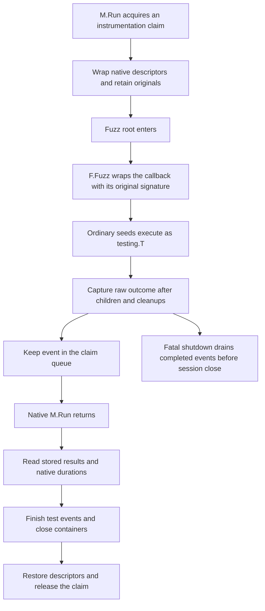
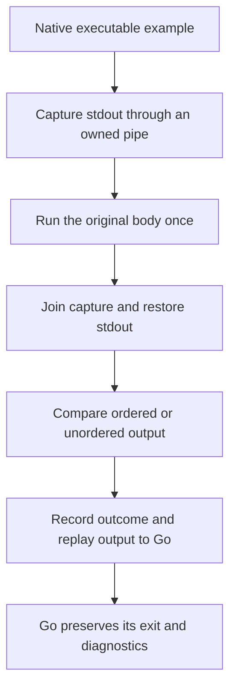

# Go Fuzz and executable Examples

Mini uses the Fuzz/Examples support from [dd-trace-go PR #5442](https://github.com/DataDog/dd-trace-go/pull/5442),
integrated in `main` at `870449702d0a0cea26a6223eefe2f0a198069d79`. All CI features
and differential tests use this [SDK base](../internal/thirdparty/dd-trace-go/SOURCE.json).
This feature adds no external runtime dependency.

## What gets reported

An ordinary `go test` emits one test event for each `Fuzz*` root and each
seed that Go executes, named `FuzzName/seed#N`. Executable examples emit one
test event. Go decides which examples are executable from their output comments;
examples without an output directive do not run or emit a test event.

During `-fuzz`, the coordinator emits the selected root and any ordinary seed
runs of non-selected targets. Generated mutations do not become CI tests.
Worker processes bypass CI initialization and emit no session. Go owns mutation
execution, shrinking and corpus storage.



Normal event draining waits for `M.Run` to return. Go writes its private duration
without the common mutex; reading it during an active root would race. Fatal
shutdown reads protected failure/skip flags and uses the captured finish time.
Raw outcomes remain available when Test Management changes native failure to skip.
The queue flushes every 256 events so a large corpus does not overflow the SDK's
1,000-entry queue. Each event and container closes once.

Examples retain native ordered/unordered comparison, stdout replay, panic and
Goexit behavior. A second pipe captures output for CI logs. Its reader is joined
and its descriptors are closed before the wrapper returns. Quarantined examples
use a joined goroutine to contain Goexit; ordinary examples keep their native
execution goroutine. `js` and `wasip1` retain native example execution without CI
wrapping because `os.Pipe` is unavailable.



Disabled/quarantined/attempt-to-fix metadata is supported. These workloads do
not enter ATR, EFD or attempt-to-fix retry loops, and ITR does not skip their
roots. That is the SDK PR contract. Atomic builds report native session coverage.
Fuzz roots/seeds and examples retain the SDK's per-test coverage upload behavior;
ordinary tests remain covered by the existing collector.

## Deferred delivery and goleak

`DD_CIVISIBILITY_DEFERRED_DELIVERY=true` keeps the fuzz root admitted until all
seeds, parallel descendants and root cleanups complete. A finished seed cannot
open an idle sending window while its root is still active. Examples hold the
same admission through output capture and event finalization. Final queue draining
uses the existing delivery checkpoints. [Delivery](delivery.md) explains their
HTTP and telemetry ownership.

Detecting goleak enables its selective wrapper in either delivery mode. Its
existing filters cover CI senders and signals; this feature also excludes the
owned fuzz-root waiter, the CI example reader, Go's `testing.runExample.func1`
pipe reader and the waiter for a managed example. These filters name specific
functions. They do not ignore all testing or HTTP goroutines. Negative fixtures
require a user-created fuzz goroutine and a user HTTP connection to be detected.

## Proof and reproduction

The differential test retains the SDK fixture's assertions and workloads in
[testdata/fuzzexamples](../testdata/fuzzexamples/SOURCE.json), with the original
license, source paths and hashes. Its intake additionally exports wire events.
The harness compares every CI attribute and count, and checks hierarchy IDs.
Library version and relocated internal stacks have documented normalization;
application functions and source lines remain strict.

Parallel-duration checks compare Go's printed time with the event at the same
two-decimal precision. The shared SDK/Mini fixture treats Windows' `-0.00s`
as rounded zero. Negative nonzero values and missing results still fail; virtual
clock tests check the exact wait subtraction independently of that formatting.

The matrix has 16 scenarios, manual/automatic entrypoints, and Mini normal/deferred
delivery: **64 comparisons**. Automatic SDK means the frozen Orchestrion binary
and the exact PR's advice. Automatic Mini means this checkout's `ddto`.
Counts below are sessions/modules/suites/tests/spans. Manual and automatic
instrumentation can differ because automatic hooks see nested `T.Run` calls.
Mini is compared with the matching SDK mode.

| Scenario | Contract | SDK = Mini manual | SDK = Mini automatic |
| --- | --- | --- | --- |
| `pass` | Roots, named seeds, argument types, ordered/unordered output; examples without output do not run | 1/1/1/11/0 | 1/1/1/11/0 |
| `fuzz-failure` | A failing seed also fails its root | 1/1/1/11/0 | 1/1/1/11/0 |
| `seed-lifecycle` | Failure/skip during cleanup and a parallel seed descendant | 1/1/1/6/0 | 1/1/1/7/0 |
| `root-cleanup-goexit` | Completed fuzz body with Goexit in root cleanup | 1/1/1/2/0 | 1/1/1/2/0 |
| `fuzz-missing-call` | Native error when a root returns without Fuzz, Fail or Skip | 1/1/1/1/0 | 1/1/1/1/0 |
| `example-mismatch` | Output mismatch preserves native failure and diagnostic | 1/1/1/11/0 | 1/1/1/11/0 |
| `example-panic` | Panic preserves the native exit and error | 1/1/1/11/0 | 1/1/1/11/0 |
| `example-panic-nil` | panic(nil) with GODEBUG=panicnil=1 | 1/1/1/1/0 | 1/1/1/1/0 |
| `test-management` | Disabled, quarantined and attempt-to-fix roots, seeds and examples; one execution | 1/1/1/19/0 | 1/1/1/19/0 |
| `active-fuzz` | One campaign iteration, one worker, and ordinary seeds for a non-selected target | 1/1/1/3/0 | 1/1/1/3/0 |
| `filtered` | Only the selected ordinary test runs | 1/1/1/1/0 | 1/1/1/1/0 |
| `fatal-shutdown` | Panic/Goexit precedence, cleanups and containers during fatal exit | 17/17/17/33/0 | 17/17/17/49/0 |
| `skip-lifecycle` | Skip reasons and native skip propagation | 29/29/29/43/0 | 29/29/29/71/0 |
| `parallel-duration` | Native duration excludes the drained parallel wait | 2/2/2/4/0 | 2/2/2/4/0 |
| `corpus-lifecycle` | 10,000 seeds, pass and skip corpora, counts and retained memory | 3/3/3/20003/0 | 3/3/3/20006/0 |
| `repeat-run` | The same M.Run executes again with original descriptors restored | 1/1/1/3/0 | 1/1/1/3/0 |

Seven additional scenarios compare atomic coverage, real production counters,
session percentages and coverage upload bitmaps in both delivery modes. Goleak
runs against a race-enabled covered consumer, including negative leaks. Linux
differential jobs cover Go 1.26 and 1.27, and Go 1.27 also with `-race`; macOS
and Windows jobs cover Go 1.27. Go 1.25 and the nightly tip job run the native Mini
lifecycle fixtures. The full
SDK requires Go 1.26, and the frozen Orchestrion reference fails on tip.
Inspect the current PR's checks for platform proof. A bounded campaign is a
regression gate, not evidence of every long-running fuzz workload or acceptance
by a real Datadog intake.

```sh
go -C testdata/orchestrion build -mod=readonly -o "$(go env GOPATH)/bin/orchestrion" github.com/DataDog/orchestrion
ORCHESTRION_BIN="$(go env GOPATH)/bin/orchestrion" \
  PARITY_REPORT_PATH="$PWD/artifacts/parity.json" \
  go test -v -count=1 -timeout=30m ./integration
python scripts/parity_report.py artifacts/parity.json --output artifacts/parity.md
```

The compatibility workflow writes per-case times and all 64 + 14 combinations
to its report and rejects missing, duplicated or failing rows. Times measure
prebuilt binaries, including startup and delivery, and are not compile benchmarks.
Use `PARITY_TEST_MODE=race` with `go test -race` to compile both references with
race support. On Windows, set `ORCHESTRION_BIN` to `orchestrion.exe`.

The SDK reference is downloaded at the recorded module version. The harness
rejects version upgrades and replacements, so a modified checkout cannot
silently substitute for the oracle. Each mock intake has its own read cache. `app/cache_control_test.go` applies the
inherited root before the child/worker branches of `TestMain`, so subprocesses
use the same intake-owned cache. A new server gets a new root even if its TCP
port is reused. The cache stays enabled. The harness rejects a child falling
back to the default user cache, and tests distinct roots and environment restore.
Fixture attributes require LF on every platform so hashes check the same bytes.

## Manual entrypoints

Without the CLI, use `testopt.RunM` in `TestMain` and `testopt.GetFuzz(f).Fuzz`
for the fuzz callback. Use the original `f` for `Add`, cleanup and other native
methods; the adapter supplies `Fuzz`. Automatic builds
recognize their hooks, so the manual adapter does not instrument twice.

```go
func TestMain(m *testing.M) { os.Exit(testopt.RunM(m)) }

func FuzzValue(f *testing.F) {
    f.Add("seed")
    testopt.GetFuzz(f).Fuzz(func(t *testing.T, value string) {
        // The native testing callback signature and input remain unchanged.
    })
}
```

## Offset access and maintenance

`reflection_offsets.go` discovers private testing fields once per process.
`fuzz_offsets.go` validates that F embeds T's exact common type at offset zero,
then records F's own `tstate` and `fuzzCalled` offsets. Hot result collection
reads the cached typed fields under the native mutex. Reflection is still used
to preserve arbitrary supported fuzz callback signatures; it is not used to
look up private fields for each seed.

Private-field lookup is outside the seed loop after offset initialization.
Callback adaptation still needs reflection to retain each native function
signature. Keep result collection and callback adaptation separate when
profiling; a faster lookup does not establish a whole-campaign improvement.

When updating the SDK, review [ADAPTATIONS.md](../internal/thirdparty/dd-trace-go/ADAPTATIONS.md),
the historical `feature_ports` entry, the current fixture hashes, both delivery modes
and the goleak filters. Run the layout-drift tests and the fatal-duration race
test before the full differential matrix. Generate the adaptation patch against
the recorded SDK base:

```sh
python scripts/upstream.py patch --library dd-trace-go --source /path/to/sdk \
  --source-commit 870449702d0a0cea26a6223eefe2f0a198069d79 > fuzz-examples.patch
```
