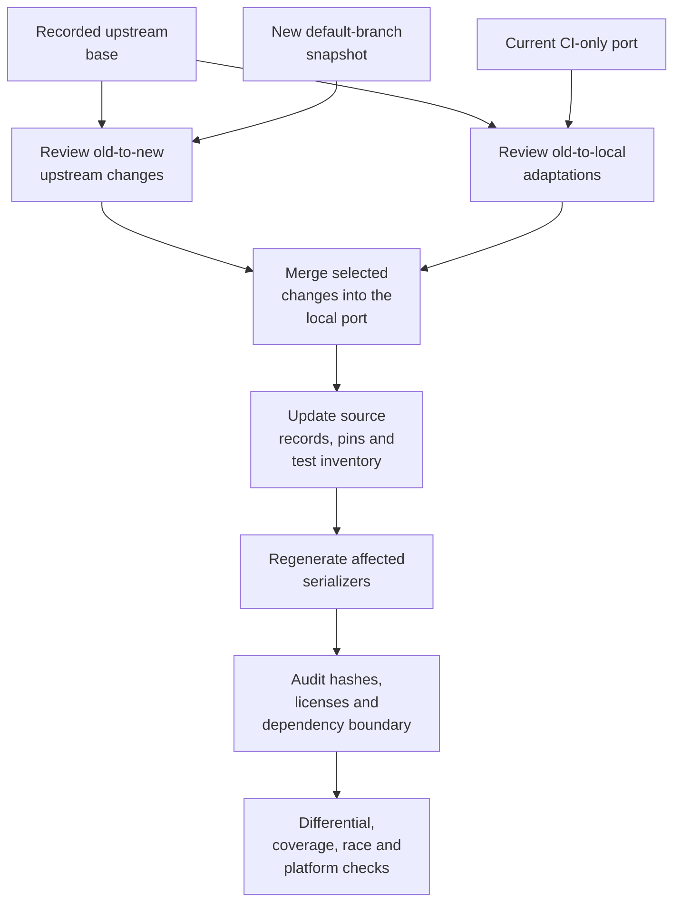

# Maintenance and source updates

The files under `internal/thirdparty` are maintained source subsets. We own their
adaptations and tests. Each origin records an exact upstream commit so a later
update can compare the original code with both the new source and our port.

An SDK update must preserve CI behavior and the Mini runtime's dependency
boundary. Review upstream changes in removed APM code too when they affect a
shared helper or the CI wire schema.

## Source ownership and records

[`internal/thirdparty/README.md`](../internal/thirdparty/README.md) lists the
origins and revisions. Every origin has its original licenses and a
`SOURCE.json` manifest. Paths in that manifest are relative to the origin
directory and use forward slashes.

| Record | Meaning |
| --- | --- |
| `repository`, `commit`, `version` | Upstream repository, exact 40-character Git SHA and module version |
| `files[].path`, `sha256` | Local file and its exact byte hash |
| `source_path`, `source_sha256` | Original upstream path and bytes at the recorded base |
| `role: upstream` | A copied file that matches upstream |
| `role: adapted` | A derived file with local changes |
| `role: local` | POC-owned code, test or documentation beside the upstream package |
| `licenses` | License files that must remain present and recorded |
| `feature_ports` | Separately frozen feature PRs, original paths/hashes and local destinations; select their SHA with `--source-commit` |
| `additional_sources` | Upstream inputs used for an extraction or schema outside a direct file copy |

When a feature PR lands in the selected base, its ordinary file records use that
base. Keep its original `feature_ports` revision for comparison history and record
the merge under `integrated_commit`. Advance the feature's differential fixture
to the same SDK version; do not apply the feature delta a second time.

The SDK's [test inventory](../internal/thirdparty/dd-trace-go/TESTS.json) records
ported assertions and adaptations. The platform
[extraction inventory](../internal/thirdparty/xsys/EXTRACTION.json) identifies
selected declarations and their origins. These records need to agree with
`SOURCE.json` after an update.

The SDK's [performance adaptation record](../internal/thirdparty/dd-trace-go/ADAPTATIONS.md)
explains each hot-path change, its ownership/lifetime rules and the regression
checks required during synchronization. Review it alongside the generated patch;
hashes identify changed bytes but do not explain why those changes exist.

SDK `internal/<path>` maps to `internal/thirdparty/dd-trace-go/<path>`.
Its `ddtrace/ext/` subtree keeps that relative path. Removing only the top
upstream `internal/` avoids a second Go visibility boundary. Codec files retain
`msgp/msgp/` and the original `fwd/` root layout; platform code keeps
`xsys/windows/`, `windows/registry/` and `unix/`.

Code outside these origins has a separate owner. The native event schema in
[`events.go`](../internal/minitracer/events.go) is derived from the SDK's
`ddtrace/tracer/civisibility_tslv.go`, recorded under `additional_sources`.
It must be reviewed even when the copied CI files are unchanged.

## Audit commands

Run these from the repository root with Python 3:

```sh
python3 scripts/upstream.py verify
python3 -B -m unittest discover -s scripts -p 'test_upstream.py'
```

`verify` checks recorded local hashes, exact commit syntax, licenses, safe paths
and unregistered Go or assembly sources. It runs offline. It does not contact
upstream to prove the supplied commit's contents or discover new upstream files.

Given explicit upstream snapshots:

```sh
python3 scripts/upstream.py diff --library dd-trace-go --source "$NEW_SDK"
python3 scripts/upstream.py patch --library dd-trace-go --source "$OLD_SDK" > "$UPDATE_DIR/local-adaptations.diff"
```

`diff` reports changed or missing selected source inputs. A successful exit can
still report changed files; read the output. New upstream files outside the
selection are not listed. `patch` first checks that the supplied old snapshot
matches the recorded hashes, then writes the adaptation diff with original and
local paths. Binary fixtures remain covered by hashes.

After reviewing a local change against the same upstream base:

```sh
python3 scripts/upstream.py rehash --library dd-trace-go --source "$OLD_SDK"
python3 scripts/upstream.py verify
```

`rehash` changes local hashes only. It preserves the upstream revision and
original hashes, and refuses missing files, unregistered code and changed
license texts. It cannot advance the SDK base. Origin READMEs and local test
inventories are also hashed; editing them needs the same review and rehash.

## Updating the SDK base

Prepare an isolated POC worktree and an update directory outside it. The examples
below use a Unix shell, Git and tar. On Windows, use Git Bash or create equivalent
archives with your Git client.

1. Read the current SDK manifest and freeze the candidate SHA from the SDK's
   default branch. Record its module version and verify that the Git commit and
   module version identify the same revision. Resolve the default branch for
   every update rather than assuming the pinned base is still its tip. This
   command returns both the branch name and its current full SHA:

```sh
git ls-remote --symref https://github.com/DataDog/dd-trace-go.git HEAD
```

2. Obtain both snapshots from an SDK checkout containing those commits.
   Set `SDK_CHECKOUT` to that checkout and `UPDATE_DIR` to a new scratch
   directory. Read `OLD_SHA` from the manifest and set `NEW_SHA` to the
   candidate's full SHA.

```sh
OLD_SDK="$UPDATE_DIR/old-sdk"
NEW_SDK="$UPDATE_DIR/new-sdk"
mkdir -p "$OLD_SDK" "$NEW_SDK"
git -C "$SDK_CHECKOUT" archive "$OLD_SHA" | tar -x -C "$OLD_SDK"
git -C "$SDK_CHECKOUT" archive "$NEW_SHA" | tar -x -C "$NEW_SDK"

python3 scripts/upstream.py diff --library dd-trace-go --source "$NEW_SDK"
python3 scripts/upstream.py patch --library dd-trace-go --source "$OLD_SDK" > "$UPDATE_DIR/local-adaptations.diff"
git -C "$SDK_CHECKOUT" diff --name-status "$OLD_SHA" "$NEW_SHA" -- internal/civisibility ddtrace/tracer/civisibility_tslv.go
```

3. Compare each affected file with three inputs: the old upstream source, the
   new upstream source and the current local adaptation. Retain import
   relocation, native-client bindings, CI-only exclusions and local ownership
   tests. Inspect added and deleted CI files separately, including helpers
   called by CI code and changes to the schema recorded in `additional_sources`.



4. Update the SDK `SOURCE.json` repository/version/commit fields, original
   hashes and source paths to the new base. Classify every new local or derived
   file explicitly and remove records only for deliberately removed files.
   Preserve original copyright headers, LICENSE and NOTICE; review any upstream
   license change. Refresh the ported-test inventory and its own manifest hash.
   If a wire-schema input changes, update its source hash and our native schema
   together.

5. Advance `SDKVersion` and `SDKCommit` in
   [`internal/version/version.go`](../internal/version/version.go).
   Update `testdata/fixture/go.mod` and its checksums to that exact module
   version, and review transitive module changes there. The CLI, differential
   tests and fixture must agree. The fixture's full SDK dependencies belong to
   comparison tests; they must not become Mini runtime imports.
   Review testing advice and CLI hook declarations too: the SDK runtime must
   receive any newly supported hook, linked to its own implementation.

6. Regenerate affected code, then use `rehash` against `NEW_SDK` after the
   original-hash records have been updated. Refresh per-origin READMEs,
   [NOTICE](../NOTICE), the root source overview and any configuration or
   compatibility descriptions changed by the update. Benchmark reports keep
   their measured revision until a new run replaces them; use the
   [benchmark guide](build-benchmarks.md) to update the latest dataset.

7. Run the applicable checks below and inspect the complete diff. An update
   description should identify the old and new SHAs, CI behavior changes,
   adaptations preserved, dependency result and platform proof.

The update is a reviewed merge. There is no command in this repository that
replaces an origin wholesale with the latest upstream source.

## Codecs and generated files

The MessagePack generator pins live in
[`scripts/internal/messagepack/source.go`](../scripts/internal/messagepack/source.go).
The copier reads those exact versions from the Go module cache; its output
includes per-origin `COPY.json` files. Those copy inventories do not replace the
canonical `SOURCE.json` record.

For a deliberate codec recopy at the checked-in pins:

```sh
go mod download github.com/tinylib/msgp@v1.6.4 github.com/philhofer/fwd@v1.2.0
go run ./scripts/vendor-msgpack
go generate ./internal/thirdparty/msgp/msgp ./internal/minitracer ./internal/thirdparty/dd-trace-go/civisibility/integrations/gotesting/coverage
```

The copier overwrites selected codec sources, so run it in an isolated worktree
and review the diff before keeping its output. A codec version upgrade also
changes the generator pins, exact Git SHAs, manifests and origin READMEs.
Generated `*_msgp.go` files come from their source schema and directives; edit
those inputs and regenerate.

Generation runs the pinned tool in an isolated module. Tool dependencies are
allowed there; the resulting Mini runtime must still import only this module
and the standard library. Check `go.mod` and `go.sum` for unintended changes.

## Platform updates and Go upgrades

The `xsys` origin is a selected adaptation, so review the declarations in
`EXTRACTION.json` alongside `SOURCE.json` and `additional_sources`. Changes
to Windows Job Objects, suspended-thread handling, timer layouts or registry
decoding need native regression tests and ABI checks for the affected
architectures. Unix metadata changes need fixed-buffer, partial-read and
formatting checks. Solaris's runtime trampoline needs special review when Go
changes.

Linux and AIX metadata use `syscall.Uname`. BSD targets use fixed-buffer
numeric sysctl reads, retaining partial data on `ENOMEM`; their tests preserve
buffer bounds and whitespace. Solaris has a small libc/runtime trampoline.
Windows keeps selected Job Object, thread, timer and registry operations,
including system-directory-only DLL loading. Review those runtime/ABI hooks
when Go changes; a cross-link does not establish native platform equivalence.

For a Go upgrade, inspect the transformer and private hook signatures, testing
reflection offsets, retry-process handling and the runtime coverage emitter.
Add the new toolchain to the compatibility matrix only after exercising it.
Keep the oldest tested toolchain until a compatibility change is explicitly
accepted.

## Verification before publication

Use focused checks while developing. For an SDK, codec, platform or ownership
change, the relevant full validation is:

```sh
python3 scripts/upstream.py verify
python3 -B -m unittest discover -s scripts -p 'test_upstream.py'
go vet ./...
go mod verify
(cd testdata/fixture && go mod verify)
go list -deps -f '{{if and (not .Standard) .Module}}{{.Module.Path}}{{end}}' ./testopt ./cmd/ddtest | sort -u
```

The final command should list only `github.com/tonyredondo/dd-ci-testing-poc`.
The distributed module has no `require` directives. This includes test-only
dependencies: a consumer's `go mod tidy` also examines dependency tests. Ported
SDK assertions use [`internal/testassert`](../internal/testassert/assert.go) and
its fatal `require` wrappers. Preserve the assertion inputs and results when
updating SDK tests; extend the helpers with standard-library code when needed.

The module declares Go 1.25 and uses that release's standard library APIs.
`internal/compat` has only two Go 1.26 equivalents: `AsType` and `Pointer`.
Keep native error matching and value ownership when changing them. Version
constraints belong at private testing layouts or APIs that differ by toolchain;
ordinary source files need no language header.

A modern toolchain can compile a client with an older language version. Preserve
that distinction: do not bump the client's `go` directive to satisfy Mini.
Preparation supplies Mini as a separate main module in a temporary workspace.
Each module keeps its language, and the workspace retains the caller's effective
GODEBUG defaults. Native `-mod=mod` may update the client's own requirements;
Mini's injected imports must never cause those updates. Alternate modfiles,
overlays, workspaces and vendored patches participate in this contract.
See [Go's GODEBUG contract](https://go.dev/doc/godebug). A missing `go`
directive means Go 1.16 in `go.mod` and Go 1.18 in `go.work`; keep those
defaults when a temporary workspace needs a newer `go` line.

Temporary workspace settings belong to ddtest's `go test` command and the build
tools it runs. List every Go environment variable that preparation replaces in
`goenv.Settings`, and save it with `goenv.Save`. Only the test runtime may import
`internal/goenv/restore`; the CLI and its tool helpers import `goenv`, which
restores nothing on its own. Both packages must keep importing only `syscall`:
their tests check that restoration initializes before `os` and before an earlier
dependency. Vendor workspaces are content-addressed: bump
`vendorWorkspaceLayout` in `internal/runner/vendor.go` whenever their stored
files or links change. Reuse and pruning coordinate through `<key>.lock`; keep
the lock beside the workspace so removal never deletes a file a waiting run
opened inside it.

Check Go 1.25, 1.26, 1.27 and tip after changing these paths. The frozen SDK
requires Go 1.26, so the Go 1.25 job runs all local runtime packages and explicit
Mini fixtures with `GOTOOLCHAIN=local`. The latter assert the child runtime
version and cover Testify, goleak, coverage, fuzz/examples and deferred delivery.
Go 1.26 and 1.27 run the complete SDK differential suite. Tip runs the native
Mini fixtures and manual SDK span-copy cases; the frozen Orchestrion reference
cannot currently serve as a tip oracle. Check Orchestrion separately before
extending the tip job to those comparisons.

Run `python scripts/dependency_boundary.py` before publication. The compatibility
workflow runs it too. It fails on any external requirement or nonstandard runtime
package outside this module. Consumer regressions cover older dependencies,
readonly/mod flags and Go 1.21 language behavior.

Install the frozen Orchestrion reference used by the
[workflow](../.github/workflows/compatibility.yml), then export
`ORCHESTRION_BIN` to that binary's absolute path. On Windows the binary has an
`.exe` suffix. Without this variable, the Orchestrion comparison is skipped.

```sh
go test -count=1 -timeout=30m ./...
PARITY_TEST_MODE=race PARITY_EXECUTION_ORDER=mini-first \
  go test -race -count=1 -timeout=40m ./...
go test -race -covermode=atomic \
  -coverpkg=./internal/thirdparty/dd-trace-go/civisibility/integrations/gotesting/coverage \
  -run TestRuntimeCoverage -count=1 \
  ./internal/thirdparty/dd-trace-go/civisibility/integrations/gotesting/coverage
```

The workflow's test timeout is 30 minutes for normal Linux/macOS, 40 minutes
for Linux race and 55 minutes for Windows. Job timeouts also include setup and
reporting. Use the [workflow](../.github/workflows/compatibility.yml) as the
source of truth when those limits change.

The full compatibility suite exercises actual binaries, payloads, retry
processes and failure paths. Its comparison preserves CI attributes and
hierarchy semantics while allowing the documented APM-only differences.
Do not expand normalization to hide a changed CI value.

The CI matrix executes Go 1.25/1.26/1.27 and tip on Linux, and Go 1.27 on macOS/Windows.
Linux also runs `-race`. Inspect the current head and PR merge checks after
publication and verify that their checked-out inputs match the proposed change.
Cross-compiling another architecture establishes build compatibility only.
Actual intake acceptance and a real Bazel compiler invocation are separate
verification tasks.

For a docs-only change, check local links, code paths, command examples and
Mermaid rendering. Diagrams are editable `mermaid` fences rendered by
[GitHub](https://docs.github.com/en/get-started/writing-on-github/working-with-advanced-formatting/creating-diagrams).
Update an invariant's description when its implementation changes.

## Updating Testify instrumentation

The Testify source belongs to the client; it is not an incorporated source subset.
The [Testify design and validation notes](testify.md) describe the version floor,
ABI guard, selective tool dispatch, cache fingerprint and coverage bridge. Review
the SDK's Testify advice and registration
hook together with a Testify version update. Add the version to
`TestTestifySupportedVersionsAndNativeSemantics` and run the full Orchestrion
comparison, including covered library/helpers, external callers, user overlays,
GOFLAGS and both retry modes. Keep the SDK/Orchestrion reference independent of
both POC backends. No Testify source is vendored into this repository.

`testifyContractVersion` in [`runner/testify.go`](../internal/runner/testify.go)
versions compiler-side edits. Bump it when the transformation changes without
changing the prepared source or hook; otherwise Go can reuse an older
instrumented object. `coverContractVersion` in
[`runner/cover.go`](../internal/runner/cover.go) versions the coverage bridge.
Prepared content fingerprints omit temporary paths. Preserve native compiler
and linker `-V=full` responses and check unchanged builds avoid both tools.

Run [`TestTestifyVersionGuardWithWarmVendoredSources`](../integration/vendor_cache_test.go)
when changing detection or version validation. Its source bytes stay constant
while module/vendor metadata changes, so compile-time-only guards cannot pass
it. Also run [`TestTestifyContractInvalidatesOnlyTestingDependents`](../integration/selective_tools_test.go)
when changing the marker or tool identity: Testify must rebuild while unrelated
standard-library packages remain cached. These assertions use
`compilerTraceLines` to recognize native `go test -x` commands, including quoted
Windows executables and Unix paths with spaces. Keep that parser control when
changing cache tests; a missed command can invalidate their proof. The
[Testify contract](testify.md) explains why selected-version validation must
run before compilation even when Go can reuse a cached archive.

After a platform change, check Unix `exec` replacement and Windows child exit
status separately. A cross-compiled CLI is build proof; the workflow must run
the integration fixtures natively on that platform. Update the architecture,
Testify contract, validation inventory and performance guide together.

## CODEOWNERS source updates

`civisibility/utils/codeownership` is maintained with the SDK code and recorded as
local additions until an upstream Go revision includes it. The
[package guide](codeownership.md) describes matching, Unicode behavior and
checks. Update it through the same SDK workflow; keep the Go rule tables,
examples and wire tests alongside the implementation.

## Fuzz and Examples source updates

The general SDK base and PR #5442 feature have separate revisions. Use
`--source-commit` with the recorded feature SHA when generating its patch.
The [feature guide](fuzz-examples.md) describes its adapters, offset validation,
fixtures and required checks. When the upstream default branch contains the
feature, compare both records before selecting a new common base; preserve the
original assertions, local deferred admission and precise goleak filters.

## Mini and Orchestrion in one build

[Orchestrion composition](orchestrion.md) assigns testing hooks to ddtest and
application weaving to Orchestrion. Keep version probes chained through the
original tool, even for packages whose compilation bypasses Orchestrion.

Mini activates the SDK guard when the existing package query finds SDK CI
dependencies, including those reached through test-only helpers. Orchestrion
builds always activate it because weaving can introduce SDK imports. Keep that
detection in the shared dependency query; it needs no extra Go command. A client
that merely requires an unused SDK keeps the wrapper disabled.

The Mini-specific SDK guard rewrites `envconfig.FromEnv`,
`Config.CIVisibilityEnabled` and `Config.CIVisibilityAgentlessActive` in temporary
compiler inputs. Both CI initialization and transport selection must stay
inactive in the full SDK while Mini owns reporting. Check the SDK consumers
when these private APIs change. Do not disable CI by changing the process
environment: Mini needs it, and runtime mutation could race with tests.

Bump the contracts in `sdkCompilerCacheMarker` when the guard semantics change. Verify both
build orders against SDK mode, and retain the actual APM HTTP test; a mock span
alone cannot establish which transport the SDK uses. The composition tests also
exercise the SDK's manual test shim and v2.11 configuration boundaries.
`TestMiniLegacySDKShim` verifies the same boundary without Orchestrion, including
native SDK builds before and after Mini, failed tests and APM HTTP delivery.
No SDK source in the module cache or incorporated runtime is changed by this guard.

The same compiler boundary installs the SDK span mirror. Maintain its construction,
`SpanContext` snapshot, finish and deferred-unlock anchors together. Capture owns
detached maps before the SDK can pool a span; delivery must run after its unlock.
Register capture's defer after the SDK unlock defer and delivery's defer before
it. Their execution order is capture, unlock, delivery. Only completed trace
bookkeeping enables capture. Keep the compiled fixture tests for final fields,
panic/early-return behavior and local renames when changing the matcher.
The native context binding in `gotesting/context.go`, `testing.go` and
`instrumentation_orchestrion.go` is a local runtime adaptation. Register local
helpers and tests in `SOURCE.json`; retain the original SDK hashes and base.
Keep SDK-free context binding allocation-free, and rerun the real APM/CI receivers,
parallel/retry isolation, pooled-context, coverage and Orchestrion cases described
in [SDK span copies](sdk-span-mirror.md). Bump the cache marker when compiler hooks
change, including generated initialization code.
