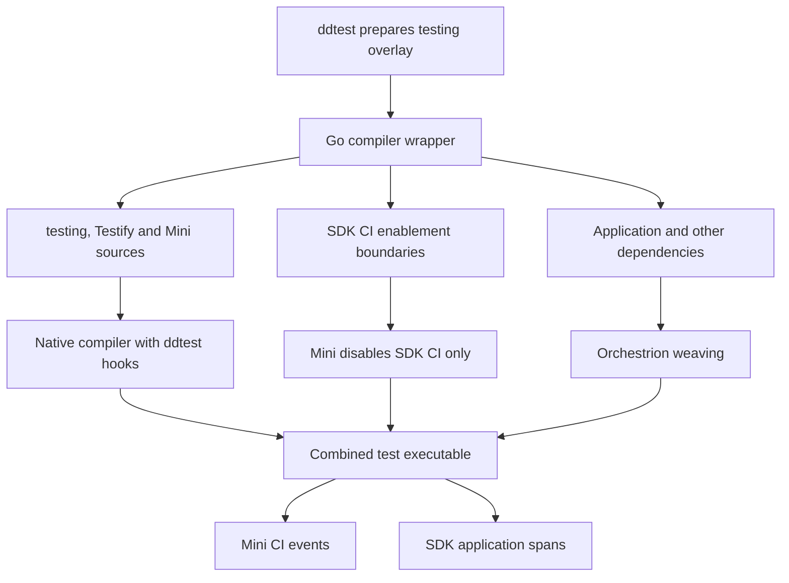

# Mini with Orchestrion

Use both instruments when a test binary needs application tracing and CI
Visibility. `ddtest` inserts the testing hooks and Mini runtime. Orchestrion
instruments the application and its dependencies using the client's existing
configuration. The resulting binary reports tests through Mini and application
spans through the full SDK.

Both instruments run during compilation. An existing binary must be rebuilt to
add Mini; `ddtest` does not modify executable files.

## Build and run

Run these commands from the client module, with its usual Orchestrion pin and
configuration. Install Orchestrion separately; it is not a dependency of the
`ddtest` driver.

```sh
# Orchestrion installed on PATH:
ddtest orchestrion go test -count=1 ./...

# Orchestrion declared as a Go tool in the client module:
ddtest go tool orchestrion go test -count=1 ./...

# Existing compiler-wrapper configuration:
ddtest test -toolexec="orchestrion toolexec" -count=1 ./...
GOFLAGS='"-toolexec=orchestrion toolexec"' ddtest test -count=1 ./...
```

Mini remains the default. `--runtime=sdk` still selects the pinned full SDK as the
CI reporter. SDK builds bypass only the testing integrations owned by ddtest;
the SDK itself still passes through Orchestrion.

To compile now and execute later:

```sh
mkdir -p test-binaries
ddtest orchestrion go test -c -o "$PWD/test-binaries/" ./...

# Execute from the working directory expected by the package's tests.
DD_CIVISIBILITY_ENABLED=parent ./test-binaries/example.test \
  -test.count=1 -test.timeout=10m -test.v
```

The executable contains both instruments and can run without `ddtest` or
Orchestrion. Mini starts its CI runtime. APM uses the application's usual SDK
lifecycle; tests that need an active APM tracer can start and stop it in their
`TestMain` or fixture. Set the normal agent or agentless CI Visibility configuration in
its execution environment. The CLI defaults `DD_CIVISIBILITY_ENABLED` to
`parent` only when absent; a standalone binary needs that setting explicitly.
Use `-count=1` when each invocation must report fresh results instead of using
Go's test-result cache.

## One owner for each integration



Applying the SDK's testing advice twice creates duplicate hook declarations in
`testing`. The selective wrapper therefore passes ddtest-owned packages directly
to the native tool. Application packages and APM integrations still pass through
Orchestrion. Version probes also pass through Orchestrion, so Go retains its
instrumented compiler identity.

The recognized tool forms are `orchestrion toolexec` and
`go tool orchestrion toolexec`, including executable paths and `.exe` names.
The Go-tool form resolves its executable once from the effective client module,
then uses that absolute path for compiler calls and auxiliary builds. The
bootstrap omits test instrumentation flags. For these commands, the final build
uses Orchestrion's `go` wrapper to own its
job server. This avoids a detached daemon retaining Go's temporary files on
Windows. An explicitly supplied `ORCHESTRION_JOBSERVER_URL` is retained.
Arbitrary outer wrappers, such as `env orchestrion toolexec`, are not recognized
as this composition; use one of the forms above.

A client can also contain manual SDK test shims or blank imports. When Mini
owns reporting, the compiler rewrites the SDK's CI environment reader and CI mode
getters to keep those shims inactive and keep APM on its own transport. The
process environment remains available to Mini. These changes affect temporary
compiler inputs only, not the client's sources or module cache. Unexpected SDK
signatures fail the build instead of silently enabling another CI reporter.
The guard also applies without Orchestrion when the selected test graph contains
the SDK. It detects dependencies of test helpers during the existing graph query.
Both `DD_CIVISIBILITY_ENABLED=parent` and `true` leave Mini as the sole CI reporter.

[SDK span copies](sdk-span-mirror.md) associate application operations with a
Mini test when the caller passes its context or a copied SDK parent's context.
Orchestrion still weaves application spans. Their original APM IDs, parents and
transport remain unchanged; Mini reports independent copies through CI intake.

Mini's deferred delivery, retries and goleak shim continue to own Mini's data and
goroutines. The goleak shim does not ignore arbitrary application or APM
SDK goroutines. Applications that start an APM tracer should stop it or apply
their usual leak-test policy.

## Cache and maintenance

The testing overlay carries `DDTestMiniSDKCIContract` whenever Mini guards the
SDK. The SDK's dependency on `testing` propagates this contract into its
compilation inputs. Builds that guard SDK CI have distinct cache inputs from
native and SDK-owned builds, without
adding a global compiler-version suffix. Bump the contract in
[`internal/runner/sdk_ci.go`](../internal/runner/sdk_ci.go) when the SDK guards
change.

The SDK guard validates private API signatures. When changing the supported SDK,
check the CI environment reader, both configuration getters, span mirror anchors
and their consumers. Keep the cache transition tests. The guards belong to the POC's build driver;
the runtime's native context binding is recorded in the SDK adaptation manifest.

Orchestrion retains its own configuration, pin checks and instrumentation
behavior. Keep its configuration valid for the selected SDK. The POC does not
remove CI advice from `orchestrion.yml` or filter individual application aspects.

## Verification

With `ORCHESTRION_BIN` set, `TestMiniOrchestrionComposition` checks explicit
wrappers, command-line `-toolexec`, `GOFLAGS` and explicit SDK selection. It
checks an actual injected APM span, real APM HTTP delivery and Mini's CI event
hierarchy in agent and agentless modes, with normal and deferred delivery.
The SDK testing advice remains enabled in the fixture configuration.

`TestMiniOrchestrionLibrariesAndDelivery` compares Mini alone with the combined
binary using the same module graph. It exercises Testify, external suite callers,
parallel groups, count, fuzz seeds, examples, process and in-process retries,
goleak success and a real client leak. Builds cover plain, atomic coverage,
`-race` and `-race` with coverage; execution covers normal and deferred delivery.
Covered cases also compare individual test coverage payloads.

`TestMiniOrchestrionLegacySDKShim` checks single reporting with an existing SDK
shim with the pinned SDK and v2.11.0-rc.2, in true/parent activation and both
delivery modes. `TestMiniLegacySDKShim` covers the same SDK versions without
Orchestrion, with a shim reached through a test helper. It verifies subtest
reporting, failed-test exit codes, APM delivery and native SDK builds on both
sides of a Mini build. Inline executions check successful and failed tests, invalid CLI
forms and a missing executable. Client module and source files are checked for
changes. Unit tests cover private API drift, tool dispatch, quoting, version probes
and temporary-file cleanup. The existing compatibility workflow runs these
suites on Linux, macOS and Windows. It uses loopback HTTP receivers and
synthetic credentials; it does not prove acceptance by a production intake or
validate a particular private service's tests.

`TestMiniOrchestrionClientPinnedTool` also builds through a client-declared
Orchestrion v1.6.1 Go tool with SDK v2.11.0-rc.2, without declaring Mini in the
client module. It checks temporary provisioning, `-C`, the injected APM span
and separate APM/CI HTTP delivery.
