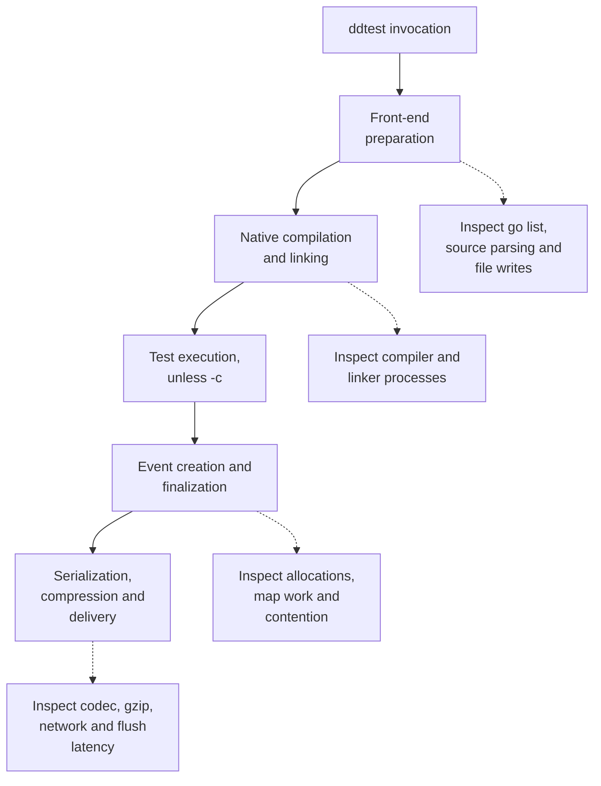

# Performance and profiling

Build performance and event-runtime performance have different causes. The
overlay front-end reduces instrumentation work during compilation. Mini reduces
the linked runtime graph and the cost of recording and delivering CI events.
Measure those paths separately.

## Where time goes



Runtime work can overlap test execution and can happen when a batch fills.
The diagram names the costs; it is not a timing scale. Compile-only measurements
use `go test -c`, which excludes test execution and event delivery.

| Measurement | Tells you |
| --- | --- |
| Wall time | How long the caller waits, including scheduling and I/O |
| Total CPU time | Work across all participating processes and threads |
| Profile flat time | Samples spent in a function itself |
| Profile cumulative time | Samples in that function and its callees; rows overlap |
| `alloc_space` / B/op | Total bytes allocated, including objects already collected |
| Live heap / aggregate memory peak | Retained memory or simultaneous process memory, depending on the tool |

Profile percentages describe where samples landed. Removing work in a function
can change CPU consumption without producing the same wall-time reduction. Parallel workers can consume many CPU-seconds during one
wall-clock second. Allocation totals are not resident memory. For Orchestrion,
include its daemon and nested builds in CPU and memory accounting; direct-child
process accounting can miss them.

## Front-end optimizations in the code

[`Transform`](../internal/instrument/transform.go) uses the standard Go AST,
skips parser object resolution and applies source-position edits. There is no
DST decoration or type-checking pass in this front-end. Files are sorted for a
deterministic transformation, and unchanged files do not become overlay outputs.
The same AST identifies `testing.parallelStop` for the optional shutdown hook;
hook selection does not parse the sources again.

[`PrepareRuntime`](../internal/runner/run.go) requests only the package fields
it needs from a targeted `go list`. Testify discovery can add one metadata or
dependency query, as described below. Both queries decode JSON directly from
Go's stdout. The front-end retains decoded package records without a second
complete JSON buffer. It drains and waits for the subprocess even after malformed
output; command failures and their stderr take precedence over partial JSON.

Rewritten-source buffers reserve the final size, including line directives and
inserted advice. Testify preparation parses each selected library file once and
uses that AST for its API/collision checks and entry rewrite. Covered compiler
inputs have different bytes and receive their own validation.

Generated files are immutable and shared by identical content within one plan.
Many packages with the same package name can share an import-only backing file.
The logical overlay entry still exists for every selected package, so metadata
and conflict checks remain correct. Memory, overlay entries and package
discovery can still grow with package count.

This sharing ends when the plan is removed. The POC uses Go's caches and has no
persistent cache of instrumented binaries or prepared overlays.

When a runtime must be provided, one `go env -json GOMOD GOWORK GOMODCACHE` call
supplies the module, workspace and cache paths. Local Mini provisioning reads
the selected runtime's Go requirement without changing the client's language
version. Small compatibility helpers keep Mini's source valid with Go 1.21
language rules. The temporary module
files read the user's effective overlay contents, including replacements or
deletion of the sum file.
This also applies to an explicit `-modfile`. Child commands derive `PWD` from
their working directory before adding environment overrides, so `-C` through a
symlink keeps the same paths during preparation and compilation. With
`-mod=mod`, a separate read-only `go list` resolves the runtime, so the package
query cannot add it to the module's requirements.

## Testify discovery and tool overhead

The [Testify contract](testify.md) selects `-toolexec` from actual reachability,
not the presence of a module requirement. Plain tests and assert-only targets
omit it unless another selected integration needs it: Mini goleak, SDK guards
and span copies, Orchestrion composition or coverage of rewritten `testing`
sources. Known library reachability without unknown test imports uses
`go list -find`; unknown test imports use `-deps`
so external helpers remain covered. The selected-version/API check stays in
preparation, before a warm cache can skip the compiler. The dependency query
excludes selected packages and dependency closures already inspected by the
first query. Unknown test-only imports stay in the query, including standard
packages outside those known closures and helpers in other modules. Runtime
dependencies are not evidence of a client's test-helper graph. Suite reachability
is checked before pruning, so a known suite still receives its metadata query
and version validation.

Unrelated tools dispatch without opening the plan. On Unix the CLI replaces
itself with the native tool; Windows delegates through a child. Process startup
still has a cost even when dispatch does little work. The [latest build matrix](benchmarks.md)
measures the complete invocation, including preparation and tool processes.

Selected-version validation must run before compilation: cached archives can
remain usable when vendor metadata changes but source bytes do not.
[`TestTestifyVersionGuardWithWarmVendoredSources`](../integration/vendor_cache_test.go)
checks that case. Testify and goleak share the lookup; both libraries' versions
and APIs are validated even on an unchanged build.

Compiler/linker version identities stay native. The exported suite fingerprint
in `testing` carries instrumentation inputs into Go's package keys. Go owns
compiled-object and test-result caching. Coverage of rewritten `testing` sources
has its own versioned bridge; ordinary client-only coverage needs no bridge.

Goleak has a package-scoped compiler flag marker because it does not import
`testing`. Its worker filters and connection checkpoint are described in
[delivery and goleak](delivery.md).
Unqualified `-gcflags` apply when Go resolved goleak as a command-line target,
including an absolute directory argument. The marker retains those flags;
package selection is not inferred with the pattern rules used by qualified
compiler flags. The CLI regression tests in `integration/runner_transparency_test.go`
cover this distinction, module overlays and the symlink case.

## Enqueue and delivery

Enqueueing takes only the client mutex: it never waits for the delivery token,
creates no timer and performs no network I/O. Network work happens in up to eight
background senders when batches fill, and at the end of the session. A batch
can seal below the event-count limit when it reaches the 2.5 MiB byte threshold.
Coverage, logs and telemetry have separate writers, so an incomplete test-cycle
batch does not establish that the process is free of background CI work.

Mini's test-cycle gzip pool uses `gzip.BestSpeed`. Agentless payloads remain gzip
and obey the same uncompressed intake limit. Coverage and diagnostic-log
compressors retain their SDK settings. Compression ratio depends on payload
shape; compare both CPU and wire size when changing the level.

Deferred mode isolates delivery from admitted test groups. It delays delivery
until idle and permits queue growth across parallel
groups. The [delivery contract](delivery.md) describes that tradeoff.

The source rewriter preserves comment bytes without constructing comment ASTs;
it handles line directives separately. Preparation runs sequentially. The
[build comparison](benchmarks.md) measures its cost as part of the complete CLI
invocation.

## Mini runtime optimizations

| Change | Cost removed or reduced | Constraint to retain |
| --- | --- | --- |
| CI-only runtime graph | Compilation/linking of excluded APM components | Retain CI policies, coverage, metadata and telemetry |
| Sealed span maps | Metadata and metric snapshots on `Finish` | Setters must never mutate a finished span's maps |
| Shared CI tag snapshots and cached options | Per-span closures, common map entries and repeated wire strings | Preserve late updates, getters, option precedence, numeric overrides, child spans and Bazel filtering |
| Metadata capacity estimate | Repeated map growth while applying common tags | Include per-event and client tags in the estimate |
| Appended close-action lists | Copying all prior actions on every registration | Execute in LIFO order, with pre-close barriers before ordinary actions |
| Lazy metric maps | A map allocation for events without numeric metrics | Tag type transitions must retain their existing semantics |
| Direct event encoding | An intermediate encoded event array and its payload copy | Preserve field names, event versions and byte limits |
| Queue and payload reuse | Fresh backing storage after every successful batch | Retryable flush failures retain events; final closure discards a failed batch once |
| Gzip writer and buffer pooling | New compression state for each agentless batch | Seal all request readers before returning storage to a pool |
| Bounded buffer retention | Long-lived oversized buffers after large payloads | Payload and gzip capacities above 2.5 MiB are discarded |
| Standard-library telemetry maps | An external concurrent-map module | Preserve registration, startup replay and log counts under concurrency |
| Bound ordinary CI counters | Repeated tag slices, key joining and registry lookup | Preserve startup replay, client swaps, disabled telemetry and feature-tag fallback |
| Inline metric points | A heap allocation on every count/gauge submission | Collect each value/timestamp together; retain zero, NaN, reset and rate semantics |
| Completed coverage workers | A worker blocked on an unbuffered shutdown notification per covered test | Close the completion channel after processing, including profile errors; shutdown still waits for outstanding work |
| Coverage duration clock | A wall-clock read from background serialization | Use monotonic elapsed durations; retain event and metric wall timestamps |
| Literal Testify prefix check | Compiling `^Test` for each suite method | Match exactly the same method names |
| Source parser without object resolution | Unused identifier objects in metadata lookup | Retain ITR comments, function ranges and parse errors |
| Direct high trace-ID hex encoding | General-purpose integer formatting | Retain 16 lowercase hex digits, including leading zeros |
| Lazy classification tries | Eager construction of stack-prefix tables | Preserve internal filtering, third-party matching and redaction; publish immutable tries once |
| Internal codec/platform subsets | External runtime module requirements | Preserve original semantics, licenses and source provenance |

Clock isolation also has costs. Ordinary coverage processing is synchronous when
telemetry or debug logging is enabled. Deferred mode retains captured profiles
until its idle checkpoint, so parallel groups can use more temporary disk space.
Startup telemetry overlaps the settings request in both modes. Initialization
waits for both before the first test, including request failures and cached
settings. A slow endpoint still delays admission; no test's duration includes
it. The recorded build/runtime benchmark tables do not measure these scheduling
changes. See
[delivery](delivery.md) and the SDK port's
[adaptation record](../internal/thirdparty/dd-trace-go/ADAPTATIONS.md) before
changing this scheduling during an upstream update.

Copying a codec into the repository does not itself make its encoder faster.
The dependency reduction comes from changing the runtime graph; the allocation
changes come from event ownership and buffer reuse. Test-only `testify` (v1.7.5)
and its dependencies remain in the repository without entering Mini's runtime
imports.

The [runtime comparison](benchmarks.md#runtime-of-the-prebuilt-test-binaries)
includes startup, test execution and delivery. Its detailed report records
event counts and wire bytes. It measures the complete implementation. Use focused
profiles and controlled comparisons to attribute a change to one optimization.

The SDK-specific implementation rules are recorded in
[ADAPTATIONS.md](../internal/thirdparty/dd-trace-go/ADAPTATIONS.md). Common
lifecycle counters keep bound handles only for the existing framework/hierarchy
tag combinations. Events with retry, EFD, quarantine or other extra tags use the
general registry path. `MockClient` resets invalidate a binding; normal client
swaps retain the existing swappable handle.

Counts and gauges keep their value/timestamp inline under a short mutex. A flush
detaches the whole point under that mutex, then encodes it after releasing the
lock. This removes per-submission snapshots while preserving collection boundaries.

### Checking metadata capacity

`newSpan` estimates metadata capacity from the option count and client tags.
Some options set timestamps, hierarchy fields or shared metadata without adding
a local map entry. A smaller reservation saves space for those spans, but can
force extra map growth for custom spans containing mostly text tags.

Keep the current estimate until an alternative handles both shapes. A fixed
capacity of eight, including a version limited to small option lists, regresses
the text-heavy cases. `BenchmarkSpanMetadata` covers CI-shaped and text-only
options with 0, 4, 12, 32 and 128 additional tags:

```sh
go test ./internal/minitracer -run '^$' -bench '^BenchmarkSpanMetadata$' -benchmem -count=5
```

Compare allocation counts as well as time, and include the complete CI lifecycle
benchmark before changing production. Options are functions; their count alone
does not reveal how many map entries they will add.

## The ownership rules behind reuse

Read [the event lifetime](architecture.md#native-event-ownership) before changing
`Finish`. The client copies caller-owned configuration at construction. A span
then owns private maps until it seals them; getters continue to work after
finalization. Hierarchy IDs are stored outside those maps so serialization can
write the CI fields without deleting tags.

Delivery owns one reusable payload buffer under `sendMu`. The transport borrows
its bytes only for the duration of `Send`. In agentless mode it borrows a gzip
compressor and buffer too. Request and replay readers must all become unable to
read before either backing buffer is reusable. Calling `Close` on just the
initial reader does not establish that boundary.

In ordinary delivery, the queue is bounded: eight sealed batches, all of which
can be in flight, plus the open batch, each limited by event count and byte
estimates. At the bound a finisher waits for a sender while deliveries succeed,
and is rejected and counted only after a delivery has failed. A throughput change
must therefore check waiting, errors and drops as well as ns/op; the slow-intake
test checks that no event is lost.

Deferred delivery can buffer more than one batch while tests are active. Its
pending queue has no total size limit; each outgoing payload still obeys the
intake bounds. Include peak memory when assessing that mode. Its checkpoints
send up to eight payloads at once and join them before the next test is admitted.
Measure both throughput and memory with the payload size and intake delay fixed.

Each background or checkpoint delivery of a sealed batch is bounded by
`FlushTimeout` (10 seconds by default). Explicit `Flush` and `Close` use their
caller's context.

[Sealed-span tests](../internal/minitracer/sealed_span_test.go),
[batching tests](../internal/minitracer/batching_test.go),
[queue/concurrency tests](../internal/minitracer/client_test.go) and
[transport reuse tests](../internal/citransport/reuse_test.go) exercise these
contracts. Preserve them when changing synchronization or pooling.

Common CI/Git/OS/runtime strings live in an immutable snapshot shared by spans.
Each span stores only its own tags, metrics and overrides. Getters check local
values before the snapshot. A numeric metric masks a shared string with the same
key; later text can replace that metric. Delivery puts compatible defaults in
payload metadata. Mixed snapshots and overridden keys use local values without
changing the effective CI attributes. See the
[metadata contract](delivery.md#payload-level-common-metadata) for fallback and
byte-accounting rules.

The pooled test-cycle compressor uses `gzip.BestSpeed`. It produces standard
gzip with less compression work and potentially more wire bytes. Coverage and
log writers keep their own SDK compression settings. Compare CPU and transmitted
bytes when changing this level; decoded content and intake limits must remain
unchanged.

## CI tag snapshot lookup

Internal readers use `GetCITagsReadOnly`, so a published snapshot can be reused
without comparing every string on every span. Explicit updates invalidate it.
A caller that requests the mutable `GetCITags` map opts that map back into full
content checks, preserving late sequential edits.

Exercise the read-only and mutable paths together:

```sh
GOMAXPROCS=4 go test ./internal/thirdparty/dd-trace-go/civisibility/utils \
  -run='^$' -bench='^BenchmarkCITagsSnapshot$' -benchtime=300ms -count=3
```

Update and concurrent-reader tests protect the snapshot's correctness. Keep
raw samples with a specific optimization experiment; the repository's retained
[comparison dataset](benchmarks.md) measures complete builds and test groups.

## Profiling the native event path

The existing `BenchmarkEventLifecycle` creates and finishes events with common
CI tags. Its HTTP transport consumes requests in memory. The agentless variant
still performs gzip, but neither variant measures real network latency, CI
policy startup or full test execution.

From the repository root, choose a new directory for the artifacts:

```sh
PROFILE_DIR="$(mktemp -d /var/tmp/dd-ci-event-profile.XXXXXX)"

GOMAXPROCS=1 go test ./internal/minitracer -run '^$' \
  -bench '^BenchmarkEventLifecycle/gzip=false$' -benchtime=10s -count=1 -benchmem \
  -cpuprofile "$PROFILE_DIR/serial.cpu.pprof" \
  -memprofile "$PROFILE_DIR/serial.heap.pprof" \
  -o "$PROFILE_DIR/minitracer.test"

go tool pprof -top "$PROFILE_DIR/minitracer.test" "$PROFILE_DIR/serial.cpu.pprof"
go tool pprof -top -cum "$PROFILE_DIR/minitracer.test" "$PROFILE_DIR/serial.cpu.pprof"
go tool pprof -top -sample_index=alloc_space \
  "$PROFILE_DIR/minitracer.test" "$PROFILE_DIR/serial.heap.pprof"
```

Repeat with `gzip=true` and different artifact names to isolate the compression
path. This benchmark runs a serial loop. Raising `GOMAXPROCS` does not turn it
into a parallel producer benchmark; concurrent finish behavior needs a workload
that actually starts concurrent producers. The race/concurrency tests establish
correctness, not throughput.

A CPU profiler inside the test binary does not profile Go's compiler and linker.
For build diagnosis, capture the Go subprocesses and their process tree, or use
`-x` and a Go build trace where available. `go test -cpuprofile` profiles test
execution and should not be used as evidence about a `-c` build's CPU cost.

## Compile-only comparisons

Use four variants: native Go, Orchestrion with the pinned testing aspects,
POC SDK and POC Mini. Fix the project revision, module graph, SDK reference,
toolchain, flags and output layout before timing. Build the CLI and reference
instrumentator outside the timed commands.

For example, after preparing each target module and output directory:

```sh
GOMAXPROCS=4 go test -p=4 -c -o ./out/native/ -ldflags=-w ./...
GOMAXPROCS=4 /path/to/ddtest test --runtime=sdk -p=4 -c -o ./out/sdk/ -ldflags=-w ./...
GOMAXPROCS=4 /path/to/ddtest test --runtime=mini -p=4 -c -o ./out/mini/ -ldflags=-w ./...
GOMAXPROCS=4 go test -p=4 -c -o ./out/orchestrion/ \
  -toolexec="/path/to/orchestrion toolexec" -ldflags=-w ./...
```

For a controlled comparison, give the Mini fixture an explicit POC requirement
and the SDK fixtures the pinned SDK. This keeps provisioning out of the timed
builds; ordinary CLI use can provide Mini automatically. Orchestrion must load
the SDK's testing-only configuration. Match
the native project's effective dependency inputs across variants and record
any graph additions made for comparison tooling.

Define the scenario before interpreting its result:

| Scenario | Cache and output condition |
| --- | --- |
| Cold build | Independent empty build cache per variant and no output binary; downloaded modules and OS page cache may still be warm |
| Unchanged build | Reuse that variant's cache and existing output binary |
| Forced link | Reuse compiled dependencies and set a fresh linker `-buildid` for each repetition |
| Real edit | Change the same executed test or application body for every variant, retaining its own cache |

Forcing a link measures more than the linker: Go planning, CLI preparation and
generated-main compilation can still contribute. A real-edit scenario must
change an executed test or application body; comment and unused-constant edits
belong in separate diagnostic scenarios. Keep separate output paths so one
variant cannot overwrite another's reusable binary.

An empty `GOCACHE` alone does not establish a cold link: an existing output
binary can let Go skip it. Remove only the experiment's output before each cold
observation, then inspect `-x` for actual compiler and linker invocations. Check
unique edits also compile; keep comment/unused-constant diagnostics distinct
from reachable body edits.

Alternate order, retain every sample and add native-versus-native controls.
Record CPU affinity, `GOMAXPROCS`, `-p`, SMT use and other host workloads.
Report medians with ranges and repetition counts; do not delete slow runs.
Agree on time/run/disk limits before a large matrix.

For a POC table cell, put the signed percentage relative to Orchestrion first,
then the overhead relative to native:

```text
100 * (POC / Orchestrion - 1)
100 * (POC / Native - 1)
Example format: 1.20 s (-40.0% vs Orchestrion; +20.0% vs Native)
```

The example is arithmetic, not a measurement. Compute percentages from
unrounded medians. A negative first value means the POC took less time than
Orchestrion; a positive second value means it took more time than native.

The [build benchmark guide](build-benchmarks.md) documents
[`scripts/build_benchmark.py`](../scripts/build_benchmark.py), which runs all four
variants across the five scenarios, assigns affinity, measures exclusive cgroups
and qualifies the outputs. Its `report` command regenerates the
[recorded build tables](results/20261005-linux-go1.27.1/build/README.md)
from every retained CSV observation, without Go or network access.

## Evidence and remaining work

The [recorded comparison](benchmarks.md) covers all four variants, Gin/Chi,
direct and external Testify, race and coverage at 4/32 CPUs. It keeps raw
durations, aggregate cgroup memory, variation and event counts, and separates
the unused-constant diagnostic from the reachable test-body edit. All build
cells qualified; four Gin race runtime cells contain real failures. The recorded
115-case parity suite passed. Those observations retain the code and failure
classifications measured at that revision; current regression checks live in
[validation](validation.md).

Further profiling can examine MessagePack encoding, tag construction, telemetry
lookups and time spent waiting for `sendMu`. A proposed change needs before/after
measurements on its affected path, plus the compatibility tests that protect its
ownership and wire behavior. Linker experiments and a persistent binary cache
are not part of the current implementation.
