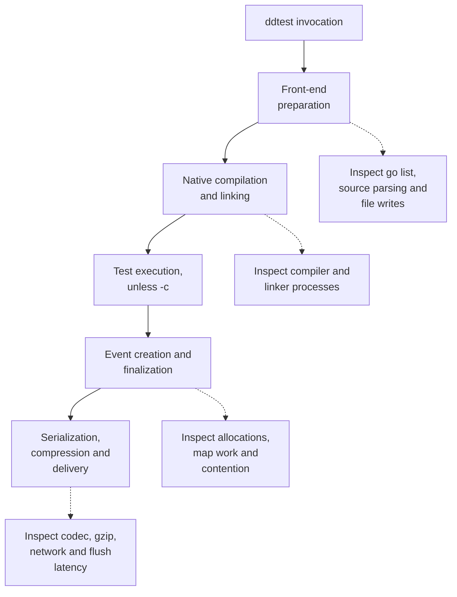

# Performance and profiling

Build performance and event-runtime performance have different causes. The
overlay front-end reduces instrumentation work during compilation. Mini reduces
the linked runtime graph and the cost of recording and delivering CI events.
Measure those paths separately.

## Where time goes



Runtime work can overlap test execution and can happen when a batch fills.
The diagram names the costs; it is not a timing scale. Compile-only measurements
use `go test -c`, which excludes test execution and event delivery.

| Measurement | Tells you |
| --- | --- |
| Wall time | How long the caller waits, including scheduling and I/O |
| Total CPU time | Work across all participating processes and threads |
| Profile flat time | Samples spent in a function itself |
| Profile cumulative time | Samples in that function and its callees; rows overlap |
| `alloc_space` / B/op | Total bytes allocated, including objects already collected |
| Live heap / aggregate memory peak | Retained memory or simultaneous process memory, depending on the tool |

Profile percentages describe where samples landed. Removing work in a function
can change CPU consumption without producing the same wall-time reduction. Parallel workers can consume many CPU-seconds during one
wall-clock second. Allocation totals are not resident memory. For Orchestrion,
include its daemon and nested builds in CPU and memory accounting; direct-child
process accounting can miss them.

## Front-end optimizations in the code

[`Transform`](../internal/instrument/transform.go) uses the standard Go AST,
skips parser object resolution and applies source-position edits. There is no
DST decoration or type-checking pass in this front-end. Files are sorted for a
deterministic transformation, and unchanged files do not become overlay outputs.

[`PrepareRuntime`](../internal/runner/run.go) requests only the package fields
it needs from a targeted `go list`. Testify discovery can add one metadata or
dependency query, as described below. Both queries decode JSON directly from
Go's stdout. The front-end retains decoded package records without a second
complete JSON buffer. It drains and waits for the subprocess even after malformed
output; command failures and their stderr take precedence over partial JSON.

Rewritten-source buffers reserve the final size, including line directives and
inserted advice. Testify preparation parses each selected library file once and
uses that AST for its API/collision checks and entry rewrite. Covered compiler
inputs have different bytes and receive their own validation.

Generated files are immutable and shared by identical content within one plan.
Many packages with the same package name can share an import-only backing file.
The logical overlay entry still exists for every selected package, so metadata
and conflict checks remain correct. Memory, overlay entries and package
discovery can still grow with package count.

This sharing ends when the plan is removed. The POC uses Go's caches and has no
persistent cache of instrumented binaries or prepared overlays.

## Testify discovery and tool overhead

The [Testify contract](testify.md) selects `-toolexec` from actual reachability,
not the presence of a module requirement. Plain tests and assert-only targets
omit it unless coverage includes rewritten `testing` sources. Known suite
reachability uses `go list -find`; unknown nonstandard test imports use `-deps`
so external helpers remain covered. The selected-version/API check stays in
preparation, before a warm cache can skip the compiler. The dependency query
excludes selected packages and dependency closures already inspected by the
first query. Unknown test-only imports stay in the query, including standard
packages outside those known closures and helpers in other modules. Runtime
dependencies are not evidence of a client's test-helper graph. Suite reachability
is checked before pruning, so a known suite still receives its metadata query
and version validation.

Unrelated tools dispatch without opening the plan. On Unix the CLI replaces
itself with the native tool; Windows delegates through a child. The dispatch
branch measured about 12.5 ns with zero allocations, while the real wrapper
added about 1.1 ms to a compiler version probe on this Linux host. The
[isolated probe results](results/selective-tools-20261003-linux-go1.27/README.md#isolated-bypass)
measure process startup as well as dispatch. A microbenchmark of the branch
alone cannot predict a build-wide saving.

The [4/32 CPU strategy experiment](results/tool-strategies-20261003-linux-go1.27/README.md)
retains 660 compile-only observations. For a directly imported suite, the
selected `-find` branch reduced unchanged median wall time from 120.31 to
110.34 ms at 4 CPUs and from 133.74 to 120.24 ms at 32 CPUs. Cold differences
were small and their ranges overlap. These fixtures measure preparation and
compilation; they do not execute tests or the event runtime.

A one-query `-deps -test` prototype also passed compatibility and cache checks,
but added about 8 ms to unchanged plain tests and needed more test-variant
handling. Always-on and hybrid prototypes that deferred validation failed a
warm-vendor version counterexample. The repository applies only `-find` for
known suites; the other strategies remain outside the implementation.

Compiler/linker version identities stay native. The exported suite fingerprint
in `testing` carries instrumentation inputs into Go's package keys. No custom
binary cache was added. Coverage of rewritten `testing` sources has its own
versioned bridge; ordinary client-only coverage needs no bridge.

## Mini runtime optimizations

| Change | Cost removed or reduced | Constraint to retain |
| --- | --- | --- |
| CI-only runtime graph | Compilation/linking of excluded APM components | Retain CI policies, coverage, metadata and telemetry |
| Sealed span maps | Metadata and metric snapshots on `Finish` | Setters must never mutate a finished span's maps |
| Metadata capacity estimate | Repeated map growth while applying common tags | Include per-event and client tags in the estimate |
| Lazy metric maps | A map allocation for events without numeric metrics | Tag type transitions must retain their existing semantics |
| Direct event encoding | An intermediate encoded event array and its payload copy | Preserve field names, event versions and byte limits |
| Queue and payload reuse | Fresh backing storage after every successful batch | Retryable flush failures retain events; final closure discards a failed batch once |
| Gzip writer and buffer pooling | New compression state for each agentless batch | Seal all request readers before returning storage to a pool |
| Bounded buffer retention | Long-lived oversized buffers after large payloads | Payload and gzip capacities above 2.5 MiB are discarded |
| Standard-library telemetry maps | An external concurrent-map module | Preserve registration, startup replay and log counts under concurrency |
| Bound ordinary CI counters | Repeated tag slices, key joining and registry lookup | Preserve startup replay, client swaps, disabled telemetry and feature-tag fallback |
| Inline metric points | A heap allocation on every count/gauge submission | Collect each value/timestamp together; retain zero, NaN, reset and rate semantics |
| Literal Testify prefix check | Compiling `^Test` for each suite method | Match exactly the same method names |
| Source parser without object resolution | Unused identifier objects in metadata lookup | Retain ITR comments, function ranges and parse errors |
| Direct high trace-ID hex encoding | General-purpose integer formatting | Retain 16 lowercase hex digits, including leading zeros |
| Lazy classification tries | Eager construction of stack-prefix tables | Preserve internal filtering, third-party matching and redaction; publish immutable tries once |
| Internal codec/platform subsets | External runtime module requirements | Preserve original semantics, licenses and source provenance |

Copying a codec into the repository does not itself make its encoder faster.
The dependency reduction comes from changing the runtime graph; the allocation
changes come from event ownership and buffer reuse. Test-only `testify` and its
dependencies remain in the repository without entering Mini's runtime imports.

The SDK-specific implementation rules are recorded in
[ADAPTATIONS.md](../internal/thirdparty/dd-trace-go/ADAPTATIONS.md). Common
lifecycle counters keep bound handles only for the existing framework/hierarchy
tag combinations. Events with retry, EFD, quarantine or other extra tags use the
general registry path. `MockClient` resets invalidate a binding; normal client
swaps retain the existing swappable handle.

Counts and gauges keep their value/timestamp inline under a short mutex. A flush
detaches the whole point under that mutex, then encodes it after releasing the
lock. This removes per-submission snapshots while preserving collection boundaries.

The [2026-10-03 optimization measurements](results/hotpaths-20261003-linux-go1.27/README.md)
retain alternating before/after observations for preparation, transformation and
counter updates. They are separate from the frozen four-variant compile matrix.

## The ownership rules behind reuse

Read [the event lifetime](architecture.md#native-event-ownership) before changing
`Finish`. The client copies caller-owned configuration at construction. A span
then owns private maps until it seals them; getters continue to work after
finalization. Hierarchy IDs are stored outside those maps so serialization can
write the CI fields without deleting tags.

Delivery owns one reusable payload buffer under `sendMu`. The transport borrows
its bytes only for the duration of `Send`. In agentless mode it borrows a gzip
compressor and buffer too. Request and replay readers must all become unable to
read before either backing buffer is reusable. Calling `Close` on just the
initial reader does not establish that boundary.

The queue is bounded by event count and byte estimates. A stalled flush can
block finishing goroutines and reject new events when an older full batch
cannot be delivered. That is observable backpressure, so a throughput change
must check errors and drops as well as ns/op.

`Client.add` creates a timeout with `FlushTimeout` (10 seconds by default). It
bounds acquisition of the delivery permit and any flush triggered by a full
batch. Expiry rejects the incoming event, increments `DroppedEvents` and records
the error. Delaying timer creation would be a separate optimization: an
uncontended enqueue need not wait, but a concurrent sender and a full queue still
need that deadline and the same drop/error semantics.

[Sealed-span tests](../internal/minitracer/sealed_span_test.go),
[batching tests](../internal/minitracer/batching_test.go),
[queue/concurrency tests](../internal/minitracer/client_test.go) and
[transport reuse tests](../internal/citransport/reuse_test.go) exercise these
contracts. Preserve them when changing synchronization or pooling.

Common-span metadata sharing is still a proposal. Today every span has a private
copy of the client's tag entries; Go already shares the strings' underlying data.
A shared immutable base could hold repeated values
such as the repository URL, commit and runtime ID, while the span stores only
its own test name/status and overrides. Reads and serialization would merge the
base with those overrides; every event would still carry the same CI fields.
Changing a string tag to a numeric metric would also need to hide the inherited
string. That ownership/type-transition work has not been applied.

The compression-level experiment also remains outside the implementation.
`gzip.BestSpeed` produces ordinary gzip with less compression work and larger
payloads. The current pooled writer keeps Go's default compression level; changing
the level would need delivery and payload-size checks across representative data.

## Profiling the native event path

The existing `BenchmarkEventLifecycle` creates and finishes events with common
CI tags. Its HTTP transport consumes requests in memory. The agentless variant
still performs gzip, but neither variant measures real network latency, CI
policy startup or full test execution.

From the repository root, choose a new directory for the artifacts:

```sh
PROFILE_DIR="$HOME/.cache/dd-ci-event-profile"
mkdir -p "$PROFILE_DIR"

GOMAXPROCS=1 go test ./internal/minitracer -run '^$' \
  -bench '^BenchmarkEventLifecycle/gzip=false$' -benchtime=10s -count=1 -benchmem \
  -cpuprofile "$PROFILE_DIR/serial.cpu.pprof" \
  -memprofile "$PROFILE_DIR/serial.heap.pprof" \
  -o "$PROFILE_DIR/minitracer.test"

go tool pprof -top "$PROFILE_DIR/minitracer.test" "$PROFILE_DIR/serial.cpu.pprof"
go tool pprof -top -cum "$PROFILE_DIR/minitracer.test" "$PROFILE_DIR/serial.cpu.pprof"
go tool pprof -top -sample_index=alloc_space \
  "$PROFILE_DIR/minitracer.test" "$PROFILE_DIR/serial.heap.pprof"
```

Repeat with `gzip=true` and different artifact names to isolate the compression
path. This benchmark runs a serial loop. Raising `GOMAXPROCS` does not turn it
into a parallel producer benchmark; concurrent finish behavior needs a workload
that actually starts concurrent producers. The race/concurrency tests establish
correctness, not throughput.

A CPU profiler inside the test binary does not profile Go's compiler and linker.
For build diagnosis, capture the Go subprocesses and their process tree, or use
`-x` and a Go build trace where available. `go test -cpuprofile` profiles test
execution and should not be used as evidence about a `-c` build's CPU cost.

## Compile-only comparisons

Use four variants: native Go, Orchestrion with the pinned testing aspects,
POC SDK and POC Mini. Fix the project revision, module graph, SDK reference,
toolchain, flags and output layout before timing. Build the CLI and reference
instrumentator outside the timed commands.

For example, after preparing each target module and output directory:

```sh
GOMAXPROCS=4 go test -p=4 -c -o ./out/native/ -ldflags=-w ./...
GOMAXPROCS=4 /path/to/ddtest test --runtime=sdk -p=4 -c -o ./out/sdk/ -ldflags=-w ./...
GOMAXPROCS=4 /path/to/ddtest test --runtime=mini -p=4 -c -o ./out/mini/ -ldflags=-w ./...
GOMAXPROCS=4 go test -p=4 -c -o ./out/orchestrion/ \
  -toolexec="/path/to/orchestrion toolexec" -ldflags=-w ./...
```

The Mini fixture must require this POC module; the SDK fixtures must require the
pinned SDK. Orchestrion must load the SDK's testing-only configuration. Match
the native project's effective dependency inputs across variants and record
any graph additions made for comparison tooling.

Define the scenario before interpreting its result:

| Scenario | Cache and output condition |
| --- | --- |
| Cold build | Independent empty build cache per variant and no output binary; downloaded modules and OS page cache may still be warm |
| Unchanged build | Reuse that variant's cache and existing output binary |
| Forced link | Reuse compiled dependencies and set a fresh linker `-buildid` for each repetition |
| Real edit | Change the same executed test or application body for every variant, retaining its own cache |

Forcing a link measures more than the linker: Go planning, CLI preparation and
generated-main compilation can still contribute. A real-edit scenario must
change an executed test or application body; comment and unused-constant edits
belong in separate diagnostic scenarios. Keep separate output paths so one
variant cannot overwrite another's reusable binary.

An empty `GOCACHE` alone does not establish a cold link: an existing output
binary can let Go skip it. Remove only the experiment's output before each cold
observation, then inspect `-x` for actual compiler and linker invocations. Check
unique edits also compile; keep comment/unused-constant diagnostics distinct
from reachable body edits.

Alternate order, retain every sample and add native-versus-native controls.
Record CPU affinity, `GOMAXPROCS`, `-p`, SMT use and other host workloads.
Report medians with ranges and repetition counts; do not delete slow runs.
Agree on time/run/disk limits before a large matrix.

For a POC table cell, put the signed percentage relative to Orchestrion first,
then the overhead relative to native:

```text
100 * (POC / Orchestrion - 1)
100 * (POC / Native - 1)
Example format: 1.20 s (-40.0% vs Orchestrion; +20.0% vs Native)
```

The example is arithmetic, not a measurement. Compute percentages from
unrounded medians. A negative first value means the POC took less time than
Orchestrion; a positive second value means it took more time than native.

The [build benchmark guide](build-benchmarks.md) documents
[`scripts/build_benchmark.py`](../scripts/build_benchmark.py), which runs all four
variants across the five scenarios, assigns affinity, measures exclusive cgroups
and qualifies the outputs. Its `report` command regenerates the
[full 2026-10-03 tables](results/compile-matrix-20261003-linux-go1.27/README.md)
from every retained CSV observation, without Go or network access.

[`scripts/benchmark.py`](../scripts/benchmark.py) is a smaller fixture runner
for native, POC SDK and Orchestrion with `GOMAXPROCS=8`. It keeps bounded
cold/warm/edit samples and wall times. It does not exercise Mini, force a link
on every warm run, assign CPU affinity or collect full-process-tree CPU. It
cannot reproduce a four-variant physical-core matrix by itself.

## Evidence and remaining work

The [README tables](../README.md#compilation-performance),
[original fixture results](results.md),
[early Mini comparison](mini-runtime.md#initial-compile-only-comparison) and
their raw JSON files retain the revisions and conditions they measured.
Those older timings predate the latest SDK extraction and source reorganization.
The [results index](results.md#later-experiments) links the refreshed four-variant
Gin/Chi matrix and the subsequent selective-tool/strategy experiments, each with
its measured inputs. The later [full compilation matrix](results/compile-matrix-20261003-linux-go1.27/README.md)
covers all four variants, Gin/Chi, direct and external Testify, race and coverage.
It preserves the observed variation and separates the unused-constant diagnostic
from the reachable test-body edit.

Further profiling can examine MessagePack encoding, tag construction, telemetry
lookups and time spent waiting for `sendMu`. A proposed change needs before/after
measurements on its affected path, plus the compatibility tests that protect its
ownership and wire behavior. Linker experiments and a persistent binary cache
are not part of the current implementation.
