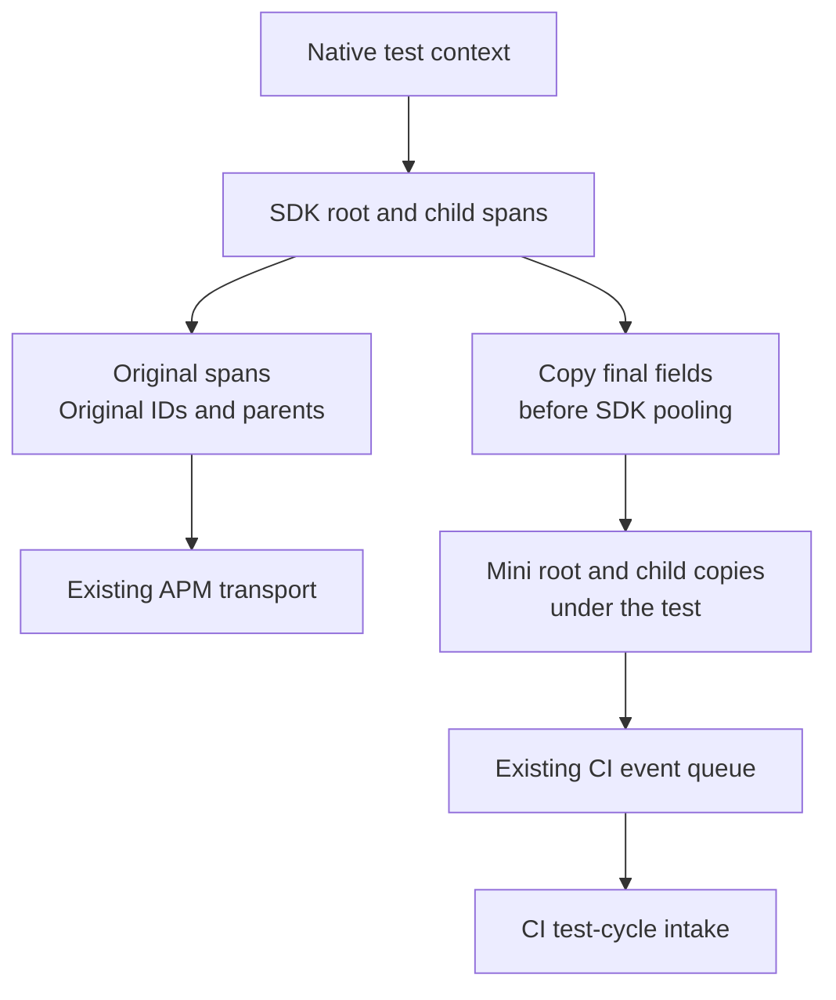

# SDK spans under Mini tests

When `ddtest` builds a Mini test binary that uses `dd-trace-go/v2`, SDK spans
can also appear beneath the test in CI Visibility. Each copy gets a new Mini
span ID. The SDK span keeps its original trace ID, parent, sampling and APM
delivery. This works with manual SDK calls and
[Orchestrion builds](orchestrion.md).

Pass the test context to application code:

```go
func TestRequest(t *testing.T) {
    // The application or test setup has already started the SDK tracer.
    root, ctx := tracer.StartSpanFromContext(t.Context(), "request")
    defer root.Finish()

    child, _ := tracer.StartSpanFromContext(ctx, "database")
    defer child.Finish()
}
```

In an instrumented binary, `t.Context()` retains Go's cancellation and values
and carries Mini's test identity. `testopt.Context(t)` works too. The context
returned by `tracer.StartSpanFromContext` carries both SDK and Mini identities
under separate keys. The SDK's propagator continues to inject its original
APM identity; `propagation.FromContext` reads the independent Mini identity.



## Which spans are copied

| SDK call or scenario | CI behavior |
| --- | --- |
| `StartSpanFromContext(t.Context(), ...)` | Copy beneath the current test |
| Child of a copied SDK span, including `StartChild` and `ChildOf` | Copy beneath that parent's copy |
| `ContextWithSpan(ctx, nil)` inside a test | Next SDK root gets a new copy beneath the test |
| A different subtest context carrying an older SDK parent | The copy belongs to the current subtest; the SDK parent remains unchanged |
| `context.Background()` with no copied SDK parent | No copy; there is no test association |
| SDK spans created before the test or during package initialization | No copy without a test association |
| Concurrent subtests and in-process retries | Each copy belongs to its own test or attempt |
| Isolated process-retry child | No copies: these children have no local Mini test identity |
| Active fuzz mutation worker | No copies; mutations are outside Mini's test-event lifecycle |
| SDK not running or returning a no-op span | No copy |
| Native build or explicit `--runtime=sdk` | No Mini mirror hooks |

Process retries still report their test results through the controlling process.
Copying SDK spans from those isolated children would require an additional
cross-process event channel. The mirror does not introduce one.
Examples have no `testing.T` context. Fuzz seeds and callbacks can use their
native `testing.T` context; contextless operations retain the rule above.

SDK spans must finish while their owning Mini client is open. Keeping a test
context after the test does not extend that client's lifetime. Copying local
spans does not reparent spans produced by remote services.

## Capture and delivery

The selective compiler hook adds private state to the SDK's `SpanContext`.
That context survives reuse of its `Span` object. At SDK finish, Mini copies
the final operation, service, resource, type, times, errors, tags and application
metrics. The copy also records `apm.trace_id` and `apm.span_id` for diagnosis.
Mini owns the CI hierarchy, origin and runtime identity; SDK sampling and
APM control metrics are omitted from the copy.

Capture runs at the exit of SDK `finish`, while the span lock still protects
its data. It includes field updates after trace bookkeeping and later SDK
defers. A completion marker prevents early returns or a panic before bookkeeping
from emitting an unfinished span. Metadata and metrics are detached before
the SDK can clear a pooled span. Enqueuing runs after the SDK unlocks, so Mini
backpressure cannot hold that lock. Repeated or concurrent `Finish` calls
produce at most one copy.

Copies use Mini's existing byte limits, gzip, HTTP retries and flush/close
handling. `DD_CIVISIBILITY_DEFERRED_DELIVERY=true` defers their delivery while
tests run. Delivery errors are logged and preserve the Go command's exit code.

The [goleak shim](delivery.md) pauses Mini delivery and filters Mini's own
workers. It does not suppress the independent SDK's workers or application
leaks. Tests that start an APM tracer retain their normal SDK shutdown and
goleak policy.

## Maintenance and checks

`internal/instrument/sdk_mirror.go` dispatches the edits;
`sdk_mirror_match.go` validates construction, context snapshots and finish/lock
anchors. The matcher follows each variable's role in the AST. Renaming a
receiver, parameter or local variable does not change the hook. Both short
declarations and `var` declarations can construct the returned SDK context.
Comments and strings containing `__ddtest` are allowed; identifiers with that
prefix are reserved for generated code.

Each operation needs one anchor. Duplicate constructors, snapshot builders or
finish calls fail compilation. The snapshot must come from the supplied span
under its nil guard and be used with that span and the incoming context.
Finish needs a direct lock and deferred unlock. Extra mutex references,
receiver aliases or reassignment are rejected because the hook cannot prove
that capture still owns the protected data. Moving these operations into new
helpers requires an explicit matcher update and behavioral tests.

The current fixtures use v2.11.0-rc.2 and the SDK revision pinned in
`internal/version`. Other private SDK layouts need validation before support
can be claimed.

Bump `miniSDKCICacheMarker` whenever the compiler edits or generated hook
change. Go does not hash wrapper-generated source into its original build
action, so an unchanged marker can reuse an incompatible SDK archive.
Native/SDK builds must remain independent of that marker.

The runtime uses cached typed `testing` offsets to bind the native context
before the test body runs. It preserves `cancelCtx`. SDK-free Mini binaries
skip binding and allocate no mirror context. There is no span registry,
per-span reflection or new worker goroutine.

`TestMiniSDKSpanMirror` checks final wire fields and independent propagation
against real APM and CI HTTP receivers. `TestMiniSDKMirrorContextMatrix`
checks parallel isolation, cleanup cancellation, pooled contexts, in-process
retries, agent/agentless delivery, deferred delivery, goleak, Orchestrion and
`-race` with SDK coverage. The regular compatibility workflow runs these
checks on Linux, macOS and Windows. `TestSDKMirrorCosmeticChanges` compiles and
executes transformed fixtures, including renames, context import aliases,
declaration styles, late field updates, early returns and panics. Rejection
tests cover duplicate anchors, foreign snapshots and unsupported locking.
Runtime unit tests cover detached map ownership, concurrent capture and the
SDK-free allocation path.
