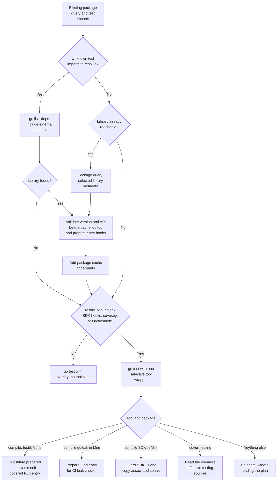
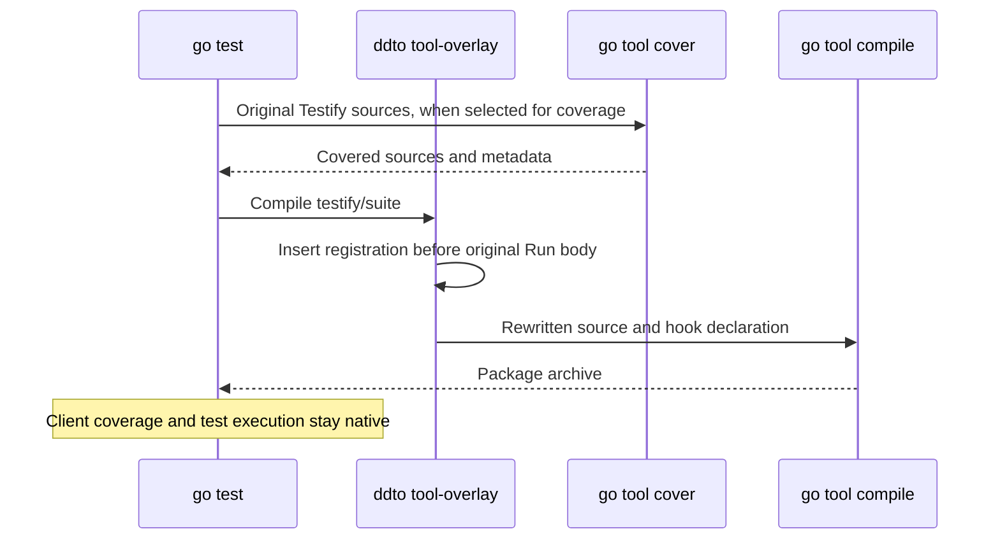

# Testify suite instrumentation

`ddto` registers a Testify suite at the entry of the client's original
`suite.Run`. All callers reach that entry, including helpers in other modules.
Testify still owns its runner, assertions, lifecycle hooks and `WithStats`.
The SDK backend calls its original registration hook. Mini registers a scope
and defers its release until `suite.Run` returns, including a panic. Each
method binds to the active suite before execution; the binding lasts through
its descendants and cleanup. This keeps `TestShared#01` attached to the second
suite when two suites expose `TestShared`. An ordinary sibling after
`suite.Run` gets no stale suite metadata.

Use `ddto` and the Mini runtime from the same revision: the scoped hook is
an internal linkname contract.

The scope follows Testify's serial method runner. It does not add support for
concurrent `suite.Run` calls sharing the same parent `*testing.T`; Testify's
own suite state also assumes serial use.

The minimum supported upstream version is **Testify v1.4.0**: from that release on,
`Run(*testing.T, TestingSuite)` runs each suite method as `t.Run(method)`, which
is all the registration needs. Releases v1.4.0 through v1.12.1 produced identical
events for the same suite. The compatibility suite runs v1.10.0, v1.11.1 and
v1.12.1; its fixture itself needs v1.6.0 or later. Preparation checks the
selected version and the actual `Run` signature, including versioned and local
replacements. A v2 module needs a separate review.

An older or newer major version, an unknown version, or an unrecognized `Run`
entry does not stop the build. `ddto` prints a warning and leaves Testify
uninstrumented; its suite methods are still reported as ordinary subtests,
without Testify suite metadata. Unreadable sources and reserved-name collisions
remain errors.

## Replacement forks

Both runtimes use the original module's version for forks with a different
module path, then validate the selected runner's API. For example:

```go
require github.com/stretchr/testify v1.12.1

replace github.com/stretchr/testify => github.com/DataDog/testify v1.1.5-0.20250616071259-629a0cde43ec
```

This fork's `suite/suite.go` matches upstream v1.10.0 byte for byte. Its
pseudo-version starts with v1.1.5, so comparing that number with the upstream
minimum would reject a compatible runner.

Preparation uses the effective module metadata returned by `go list`:

- For a replacement with a different module path, use the original Testify
  version for the minimum-version check. Forks have independent version schemes;
  their release numbers do not identify an upstream Testify release.
- For a versioned replacement within `github.com/stretchr/testify`, check the
  replacement version. Replacing v1.12.1 with upstream v1.3.0 still warns.
- For a local replacement, check the original module version.

This policy supports forks without a module allowlist or a pinned revision.
The original version is the client's declared compatibility contract; Go does
not verify that a fork preserves it. Preparation therefore still validates
`Run(*testing.T, TestingSuite)` in the effective selected sources before the
build can use its cache. Overlays participate in that check. An incompatible
entry produces a warning naming both the original version and the replacement.
The prepared-source fingerprint continues to protect the compiler cache; no
new subprocess, cache or runtime dependency is needed.

`TestTestifyDataDogReplacement` checks this replacement for Mini and SDK.
`TestTestifyReplacementVersionPolicy` covers independent fork versions,
upstream upgrades and downgrades, local replacements, and unsupported original
versions. `TestTestifyForkReplacementGuards` checks incompatible entries and
overlays for both runtimes. The `DataDog-fork` case of
`TestTestifySupportedVersionsAndNativeSemantics` compiles the actual replacement
with native Go, SDK and Mini, including race and coverage. It checks native
behavior, suite hierarchy, lifecycle hooks, external helpers, panic, coverage,
retries and ordinary/deferred Mini delivery. These tests run in the existing
cross-platform compatibility workflow.

## Preparation and tool selection



A requirement in `go.mod` does not enable `-toolexec`. Importing `testify/assert`
alone does not enable it either. The selected build tags and reachable test
imports decide whether `testify/suite` is part of this build. Dependencies of
external helpers participate in that check. Known standard-library imports are
excluded from the extra lookup.

Testify and goleak share this discovery query. When reachability is known and
no unknown test imports remain, the package query, `go list -deps`, has already
listed the selected library with its metadata, and no other query runs. Unknown
test imports require `-deps`, including when the suite is already known, so a
helper's goleak import remains visible.
This keeps version and API validation before
the build, including when Go can recover the suite from cache. Moving that
validation into the compile wrapper would miss warm-cache version changes.
[`TestTestifyVersionGuardWithWarmVendoredSources`](../integration/vendor_cache_test.go)
checks that warm-cache counterexample. The [performance guide](performance.md)
records the discovery and cache constraints.

Preparation reads only the selected Testify sources. It validates the entry,
adds a registration call (with a deferred release for Mini) and prepares a linkname declaration for the selected
CI runtime. The compiler receives temporary source paths; module-cache files
and client files stay untouched. There are no wrappers in client packages,
and no Testify source is incorporated into Mini.

Mini's goleak integration uses the same wrapper with a different package cache
marker. See [delivery and goleak](delivery.md); the SDK backend does not add it.

## The bypass and cache contract

The private `tool-overlay` entrypoint dispatches before reading JSON, creating
contexts or setting CI environment defaults. Compiler and linker version
probes keep their native output. Other selected integrations, such as the Mini
SDK guard or Orchestrion composition, can also require this wrapper. Unrelated
tools and packages never read the plan. On Unix the wrapper uses `exec` to
replace itself with the native tool;
Windows requires a child process and preserves its streams and exit code.

`-toolexec` is a build-wide hook: even a selective wrapper starts for unrelated
tool invocations that Go actually runs. The bypass removes the second process
on Unix, but does not remove the wrapper's own startup. Builds without a
selected transform avoid that cost entirely.

Go includes compiler identity in every package's build key. Changing
`compile -V=full` would split the cache for every package. Instead, the
instrumented `testing` package exports `DDToTestifyContract`, a constant
containing a hash of the prepared suite edit, runtime hook and transformation
contract. Testify imports `testing`, so its dependency content ID carries the
hash into its native build key. An exported constant survives in export data;
an unused private marker would not provide that guarantee.

The fingerprint excludes temporary backing paths. A new preparation with the
same inputs can reuse Go's cache. A source, runtime or contract change updates
its key. The contract test checks actual compiler invocations: a changed marker
rebuilds Testify while `strings`, `fmt` and `crypto/sha256` remain cached. We do
not maintain a separate cache.

A plan and its selective tool command belong together. Building a prepared
Testify plan manually without its tool wrapper is outside this contract: it
could store an uninstrumented object under the prepared dependency identity.
`ddto` always supplies both.

## Coverage

Go's cover tool opens normal source paths directly. When coverage includes the
rewritten standard-library `testing` sources, the private bridge translates its
inputs to overlay backing files. Relative patterns such as `./...` stay within
the selected directory tree; they must not accidentally select an unrelated
GOROOT. Ordinary client coverage needs no bridge.

For Testify itself, registration is inserted **after** Go has generated covered
source, just before compilation. Its existing counters, source mapping and
coverage denominator stay intact. This supports coverage patterns that include
`testify/suite`, and callers need no generated coverage exclusions.



The [latest benchmark comparison](benchmarks.md) includes direct and external
Testify callers at 4/32 CPUs, with race, coverage and their combinations.
It measures complete invocations, including preparation and selective tool startup.

## Compatibility checks

`TestCIVisibilityTestifyParity` compares actual events against the unmodified
SDK instrumented by Orchestrion, with a separate pass/skip control for the POC
SDK backend. Its child
binaries use `-race -covermode=atomic -coverpkg=./...`.

| Area | Cases |
| --- | --- |
| Execution | Pass, skip, assertion/require failures, panic, method filtering, count/shuffle |
| Lifecycle | Suite/test/subtest setup and teardown, before/after callbacks, original ordering and `WithStats` |
| Callers | Named/aliased/dot imports, saved function values, internal/external test packages, local and external-module helpers, custom/shadowed `Run` |
| Parallel execution | Independent suites with `t.Parallel`; shared suites retain Testify's own limitations |
| Coverage | Client helpers and the Testify library, full filenames, bitmaps and SDK coverage percentage |
| Retry policies | ATR and EFD in process and in-process modes; ATR with coverage |
| Management | Disabled, quarantined and attempt-to-fix methods |
| ITR | Parent entry skipping; method behavior matches the pinned SDK limitation |

The 26 execution/policy cases check counts, hierarchy, CI attributes and exit
status, with per-case timing in the JSON and Markdown reports. The pass/skip
fixture produces one session, one module, two suites and three test events.
Separate tests check both supported versions, tags, user overlays, external
modules through `replace` and `go.work`, dynamic tool activation, native tool
identities and failures, and cache invalidation. A bounded fuzz test checks
source edits.

The compatibility workflow discovers these tests on Linux Go 1.26/1.27 and
macOS/Windows Go 1.27. Go 1.25 and tip run selected native Mini fixtures with
Testify, coverage, goleak and deferred delivery. Linux also runs the stable
toolchains with the race harness. Local Linux and
cross-compilation proof cannot replace execution in the other platform jobs.

## Maintenance and remaining boundary

Explicit `.go` file mode runs native `go test` without instrumentation. The pinned SDK applies ITR to
the top-level `testing.M` entry, not individual Testify methods. The regression
suite records that behavior; it does not claim method-level skipping works.

When updating the SDK, review its Testify advice and
`gotesting.instrumentTestifySuiteRun`, including the linkname signature. When
updating Testify, add a version fixture and review `suite.Run` and its lifecycle.
The hook declaration uses `interface{}` because supported Testify releases
declare Go versions before 1.18; using `any` there would fail even with a newer
installed toolchain.

Bump `testifyContractVersion` when compiler-side edits change without changing
the prepared inputs. Update the ABI tests and run the full reference comparison.
A cover-bridge semantic change must bump `coverContractVersion`. Never accept
new snapshots just to remove an event, source or grouping difference.
