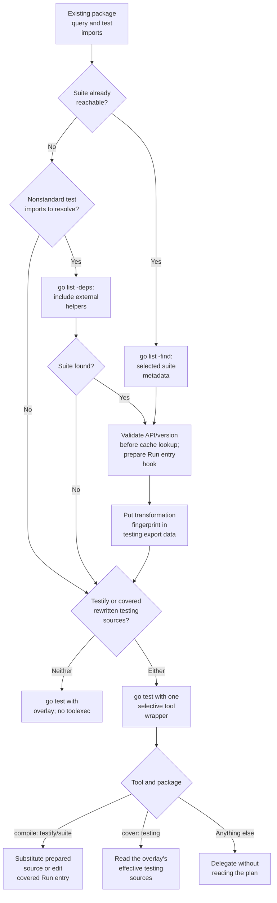
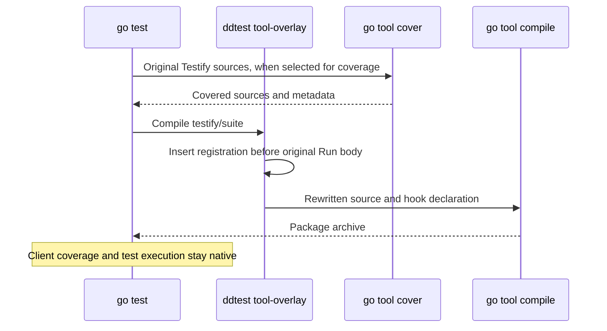

# Testify suite instrumentation

`ddtest` registers a Testify suite at the entry of the client's original
`suite.Run`. All callers reach that entry, including helpers in other modules.
Testify still owns its runner, assertions, lifecycle hooks and `WithStats`.
Both `--runtime=sdk` and `--runtime=mini` use the same transformation.

The minimum supported version is **Testify v1.11.1**. The compatibility suite
also exercises v1.12.1. Preparation checks the selected version and the actual
`Run(*testing.T, TestingSuite)` signature, including versioned and local
replacements. Other v1 versions above the minimum pass these guards but do not
have dedicated version fixtures. A v2 module needs a separate review.

## Preparation and tool selection

A requirement in `go.mod` does not enable `-toolexec`. Importing `testify/assert`
alone does not enable it either. The selected build tags and reachable test
imports decide whether `testify/suite` is part of this build. Dependencies of
external helpers participate in that check. Known standard-library imports are
excluded from the extra lookup.

When the existing query already proves suite reachability, preparation uses
`go list -find` to read only the selected library metadata and sources. Unknown
test imports still require `-deps`. This keeps version and API validation before
the build, including when Go can recover the suite from cache. Moving that
validation into the compile wrapper would miss warm-cache version changes.
The [strategy experiment](results/tool-strategies-20261003-linux-go1.27/README.md)
records the alternatives, cache counterexample and all compile timings.

Preparation reads only the selected Testify sources. It validates the entry,
adds a registration call and prepares a linkname declaration for the selected
CI runtime. The compiler receives temporary source paths; module-cache files
and client files stay untouched. There are no wrappers in client packages,
and no Testify source is incorporated into Mini.

## The bypass and cache contract

The private `tool-overlay` entrypoint dispatches before reading JSON, creating
contexts or setting CI environment defaults. Compiler and linker version
probes keep their native output. Unrelated tools and packages never read the
plan. On Unix the wrapper uses `exec` to replace itself with the native tool;
Windows requires a child process and preserves its streams and exit code.

`-toolexec` is a build-wide hook: even a selective wrapper starts for unrelated
tool invocations that Go actually runs. The bypass removes the second process
on Unix, but does not remove the wrapper's own startup. Builds without a
selected transform avoid that cost entirely.

Go includes compiler identity in every package's build key. Changing
`compile -V=full` would split the cache for every package. Instead, the
instrumented `testing` package exports `DDTestTestifyContract`, a constant
containing a hash of the prepared suite edit, runtime hook and transformation
contract. Testify imports `testing`, so its dependency content ID carries the
hash into its native build key. An exported constant survives in export data;
an unused private marker would not provide that guarantee.

The fingerprint excludes temporary backing paths. A new preparation with the
same inputs can reuse Go's cache. A source, runtime or contract change updates
its key. The contract test checks actual compiler invocations: a changed marker
rebuilds Testify while `strings`, `fmt` and `crypto/sha256` remain cached. We do
not maintain a separate cache.

A plan and its selective tool command belong together. Building a prepared
Testify plan manually without its tool wrapper is outside this contract: it
could store an uninstrumented object under the prepared dependency identity.
`ddtest` always supplies both.

## Coverage

Go's cover tool opens normal source paths directly. When coverage includes the
rewritten standard-library `testing` sources, the private bridge translates its
inputs to overlay backing files. Relative patterns such as `./...` stay within
the selected directory tree; they must not accidentally select an unrelated
GOROOT. Ordinary client coverage needs no bridge.

For Testify itself, registration is inserted **after** Go has generated covered
source, just before compilation. Its existing counters, source mapping and
coverage denominator stay intact. This supports coverage patterns that include
`testify/suite`, and callers need no generated coverage exclusions.

The [selective tool measurements](results/selective-tools-20261003-linux-go1.27/README.md)
keep every run, distinguish dispatch from process startup, and show the cost of
closing the external-caller gap. They also record the existing cache and
compatibility checks.

## Compatibility checks

`TestCIVisibilityTestifyParity` compares actual events against the unmodified
SDK instrumented by Orchestrion, with a separate pass/skip control for the POC
SDK backend. Its child
binaries use `-race -covermode=atomic -coverpkg=./...`.

| Area | Cases |
| --- | --- |
| Execution | Pass, skip, assertion/require failures, panic, method filtering, count/shuffle |
| Lifecycle | Suite/test/subtest setup and teardown, before/after callbacks, original ordering and `WithStats` |
| Callers | Named/aliased/dot imports, saved function values, internal/external test packages, local and external-module helpers, custom/shadowed `Run` |
| Parallel execution | Independent suites with `t.Parallel`; shared suites retain Testify's own limitations |
| Coverage | Client helpers and the Testify library, full filenames, bitmaps and SDK coverage percentage |
| Retry policies | ATR and EFD in process and in-process modes; ATR with coverage |
| Management | Disabled, quarantined and attempt-to-fix methods |
| ITR | Parent entry skipping; method behavior matches the pinned SDK limitation |

The 26 execution/policy cases check counts, hierarchy, CI attributes and exit
status, with per-case timing in the JSON and Markdown reports. The pass/skip
fixture produces one session, one module, two suites and three test events.
Separate tests check both supported versions, tags, user overlays, external
modules through `replace` and `go.work`, dynamic tool activation, native tool
identities and failures, and cache invalidation. A bounded fuzz test checks
source edits.

The compatibility workflow discovers these tests on Linux Go 1.26 and 1.27,
and macOS/Windows Go 1.27. Linux also runs the race harness. Local Linux and
cross-compilation proof cannot replace execution in the other platform jobs.

## Maintenance and remaining boundary

Explicit `.go` file mode remains unsupported. The pinned SDK applies ITR to
the top-level `testing.M` entry, not individual Testify methods. The regression
suite records that behavior; it does not claim method-level skipping works.

When updating the SDK, review its Testify advice and
`gotesting.instrumentTestifySuiteRun`, including the linkname signature. When
updating Testify, add a version fixture and review `suite.Run` and its lifecycle.
The hook declaration uses `interface{}` because v1.11.1 declares Go 1.17; using
`any` there would fail even with a newer installed toolchain.

Bump `testifyContractVersion` when compiler-side edits change without changing
the prepared inputs. Update the ABI tests and run the full reference comparison.
A cover-bridge semantic change must bump `coverContractVersion`. Never accept
new snapshots just to remove an event, source or grouping difference.
