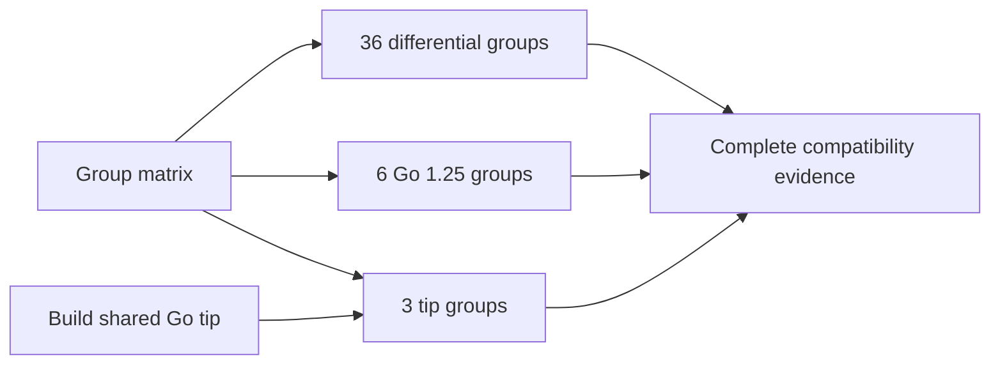

# Validation contract

Mini is the default runtime. Explicit `--runtime=sdk` selects the unchanged
public dd-trace-go SDK, pinned to
[main at 870449702d0a](https://github.com/DataDog/dd-trace-go/tree/870449702d0a0cea26a6223eefe2f0a198069d79).
The reference is Orchestrion commit
[5c24783fcd76](https://github.com/DataDog/orchestrion/commit/5c24783fcd76f00cd1ff21c418a6662785d6c811),
built as `v1.13.2-0.20260917114356-5c24783fcd76` from the locked
[test tool module](../testdata/orchestrion/go.mod), with `x/tools v0.50.0`.
CI uses the same Go toolchain for the reference build and the test build.
That pairing lets both the standard-library importer and x/tools read the V5
export format introduced by Go 1.27.2. The SDK reference and Orchestrion source
revision stay pinned; the root module retains zero external dependencies.

## Architecture and dependency boundary

The driver imports only the Go standard library and its own packages. A targeted
`go list` supplies native `testing`, runtime and selected client-package metadata.
Preparation parses `testing` with `go/parser` and writes an overlay containing
changed sources, private hook declarations and an external runtime import for
each selected test package. Native Go performs the build.

Testify and goleak share library discovery. Known reachability without unknown
test imports uses `go list -find`; unknown imports require `-deps` to discover
libraries through helpers. Version and API validation happen before the native
build-cache lookup. A selective compiler wrapper transforms `testify/suite`
and, in Mini, reachable `go.uber.org/goleak`; a coverage bridge handles rewritten
`testing` sources when coverage includes them.
[Combined Orchestrion builds](orchestrion.md) use the same selective wrapper
to preserve application weaving and a single CI reporter. Mini also selects it
when the test graph reaches the full SDK, to guard its
CI reporter and install span-copy hooks. Builds needing none of these features
omit `-toolexec`. The POC has no configuration engine or build daemon. Selecting a
module-declared Orchestrion tool lets Go build/cache that tool before the test
build; Orchestrion owns any additional builds it needs for application weaving.

The ten SDK aspects are retained: M.Run, T.Run, F.Fuzz, B.Run, Fail, FailNow, formatted
errors, formatted skips, SkipNow and Parallel. Formatting wraps the already
formatted result, so String methods run once. The SDK's ownership marker retains
its existing name. Runtime retries, skip policies and finalization are owned by
the selected runtime. This POC depends on its private hook ABI and is intentionally version-pinned.

Virtual external test files anchor the public SDK import without editing project
sources. Temporary plans are invocation-local and removed after Go exits. There
is no additional persistent instrumentation cache. Test-result caching remains
Go's choice: explicitly select packages for result caching, and use `-count=1`
when fresh CI events are required. `-work` preserves Go's own work directory, but
the POC overlay is still removed; this POC does not provide retained overlay debugging.

## CI feature parity

The [feature inventory and differential matrix](ci-parity.md) compare Mini against
the full SDK/Orchestrion testing configuration. CI exports per-scenario counts
and supplemental hierarchy/span/telemetry evidence. [Testify validation](testify.md)
adds 26 policy/lifecycle cases plus selected-version, workspace, covered-library,
fast-bypass and cache-invalidation tests. Both local and external-module callers
reach the same original runner.

## Runtime checks

The tests compile actual native, POC and Orchestrion binaries using the same
fixture and temporary module graph. Adding Orchestrion may upgrade transitive
modules through Go MVS; that graph is used by both instrumented variants, and
an assertion verifies the SDK remains the pinned release. The reference YAML is
read directly from the installed SDK. The SDK backend reads the original module; the mini backend contains adapted CI source. See [mini runtime validation](mini-runtime.md).

| Contract | Proof |
| --- | --- |
| CLI activation | Unset enables parent-only mode; explicit true/false/parent/empty/custom values, real child processes and SDK-managed retries checked |
| TestMain, success, logs and exit codes | Native output with CI disabled; real SDK events versus Orchestrion when enabled |
| Subtests, nested tests, parallel children, cleanup and Context | Fixture asserts completion, callback order and cancellation before cleanup |
| Fail, FailNow, Error, Errorf, Fatal, Fatalf and Helper | Negative cases compare exit codes, error messages, stacks and source locations; formatting occurs once |
| Skip, Skipf, SkipNow | Native output and SDK skip semantics |
| Count, shuffle, list, JSON, tags and multiple packages | Native flags and selected test execution |
| Test-result cache | Second package-mode run is cached; count=1 runs again |
| Existing overlay | Both command flag and GOFLAGS preserve an intentional test failure |
| Race and atomic coverage | Actual instrumented fixture builds/runs; SDK events compared to Orchestrion |
| Benchmarks | Native execution and reference SDK event semantics |
| Fuzz and executable Examples | Exact SDK PR #5442 workloads/assertions, 64 event comparisons plus 14 atomic coverage combinations; normal/deferred and goleak |
| Process retries | First attempt fails, second passes; reference events and process exit |
| EFD, ITR, disabled, quarantine, attempt-to-fix | Real SDK requests against loopback policy responses and reference event equivalence |
| Panic, Goexit and timeout | Abnormal exit and diagnostic marker; enabled/disabled reference event equivalence |
| Unsupported input | Missing/ambiguous hooks, malformed source and double instrumentation rejected |
| Mini + Orchestrion | Explicit wrappers, GOFLAGS and toolexec; injected APM span and HTTP delivery; one CI hierarchy, Testify, goleak, retries, coverage and race |
| SDK span copies under Mini tests | Independent APM/CI HTTP captures; original propagation and parentage, final fields, pooling, parallel/retry isolation, Testify, seeds, benchmarks, goleak, coverage and Orchestrion |
| Command line | Go's own package/flag classification, `-C`, `--flag` spellings, custom test flags, overlay precedence and chained `-toolexec` |

The backend responses are synthetic, but hooks, retry processes, serialization
and network requests come from the real SDK. Fixtures inherit a small whitelist
of tool/path environment variables; real API keys and CI credentials are excluded.
Events are captured over loopback using a synthetic key.

The comparison retains event type, name, resource, error flag, semantic test
attributes, error stacks and source positions. It excludes generated IDs,
durations, timestamps, execution order and invocation names. It does not prove
identity of binaries or generated source bytes. The added parity matrix validates
the event ID hierarchy and additional CI span parentage independently.
Parallel child completion order and elapsed times may differ in native output;
line content and multiplicity are retained.

## Scope limits

The default Mini backend uses this module. The SDK backend requires the exact
unreplaced SDK. Standard library test targets are unsupported; explicit Go file mode runs native `go test`
without instrumentation. Testify callers in client and external modules use the original
selected runner; dedicated version fixtures cover v1.10.0, v1.11.1 and v1.12.1.
Application weaving belongs to Orchestrion. Mini's SDK integration copies
context-associated spans while retaining their APM behavior.
The AST transformer validates hook presence and ambiguity and selected shape
constraints; future Go source/ABI changes still require a new compatibility run.
The [compatibility workflow](../.github/workflows/compatibility.yml) defines the
supported test matrix. Adding a Go or SDK version requires exercising its private
hooks and runtime behavior. Long-running campaigns and arbitrary downstream modules need separate validation.
[Fuzz and Examples](fuzz-examples.md) records the bounded campaign and feature cases.

## Mini runtime contracts

The current mini/SDK wire contract compares CI attributes and metrics while
explicitly excluding APM sampling, profiling and process enrichment. It also
checks complete envelope metadata, native hierarchy IDs, duplicate aliases,
service version and all session-name fallback cases. The unmodified SDK remains
the oracle; fewer APM fields is intentional.

| Contract | Proof |
| --- | --- |
| Service version and session name | `TestMiniCIConfigurationWireParity`: explicit `DD_VERSION`, custom tags, automatic command/job name, explicitly empty session name |
| CI payload byte limits and gzip | `TestCIByteBatchingAndCompression`: multiple real decoded batches, all events delivered below 5 MiB in both agent/agentless modes |
| Oversized events and delivery failures | `TestLargeBatchFailureRetainedAndOversizedEventRejected`: single-event rejection, failed batch retention and recovery |
| Slow and failing intake | `TestSlowIntakeDeliversEveryEvent`: concurrent senders and waiting finishers lose no event behind a slow intake; `TestFailingIntakeDoesNotStallFinishers`, `TestCloseReleasesWaitingFinisher` and `TestDeferredDeliveryNeverWaitsForSpace`: no finisher waits on a failing intake, after closure or in deferred mode; `TestDeferredCheckpointSendsConcurrently` and `TestDeferredCheckpointStopsAfterFailure`: checkpoints send up to eight batches at once, finish every sender before returning and start no batch after a failure |
| Temporary files | Every Mini run of the parity matrix, the deferred matrix and the Testify parity uses its own `TMPDIR`, which must be empty afterwards; mutating pack-file cleanup fails the git upload case |
| Retried parallel tests | `TestMiniInProcessRetryKeepsAllocsPerRun`: under `-count=2`, `testing.AllocsPerRun` still works after a parallel test that passed at once and one retried in process |
| Bazel output and offline mode | `TestMiniBazelOfflineAndPayloadFiles`: real manifest/cache, test/coverage/telemetry JSON files versus SDK, zero HTTP requests; native file writer error propagation tested separately |
| Parallel and retry coverage attribution | `TestMiniParallelAndRetryCoverageAttribution`: both runtimes compiled with `-race -covermode=atomic`, exact distinct-function bitmaps and initial-attempt-only retry policy |
| Coverage and global local-zone changes | `TestMiniCoverageWithGlobalTimeChanges`: Mini mutates `time.Local` under race/atomic coverage at 4/32 CPUs, ordinary/deferred delivery and telemetry off/on; exact bitmaps and CI attributes compared with a safe SDK run |
| Coverage processing lifetime | `TestCoverageProcessingFinishesBeforeShutdown` and deferred group/error checks: profiles captured at test boundaries, processing outside active deferred groups, completion also on profile errors |
| Telemetry startup and response lifetime | `TestStartupTelemetrySendsBeforeTests` and `TestWriterFlushWaitsForResponseCompletion`: `StartApp` returns only after its startup request; configuration, retry, concurrent close and failed initialization checked in both modes; response EOF handshake joined for 200/503 responses |
| CI product metadata | Expanded pass/error/policy comparison retains capability tags and ITR correlation; delayed session enrichment is checked |
| Original CI assertions | Ported SDK tests, including retry runtime/parallel ownership, coverage writer/profile, ITR backfill, source metadata and lifecycle; [exact provenance](../internal/thirdparty/dd-trace-go/TESTS.json) |

Actual Bazel compiler invocation and real Datadog intake/UI acceptance remain
unverified. Loopback and payload-file fixtures prove their local contracts.

Mini, the CLI and ported SDK assertion helpers use only this module and the Go
standard library. Consumer tests run `go mod tidy` and verify the exact module
graph. Older Testify, go-spew and YAML versions stay unchanged with both readonly
and mod flags. The CI dependency gate rejects any external requirement or runtime
package; printing the dependency list alone is insufficient.

The transparency and safety regressions cover these contracts:

| Contract | Regression coverage |
| --- | --- |
| Credential-safe transport errors | `TestRequestErrorsHideEndpointCredentials`, `TestResponseErrorsRedactEchoedCredentials`: query/fragment credentials and echoed keys are absent; error identity remains available |
| Cancel package resolution with inherited stdout | `TestReadPackagesCancelsAnInheritedStdout`: cancellation returns while a descendant still owns the pipe |
| Reserved span fields | `TestReservedTagsUpdateEventFields`, `TestReservedTagsReachWireFieldsAndEventKind`: names, service, resource and type reach the decoded event fields |
| Reentrant tag values | `TestTagFormattingCanReadItsSpan`: stringers, formatters, slices and errors can read the span; a callback that finishes it cannot add a late tag |
| Consumer dependency versions | `TestMiniPreservesOlderConsumerDependencies`, `TestMiniConsumerAddsOnlyOwnModule`: readonly/mod builds keep old Testify, go-spew and YAML; consumer tidy adds only Mini |
| Consumer language version | `TestMiniPreservesConsumerLanguage`: Go 1.21, 1.22, 1.25 and a missing `go` directive; loop closures, timer compatibility and `panic(nil)` match native Go |
| SDK compiler cache | `TestMiniLegacySDKShim`: native SDK builds before and after Mini retain CI reporting, and SDK spans retain their APM transport |
| Optional SDK mirror compatibility | `TestMiniUnsupportedSDKMirrorRetainsTestReporting`: SDK 2.10.1 builds twice, warns, and retains one test/session per run without duplicate SDK reporting |
| Package setup failures | `TestMiniContinuesAfterPackageSetupFailures`: valid packages execute beside mixed-package, missing and empty targets with native exit status |
| Event metadata placement | Accepted change from the SDK: shared CI/Git/system strings use event-kind envelope metadata. `TestMiniCIConfigurationWireParity` and common-tag wire tests: defaults and local overrides retain effective values; raw payload assertions check their placement |
| Workspace and vendor provisioning | `TestMiniProvisionsWorkspaceWithoutChangingModules`, `TestMiniProvisionsVendorAndPreservesPatchedSources`: preserve caller files, loop semantics, local patches, program defaults and modfiles from flags or `GOFLAGS`; runner tests cover selected versions, forks, source overlays, cached vendor links and their fallbacks |
| Test cache and `-exec` programs | `TestMiniTestCacheFollowsCallerEnvironment`: a result cached under `GOWORK=off` does not pass for a caller without `GOWORK`, while an unchanged caller still reuses it. `TestMiniExecWrapperSeesCallerEnvironment`: a `-exec` program sees the caller's `GOWORK` and `GOFLAGS` and an argument with both quote characters; runner tests cover the cross-compilation helper, argument replacement and quoting, and, on Windows, that terminating the wrapper ends the program but not processes it left running |
| Go environment of tests | `TestMiniTemporaryWorkspaceRestoresGoEnvironment`: older modules, vendor and existing workspaces; tests and a dependency initialized before `testing` see the caller's `GOWORK` and `GOFLAGS`, and their `go list -m` and nested builds match native Go. `TestMiniTemporaryWorkspaceKeepsBuildToolEnvironment`: a user `-toolexec` chained by ddtest still resolves Mini through the build workspace. `internal/goenv` tests check imports, initialization order and that importing `goenv` restores nothing |
| Vendor tree | `TestMiniVendorTreeMatchesGo`: `go test . example.com/patternhelper/...` selects the same vendored packages and failures as native Go, and vendored `//go:embed` of a file and a directory embeds the same contents; real vendored directories stay traversable |
| Vendor selection | `TestMiniVendorSelectionMatchesGo`: a `go mod vendor` tree beside a Go 1.21 or 1.25 `go.work`, and a `go work vendor` tree under `GOWORK=off`, are ignored as with `go test`; module or workspace manifests with relative local replacements, including a `go.work` replacement of one version, a project directory containing spaces with another version replaced elsewhere, and a linked vendor directory, keep working; runner tests mirror cmd/go's selection and replacement canonicalization |
| Vendored build cache | `TestMiniVendorWorkspaceLinksAndReusesBuildCache`: the vendor workspace hard-links sources, an unchanged vendored package is not recompiled, and later vendor edits are used. Runner tests check that a workspace whose files or links no longer match the client's is not reused, that pruning skips a workspace in use, that a run waiting during a prune rebuilds it, and that waiting for the lock honors cancellation |
| Enforced dependency boundary | `scripts/test_dependency_boundary.py`: reject unused external requirements and nonstandard packages outside this module |


## Compatibility workflow

The [workflow](../.github/workflows/compatibility.yml) checks three stable Go families and tip:

| Platform | Go | Suite |
| --- | --- | --- |
| Linux | 1.25 | Native Mini suite in normal and `-race` modes; `GOTOOLCHAIN=local` prevents an upgrade |
| Linux | 1.26, 1.27 | Complete SDK differential suite in normal and `-race` modes |
| Linux | tip | Native Mini suite and manual SDK span-copy cases; source commit recorded before building Go |
| macOS | 1.27 | Normal suite |
| Windows | 1.27 | Normal suite |

The unit group for each configuration audits incorporated sources and licenses,
checks the dependency boundary and runs `go vet`. Go 1.25 and tip execute all local runtime packages, plus native Mini
fixtures for compiler/coverage hooks, Testify, goleak, fuzz/examples, delivery and
consumer transparency. Tip also checks the manual SDK mirror, its compatibility
fallback and native builds before and after Mini. The full SDK reference requires
Go 1.26. The frozen Orchestrion reference fails on tip, so the complete differential
suite runs on Go 1.26/1.27. Its report step
requires the independent Orchestrion reference and exports feature outcomes,
counts and timings. Logs and JSON reports are uploaded even when a test fails.

### Parallel test groups

Each differential configuration runs six jobs: local unit/runtime packages, CLI,
CI parity and Testify, fuzz/examples, Orchestrion composition/cache, and SDK span
copies. Go 1.25 and tip each run three groups: local packages, native integration,
and native fuzz/examples. The workflow has 45 test jobs. Three support jobs
prepare their matrices, build one shared tip toolchain, and collect the evidence.



[`ci_shards.json`](../scripts/ci_shards.json) assigns integration tests to groups,
including the Unix socket and Windows file-lock cases. Add a new test there when
adding it to the suite. The runner compares these assignments with the tests
listed by the selected Go toolchain; missing, duplicate and unknown assignments
fail CI. It also checks that each selected test produces a terminal result.
Only the two existing Windows symlink cases may skip if symlinks are unavailable.
Go's package skips for directories without test files remain valid.

Normal and deferred cases stay together so they can share fixtures. Tests run
sequentially within their group; jobs have independent workspaces and run in
parallel. Tip is built once from a recorded source SHA. All three tip groups
download that toolchain, check its revision, and disable automatic upgrades.

Every group uploads `tests.log`, `tests.jsonl`, a manifest recording its checkout,
toolchain, selection and command, and any parity JSON it produced. The final job
requires all 45 manifests from the same checkout, rejects conflicting report
files and invokes the existing complete parity validator for every differential
configuration. Its `compatibility-evidence` artifact contains the six rendered
reports, their JSON and the group manifests. `summary.md` records each group's
test-command duration, including compilation during that invocation. It excludes
setup, the inventory query and artifact transfer; GitHub records full job times.

To reproduce one group on Linux with Go 1.27 and the pinned Orchestrion installed:

```sh
ORCHESTRION_BIN="$(go env GOPATH)/bin/orchestrion" \
  python scripts/ci_shards.py run --suite differential --os ubuntu-latest \
  --go 1.27.x --mode normal --shard sdk --output artifacts/sdk
```

Choose a fresh output directory for each run. Replace `sdk` with another group,
or select `--suite mini --go 1.25.x --shard native` for the minimum toolchain's
native integration. `--mode race` enables the race detector in the group and its
fixtures. These are correctness checks; their durations are not benchmark results.

For a PR, inspect the jobs for its current head and merge revision. The workflow
configuration describes what runs; successful execution must be checked on that
revision. Cross-compilation proves a target builds, while a native job checks
that target's runtime behavior. The [latest local comparison](benchmarks.md)
records Linux measurements separately from GitHub Actions.

## Selective-tool validation

The [recorded Linux Go 1.27.1 dataset](results/20261005-linux-go1.27.1/parity/README.md)
repeats all 26 Testify cases and seven deferred Testify cases against the full
SDK/Orchestrion reference, within the 115-case matrix. Six rounds pass at each
of 4/32 CPUs. This is local protocol and runtime evidence; native macOS/Windows
execution is checked separately by the compatibility workflow.

[`TestTestifyVersionGuardWithWarmVendoredSources`](../integration/vendor_cache_test.go)
warms the build cache with supported vendored sources, then changes consistent
replacement metadata to an unsupported release while keeping source bytes
identical. Preparation must reject it even if Go would reuse the suite archive.
Other [selective-tool tests](../integration/selective_tools_test.go) check native
compiler/linker identities, bypass exit status, Unix process replacement,
coverage, workspaces and fingerprint invalidation. The compile-only matrix
records unchanged cache hits and cross-strategy reuse separately from runtime
feature comparisons.

The source-range regression fixture checks an optimized constant-sum test against
its literal lines 5–10. Normal, unoptimized and race builds must all send that
range. CLI checks cover default Mini selection, both runtime option forms after
Go flags, an unchanged Go flag value that resembles `--runtime`, and invalid
runtime values rejected before a Go process can start. The compiled default
binary must contain Mini symbols and no SDK runtime symbols.
